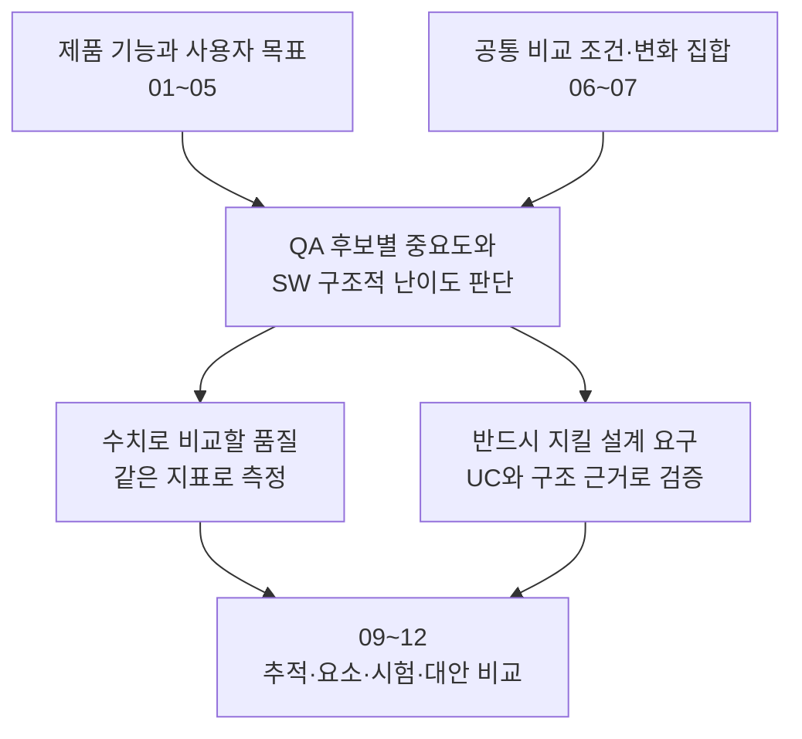

# 8. Architecture Significant Requirements — 중요한 품질과 설계 요구

> 상태: **작성 완료 · 사용자 검토본 — ASR 선정과 측정 정의 제안**  
> 근거: [01 시스템 정의](./01-system-mission-and-boundary.md) · [02 용어](./02-terms.md) · [03 설계 범위](./03-fixed-architecture-scope.md) · [04 공통 흐름](./04-canonical-interaction-flow.md) · [05 UC](./05-representative-use-cases.md) · [06 비교 조건](./06-fixed-assumptions.md) · [07 변경 집합](./07-intentional-variables.md)  
> 07 적용 범위: M-01~09, A-01~09, C-01~06 — 총 24개  
> 여기의 중요도·난이도는 문서 근거에 따른 설계 판단이다. 실측 성능, 사용자 조사 결과 또는 Architecture 대안의 승패가 아니다.

## 8.1 이 문서에서 결정할 것

**VIA에 중요한 품질이 무엇인지 먼저 판단하고, 그것을 만족시키려면 어느 정도의 SW 구조적 고민이 필요한지 살핀다.** 점수가 잘 갈리는 지표부터 찾아 제품 요구를 맞추지 않는다.

본 문서의 제안은 다음과 같다.

- 우선 수치로 비교할 품질은 **VIA 처리 지연, 화면 지칭 정확도, 업무 연결 정확도, 모델 변경 대응성, Agent 변경 대응성**이다.
- **복합 요청, 대화·업무 연속성, 재시작 복구, 권한·승인, 상태·결과의 정합성**도 설계상 중요한 요구로 명시한다. 점수 합산에서 뺐다는 이유로 구현·검증에서 제외하지 않는다.
- Context/저장 정보의 변경 6개도 전부 평가한다. 다만 모델·Agent 변경 점수에 몰래 섞지 않고 별도 변경 분석으로 유지한다.

이 다섯 품질만이 ASR이라는 뜻은 아니다. **ASR은 설계에 중요한 요구이고, 비교 점수표는 그중 이번 대안 비교에 사용할 일부 품질이다.** 필수 기능, ASR, 주요 DP는 서로 같은 목록이 아니다.

이 문서에서는 선정 이유, 품질의 범위, 대표 측정법과 한계를 제안한다. 관련 UC/변경의 상세 연결은 09, 셈의 실제 요소 목록은 10, 실행 데이터·공통 목표·0~5점 경계 확정은 11의 평가 준비에서 수행한다. 12의 최종 결과를 본 뒤 목표나 분모를 바꾸지 않는다.

---

## 8.2 시스템 정의에서 출발한 제품 관심사

| VIA의 특징 | 사용자·개발자에게 중요한 결과 | 근거 |
| --- | --- | --- |
| 음성을 듣고 짧게 말하며 Text로 상세 내용을 남김 | 지연 없이 반응하고, 말을 끊을 수 있으며, 두 응답의 의미가 일치 | UC-01, 11, 13, 15 |
| 먼저 선택하거나 말하면서 대상을 지정함 | “이것/여기”가 실제 지정한 대상과 연결 | UC-03~05 |
| 명시적인 Agent thread 선택 없이 이전 일을 이어 말함 | 다른 일과 섞이지 않고 새 업무·기존 업무를 구분 | UC-07, 10, 14~15 |
| 복합 요청·비동기 결과·여러 업무가 공존함 | 명시된 조건·순서·대상과 사용자 제어를 유지 | UC-09~14 |
| VIA가 사용하는 모델과 배치가 바뀔 수 있음 | 기존 기능을 잃지 않고 모델 계약 변화에 적은 변경으로 대응 | 01 §1.3, M-01~09 |
| 연결하는 Agent·Context 제공자·저장 기록이 바뀜 | 사용자 대화와 업무를 유지하며 연동·데이터를 확장 또는 이행 | A-01~09, C-01~06 |
| 개인 정보를 사용하고 재시작 후에도 일을 이어감 | 허용 범위와 기억·업무 기록을 유지하고 중복 실행을 막음 | UC-16~18, FA-14~15 |



이 흐름은 특정 DP나 Component 구성을 미리 선택하지 않는다.

---

## 8.3 중요도와 Architecture 난이도 판단 기준

두 축은 **높음(H) / 중간(M) / 낮음(L)**으로 기록한다. 서열을 숫자로 바꿔 곱하거나 소수점 순위를 만들지 않는다.

| 수준 | 중요도 — VIA에서 왜 중요한가 | Architecture 난이도 — 무엇을 구조로 해결해야 하는가 |
| --- | --- | --- |
| H | 실패하면 핵심 사용 흐름·신뢰·필수 변화 대응이 무너지며, 승인 UC 또는 범위와 직접 연결됨 | 책임·계약·상태·수명·실행 경계를 함께 정해야 하며 한 함수·프롬프트 수정만으로 전체 요구를 닫을 수 없음 |
| M | 제품에 필요하지만 핵심 흐름의 보조이거나 영향 범위가 제한됨 | 정해진 경계 안의 기능 구현이 중심이지만 일부 연동 설계가 필요함 |
| L | 승인된 과제 범위와의 연결이 약함 | 설정값 또는 국소 구현 선택으로 처리 가능함 |

**구현이 어렵다, LLM이 자주 틀린다, 모든 제품에 중요하다는 말만으로 구조 난이도를 H로 주지 않는다.** 반대로 필수 기능을 안정적으로 구현할 수 있다는 이유만으로 상태 소유권·연계 계약 설계를 쉬운 문제라고 내리지 않는다.

H/H는 ASR로 중점 검토한다. 이후 관리 방식은 구분한다.

| 관리 방식 | 의미 |
| --- | --- |
| 정량 비교 ASR | 대표 지표를 하나 정해 대안별 값을 비교. 해당 품질과 무관한 DP에 억지로 연결하지 않음 |
| 필수 설계 ASR | 책임·계약과 검증 조건을 명시하고 모든 유효 후보가 만족해야 함. 다른 장점으로 요구 위반을 상쇄하지 않음 |
| 연계 평가·지원 요구 | 기능·회귀·변경 분석에서 유지하되 독립적인 핵심 점수 축을 늘리지 않음 |

정량 비교 품질도 요구사항이다. 이 구분은 중요/비중요 또는 구현/미구현 구분이 아니다. 필수 설계 ASR 역시 구조 선택과 trade-off를 만들 수 있으므로 12의 검토에서 제외하지 않는다.

---

## 8.4 QA 후보 전체 검토

| 품질 후보 | 중요도와 근거 | 구조 난이도와 근거 | 이번 관리 제안 |
| --- | --- | --- | --- |
| **VIA 처리 지연** | H — 음성 요청과 결과 전달 전반의 대기, UC-01~15 | H — 모델 호출·Context 준비·병렬화·전달 경계가 응답 경로를 결정 | 정량 ASR-01 |
| **화면 지칭 정확도** | H — 두 화면 지칭 방식이 핵심 UC-03·04 | H — 발화·선택·시각·문서 identity를 입력부터 사용 지점까지 연결해야 함. 매칭 알고리즘 자체의 난이도와는 구분 | 정량 ASR-02. 순수 구조 효과와 후보 변별력은 별도 검증 |
| **업무 연결 정확도** | H — 기존 작업의 조회·수정·취소 대상, UC-07, 10, 14~15 | H — 대화·Request·Task·Agent 실행의 서로 다른 수명과 접근 계약이 필요. 의미 판별 모델 성능도 영향 | 정량 ASR-03. 구조 효과의 범위를 명시 |
| **모델 변경 대응성** | H — S2S·의미 판단 모델·위치·이력 계약 변화, M-01~09 | H — 입력/출력·streaming·대화·배치 결합에 변경이 전파될 수 있음 | 정량 ASR-04 |
| **Agent 변경 대응성** | H — 이질적 Agent 선택·후속·결과 중계, A-01~09 | H — 업무 capability·질문·실행 식별·상태·결과 계약을 유지해야 함 | 정량 ASR-05 |
| **복합 요청 의미와 관계 보존** | H — 독립·순차·데이터 의존·조건은 필수, UC-09·14 | H — 부분 해석·분기·결과 연결·취소의 책임과 계약이 함께 필요 | 필수 설계 ASR. 단계 순서·분기·부분 완료 검증 |
| **대화·업무 연속성** | H — 직접 응답에서 업무 전환, Voice/Text·연결 전환, UC-07·13~15 | H — 연결·Conversation·Task·실행의 identity와 상태 수명 분리 | 필수 설계 ASR. 의미 연결 정확도와 상태 보존을 구분 |
| **재시작 복구** | H — UC-18과 05 §5.10에서 필수로 확정 | H — 메모리 밖 기록·외부 실행 확인·중복 실행 방지의 책임 필요 | 필수 설계 ASR. FA-14의 세 조건으로 검증 |
| **권한·Context 전달·승인 안전성** | H — 개인 자료·사용자 동의·외부 Action, UC-16 | H — 허용 범위가 조회·모델·Agent 전달·사용자 응답 경계를 관통 | 필수 설계 ASR. 권한 위반은 속도/정확도 점수로 보상하지 않음 |
| **제어·상태·결과 정합성** | H — 중복 응답, 잘못된 취소·승인, 거짓 완료 방지, UC-11~16·18 | H — 비동기 명령과 이벤트가 교차하고 출력 채널이 나뉨 | 필수 설계 ASR. 의미를 맞힌 뒤 실제로 올바른 연결·전이를 수행하는지 검증 |
| **의도 정리·Agent 선택의 의미 정확도** | H — 요청을 빠뜨리거나 잘못 위임하면 UC-06·08·09를 못 수행 | M — 주어진 자료와 계약 안의 의미 판별은 모델/규칙 영향이 큼. 책임 분리의 구조 문제는 지연·변경·복합 요청에 연결 | 기능 검증 유지. 별도 “전체 업무 성공률” 점수로 Agent 성능을 섞지 않음 |
| **Context·저장 기록 변경 대응성** | M — 승인된 자료·기억·업무 기능을 유지해야 함, C-01~06 | H — Source 추가·schema 이행이 참조·기존 데이터와 연결됨 | 전체 6개 변경을 연계 평가. 모델/Agent 변화 점수에 합치지 않음 |
| **장기 기억 정확한 관리** | H — 사용·확인·수정·삭제는 UC-17 필수 | M — 제한된 개인화 기록의 기능이 중심. 수명·권한·이행은 관련 필수 ASR과 C-04에 연결 | 기능 검증 유지. 지능적 기억 추론이라는 새 연구 과제로 확대하지 않음 |
| **음성 중단 반응성** | H — Voice에서 즉시 끼어들기, UC-11 | H — 입력 감지·생성 취소·출력 버퍼와 재생 차단 경계를 함께 다룸 | 별도 중단 지연을 보조 관찰하고 필수 제어 검증. ASR-01의 요청/결과 지연과 섞어 평균내지 않음 |
| **진단·운영 용이성** | M — 오류와 성능 원인 규명이 필요, UC-18 및 06 증거 조건 | M — 공통 식별·trace 연계 필요. 측정 가능한 운영 조직 조건은 현재 제한적 | 모든 후보의 증거/추적 요구로 유지. 근거 없는 MTTR 점수는 도입하지 않음 |
| **자원·비용·최대 동시 처리량** | M — 제품에는 의미가 있지만 목표 기기/예산/최대 부하가 확정되지 않음 | 현재 Core ASR로 H를 입증할 제약 부족 | 보조 정보만 기록. Task 4개 조건을 scalability 성능 목표로 바꾸지 않음 |

### 선정 해석

정량 비교 축은 5개를 제안한다. 복합 요청·연속성·복구·안전성·상태 정합성은 **별도의 5개 필수 설계 묶음**으로 유지한다. 음성 중단도 제어 요구와 함께 검증하며 지연은 별도 관찰한다.

이는 이름을 다섯 개 맞추기 위한 선정이 아니다. 현재 제품 경험에서는 지연·화면 대상·업무 대상이 다른 질문이며, 변화 대응에서는 모델과 Agent가 서로 다른 계약을 바꾼다. 나머지는 현재 UC가 요구하는 보존·안전 조건과 보조 분석으로 관리하는 것이 중복 점수를 줄인다.

---

## 8.5 정량 비교 ASR 요약

| ID | 품질 질문 | 대표 지표 | 방향 | 대표 평가 범위 |
| --- | --- | --- | --- | --- |
| **ASR-01 VIA 처리 지연** | 실제 Agent 업무 시간을 제외하고 VIA 때문에 얼마나 기다리는가? | **VIA 처리시간 p95 (ms)** | 낮을수록 좋음 | 같은 입력·결과 조건의 요청/응답 경로 |
| **ASR-02 화면 지칭 정확도** | 사용자가 지정한 대상·집합·영역을 정확하게 연결했는가? | **화면 지칭이 모두 맞은 시험 비율 (%)** | 높을수록 좋음 | UC-03·04의 고정 입력과 지칭 정답 |
| **ASR-03 업무 연결 정확도** | 새 목표인지 기존 업무의 연속인지, 기존 업무라면 어느 업무인지 맞혔는가? | **업무 연결이 모두 맞은 시험 비율 (%)** | 높을수록 좋음 | UC-07·10·14·15의 고정 대화/업무 상태 |
| **ASR-04 모델 변경 대응성** | 같은 기능을 유지하면서 모델 계약을 바꿀 때 얼마나 고쳐야 하는가? | **모델 변경 1건당 평균 변경 요소 수 (개/변경)** | 낮을수록 좋음 | M-01~09 |
| **ASR-05 Agent 변경 대응성** | 같은 기능을 유지하면서 Agent 연동을 바꿀 때 얼마나 고쳐야 하는가? | **Agent 변경 1건당 평균 변경 요소 수 (개/변경)** | 낮을수록 좋음 | A-01~09 |

지표가 정의되었다는 사실과 실제 후보값이 측정되었다는 사실은 다르다. 현재 측정 결과나 Architecture별 점수는 없다.

---

## 8.6 ASR-01 — VIA 처리 지연

**요구:** 같은 사용자 요청을 처리할 때 Agent가 실제 업무를 수행하는 시간을 제외한 VIA의 입력 처리·연결·응답 전달 지연을 줄인다. Cloud에 있는 VIA 모델 호출도 VIA 처리에 포함한다.

### 무엇을 재는가

단일 Agent 위임 요청의 기본식은 다음과 같다.

```text
VIA 처리시간
= (사용자 입력 종료 → Agent 업무 시작 경계까지)
+ (Agent 결과 준비 → 사용자에게 유효한 결과 응답 시작까지)
```

시험용 Agent의 업무 시작·결과 준비 이벤트를 경계로 사용한다. 사용자 입력 종료는 음성 원본의 해당 발화 끝 또는 Text 전송 시점이며, 모델의 전사 확정이 늦었다는 이유로 시작점을 뒤로 옮기지 않는다.

유효한 응답은 요청의 답·결과·확인된 상태를 전달하는 응답이다. “알겠습니다” 같은 접수 문구로 결과 도착을 대체하지 않는다. Voice/Text를 모두 전달해야 하는 조건에서는 **두 채널에서 유효한 응답이 시작된 시점 중 늦은 시점**을 사용한다. 음성 비활성 조건은 Text 시점만 사용한다. 전체 설명의 낭독 완료 시간을 뜻하지 않는다.

Direct Response는 Agent 업무 구간이 없으므로 **입력 종료부터 유효한 응답 시작까지 전부**를 기록한다. 입력 전 선행 처리의 비용은 숨기지 않고 별도 실행 기록으로 남긴다.

시험별 처리시간을 먼저 구한 뒤 고정된 시험 집합에서 p95를 구한다. 두 구간의 p95를 각각 계산해 더하지 않는다. 여러 Request·병렬 Agent·사용자 확인 대기가 있으면 06 FA-12에 따라 시간선을 먼저 분리한다. Agent들의 시간을 단순 합산해서 전체 시간에서 빼지 않는다. 요청 단위 표본과 묶음 응답 연결 규칙은 11에서 고정하고 모든 DP에 같이 적용한다.

### 비교할 때 지킬 것

- 실패·보류·응답 없는 시험을 빠른 성공으로 세거나 목록에서 숨기지 않는다. 지연값 옆에 그 건수와 적용 조건을 함께 제시한다.
- Voice/Text, 직접 응답/위임 등 유형별 결과도 보이되 후보마다 표본 비중을 바꾸지 않는다.
- 같은 업무를 VIA 밖으로 옮겨 제외 구간이 커졌다면 낮은 VIA 지연만으로 “사용자 전체 응답이 빨라졌다”고 주장하지 않는다. 06의 동일 업무 배치 비교 및 별도 전체 경로 분석을 따른다.
- 합성 latency 계산과 실제 계측을 구분한다. 토큰 수/처리량 추정은 근거가 있는 해당 모델 프로필에만 사용하고 S2S 오디오에 그대로 적용하지 않는다.

**구조적 검토 축:** 선행·병렬 처리, 필요한 모델 호출, Context 준비 시점, 직접/위임 경계, 결과 연결·출력 경로. 어느 구조가 빠른지는 아직 결정하지 않는다.

---

## 8.7 ASR-02 — 화면 지칭 정확도

**요구:** 사용자가 먼저 선택하거나 말하면서 지정한 실제 대상·집합·영역을 해당 표현과 정확하게 연결한다. 이후 Agent가 그 대상으로 일을 잘했는지는 별도이다.

### 무엇을 채점하는가

한 시험은 고정된 입력과 그 입력에서 **최종적으로 유효한 지칭 표현 → 대상**의 정답 묶음으로 구성한다.

```text
사용자: “이 표들은 두고 이 문단만 고쳐줘.”
정답:
  “이 표들” → 지정한 표 집합 {Table-A, Table-B}
  “이 문단” → Paragraph-C
```

시험의 유효한 지칭을 모두 맞히면 1, 하나라도 잘못 연결하거나 빠뜨리면 0이다. 대표값은 `100 × 성공 시험 수 / 고정된 채점 대상 시험 수`이다. 집합 순서는 의미가 없으면 무시하지만 원소의 누락·추가는 허용하지 않는다. 넓은 화면 전체를 전달하고 정답이 그 안에 있다는 이유로 성공 처리하지 않는다.

대상 ID가 있으면 문서/자료 identity와 대상 identity를 비교한다. ID가 없는 화면 영역은 11에 사전 등록한 같은 문서·페이지·영역 정답과 허용 오차로 비교한다. 후보마다 허용 범위를 다르게 두지 않는다. 발화 중 정정한 경우 철회된 지칭을 최종 실행 대상 정답에 포함하지 않는다.

본질적으로 모호한 원천 입력은 05처럼 확인이 필요한 시험으로 분리한다. 정확도 목록에서 후보의 실패 사례를 사후 제거하는 것은 금지한다. 평가기에 제공한 고정 대화가 끝난 뒤 정답을 확정할 수 있는 시험을 채점하고, 추가 힌트 없이는 해결하지 못한 결과를 정답 성공으로 바꾸지 않는다. 재질문 횟수 자체를 점수로 사용하지 않는다.

### 구조와 모델을 어떻게 구분하는가

같은 원천 음성·화면·포인터·선택과 같은 역할의 판단 모델/설정을 우선 사용한다. 원천을 수집·보관·전달하는 구조는 후보마다 다를 수 있다. 시험기가 누락한 이력이나 정답 대상을 대신 공급하지 않는다.

**중요한 반례:** source별 이력을 나중에 합치는 구조와 미리 합친 timeline이 동일한 정보를 같은 알고리즘에 제공하면 정확도가 같을 수 있다. 중앙화 자체가 정확도 향상의 증거는 아니다. 두 필수 지칭 UC 중 하나를 아예 지원하지 않는 snapshot만의 후보를 약한 비교 대상으로 세워 우위를 만들지도 않는다.

따라서 H 난이도는 여러 입력·수명·계약을 연결해야 한다는 판단이다. **순수 구조만으로 정확도가 크게 벌어진다는 주장은 아직 입증하지 않았다.** 실제 판단 모델을 실행한 품질값과 정보 전달 계약의 conformance 시험을 구분한다. 고정 모델 응답 replay만으로 의미 정확도를 실측했다고 하지 않는다.

**구조적 검토 축:** 지칭 당시 evidence 접근, 입력 정정 계약, 자료 identity, grounding 책임·경계. 동일 정보와 판단이면 동점도 정당하다. 지표를 first-pass·clarification·임의 최대 복잡도로 바꾸어 차이를 만들지 않는다.

---

## 8.8 ASR-03 — 업무 연결 정확도

**요구:** 사용자의 새로운 요청을 무관한 기존 업무에 붙이지 않고, 후속·수정·조회·취소 요청은 의도한 기존 VIA Task와 연결한다.

### 무엇을 채점하는가

고정된 User Turn에 들어 있는 의미상 요청마다 의도한 업무 관계를 정답으로 둔다. 후보가 사용하는 임의의 Task ID 문자열은 평가용 업무 identity로 대응시킨다.

```text
기존 업무: T-PPT = 발표자료 작성, T-MAIL = 메일 검색
사용자: “메일 검색은 취소하고 발표자료에는 결론을 더 넣어줘.”
정답 연결:
  메일 검색 취소 → Existing T-MAIL
  결론 추가      → Existing T-PPT
```

시험에 포함된 연결을 모두 맞히면 1, 하나라도 틀리거나 누락하면 0이다. 대표값은 `100 × 성공 시험 수 / 고정된 채점 대상 시험 수`이다. 취소를 실제 수행했는지, 요청의 실행 순서를 지켰는지는 연결 정확도와 별도의 기능 검증이다.

**정답이 내부 구조를 강제하면 안 된다.** 기존 업무와 무관한 PDF 설명을 Core에서 처리하면 No Tracked Task, Agent 업무로 맡기면 New Task일 수 있다. 이 경우 정답은 기존 Task에 잘못 붙이지 않고 새 사용자 목표를 분리했다는 의미이다. 해당 UC에서 합법적인 관계값의 집합을 시험 전에 명시한다. 반면 명확한 기존 업무의 수정은 그 업무에 연결해야 한다. Task를 만들었다는 이유만으로 오답·정답을 결정하지 않는다.

모든 상황에서 No Tracked/New를 자유롭게 허용하는 것도 아니다. Agent 업무에는 Task 연결이 필요하다는 02~04의 조건을 함께 검증한다. 정답 허용 집합은 실행 결과를 본 뒤 늘리지 않는다.

### 무엇을 분리하는가

- 같은 초기 대화·Task 상태·원천 이벤트와 같은 역할의 모델을 우선 사용한다. 후보의 실제 상태 관리·조회 경로를 거쳐 판단해야 한다.
- 주 시험에서 화면 대상 식별을 함께 시험하지 않는다면 요청 대상은 명시적 표현 등으로 제공한다. ASR-02 실패를 전부 ASR-03 실패로 중복 계산하지 않는다. 복합 통합 시험은 별도로 유지한다.
- 대화나 화면 대상 지칭을 이해했는지와, 주어진 올바른 Task ID의 이벤트를 잘 전달했는지는 서로 다르다. 후자만으로 의미 연결 정확도를 100%라고 주장하지 않는다.
- Direct Response에 Task가 없더라도 Conversation은 남아야 한다. 대화 보존과 복구는 별도 필수 설계 요구에서도 검증한다.

**구조적 검토 축:** Conversation/Task/Agent 실행의 identity 분리, 후보 Task 접근, 상태 갱신·연결 계약. 두 구조가 같은 상태를 같은 모델에 제공하면 같은 정확도일 수 있다. 단순 Task 수 4개를 준다는 이유로 차이가 난다고 가정하지 않는다.

---

## 8.9 ASR-04·05 — 모델 및 Agent 변경 대응성

### 같은 측정법, 다른 변경 대상

ASR-04는 **M-01~09**, ASR-05는 **A-01~09**를 각각 전부 다룬다. 한 후보가 모델 교체에는 강하지만 Agent 질문/후속 계약 변경에는 약할 수 있으므로 두 집합을 구분한다. 두 값의 통계적 독립이나 서로 반대 방향을 미리 보장하지는 않는다.

대표값은 다음과 같다.

```text
변경 1건의 요소 수
= 수정·추가·제거하는 설계 요소 ID의 중복 없는 합집합 크기

분야별 대표값
= 동일하게 적용 가능한 그 분야 전체 변경의 요소 수 합 / 변경 수
```

각 항목은 변경 전의 동일한 후보 설계에서 따로 적용한다. 앞 변경을 누적한 다음 나머지를 싸게 고친 것으로 세지 않는다.

### 코드 없이 무엇을 세는가

06 FA-16의 네 유형인 **Component/책임, Interface/계약, State/Schema, Runtime/배치 단위**를 같은 설계 깊이로 식별하여 센다. 소스 파일·crate·함수·클래스 수가 아니다.

10에서 후보별 요소 ID, 책임·계약의 독립성, 내부 상세와 외부 계약을 구분하는 기준을 확정한다. 설계도에 이름만 있는 상태에서 “adapter 하나만 바꾸면 된다”는 주장으로 숫자를 만들지 않는다. 기존 계약의 의미·소비자·상태 영향을 검토한다.

수정/추가/제거는 따로도 표시한다. 새 adapter 추가를 공짜로 빼거나, 동일 논리 요소를 파일·API 필드 수만큼 중복 세지 않는다. 설계 요소의 수는 **변경 범위 지표이지 M/M·개발시간·AI 토큰 비용의 직접 측정치가 아니다.** 이질적인 요소를 합치는 만큼 유형별 원장도 함께 공개하고 같은 분류 규칙을 고정한다.

### 0개·적용 없음·처리 불가

설정값만 바꿔 동일 기능을 유지하면 0개가 가능하다. 적용 대상이 진짜 없는 경우는 이유를 적고 0개로 평균에 넣지 않는다. 두 후보의 적용 집합이 다르면 공통 집합 결과와 제외·처리 불가 목록을 함께 보여주며, 서로 다른 분모의 평균으로 전체 순위를 단정하지 않는다.

별도 모델이 없어도 S2S가 그 의미 판단을 담당한다면 해당 역할의 변경 영향을 분석한다. 구조가 불리하다는 이유로 M 계열을 일괄 적용 없음으로 만들지 않는다. 직접 처리하지 않는 Context도 VIA의 입력 grounding 책임 또는 외부 계약에 드러나면 변경에 포함한다.

기능을 유지할 수 없는 경우는 작은 변경값으로 우승할 수 없다. 그 변화가 모든 후보에 물리적으로 불가능한 조건인지, 해당 후보의 결합 때문에 재설계가 필요한지 구분한다. 필수 기능 유지와 설계 변경 근거를 갖춘 경우에만 유효한 변경값으로 비교한다.

### Context/저장 정보 6개는 어떻게 하는가

**C-01~06도 같은 원장·집계법으로 전부 평가**한다. 별도의 분야별 평균과 상세 결과를 유지하되 ASR-04·05의 분모에는 넣지 않는다. C-04·06의 데이터 이행은 Memory/Recovery 필수 요구도 검증한다.

M/A/C 모두를 하나의 24개 평균으로 더하거나, 같은 변경을 여러 ASR에 가산하여 특정 구조를 유리하게 하지 않는다. 이후 가중치도 항목 수가 아니라 제품 중요도로 정한다.

---

## 8.10 점수와 별도로 반드시 설명·검증할 설계 요구

| 설계 요구 묶음 | 충족해야 하는 것 | 검증 근거 | 피해야 할 우회 |
| --- | --- | --- | --- |
| **복합 요청 관계 보존** | 사용자 명시 요청·순서·조건·결과 의존을 보존하고 부분 실패를 구분 | UC-09·14의 입력/관계/실행·결과 기록 | 쉬운 독립 요청만 시험하거나 새로운 업무 planning을 VIA에 떠넘김 |
| **대화·업무 연속성** | Direct/Core/Agent 및 Voice/Text·연결 전환 후 이전 기록과 업무 연결 유지 | UC-07·10·13~15, 질문·결과 연결 계약 | 모든 입력을 하나의 영구 Task로 합치거나 정답 이력을 시험기가 보충 |
| **재시작 복구** | 복구 가능한 외부 상태에서는 실제 재연결; 확인 불가 상태는 중복 실행 없이 안내 | FA-14 세 조건과 UC-18, 후보가 남긴 기록 | 메모리를 유지한 재시작 흉내 또는 “다시 요청하세요”로 정상 복구 대체 |
| **권한·동의·승인** | 허용 Context만 읽고 전달하며 답변을 올바른 질문/Action에 연결 | UC-16, A-07·08, 권한 있음/거부/철회 | 과거 “응”을 현재 승인으로 재사용, 안전 검사 생략으로 성능 개선 |
| **제어·상태·결과 정합성** | S2S/Core 중복 처리 방지, 잘못된 취소/결과 연결 금지, 확인된 상태만 보고, Voice/Text 의미 일치 | UC-11~16·18, A-04·05·08·09 | 취소 접수를 취소 완료로 보고하거나 Agent 생성 결과를 VIA 지능으로 평가 |

합의된 명확한 기능·안전 조건을 위반하면 그 범위의 후보는 보완 없이 채택하지 않는다. **이 원칙이 모델의 모든 자연어 판단에 무조건 100% 정확도를 요구한다는 뜻은 아니다.** 의미 판단 품질은 별도 정답·허용 조건·지표로 다룬다.

User Memory의 확인·수정·삭제도 UC-17로 전부 검증한다. 영구 저장 기능이 있다는 이유만으로 지능적인 장기 기억 모델의 연구 성능을 과제 목표에 추가하지 않는다.

음성 중단 지연은 공통 입력 시점부터 실제 재생이 멈추는 시점까지 별도로 관찰한다. 요청/결과 지연과 같은 숫자로 합치지 않는다. 향후 이 값이 구조 선택의 주된 차이를 만든다는 증거가 나오면 공식 검토로 비교 축을 조정하며 결과에 맞춘 사후 교체는 하지 않는다.

---

## 8.11 사고실험으로 확인한 한계와 평가 규칙

| 사고실험 | 판단 | 문서에 반영한 규칙 |
| --- | --- | --- |
| 분산 history와 중앙 timeline이 같은 evidence를 같은 grounding 모델에 전달 | 정확도가 같을 수 있음 | ASR-02의 구조 우위 미리 단정 금지 |
| 대화 projection과 Task index가 같은 최신 Task 정보를 제공 | 의미 연결 결과가 같을 수 있음 | ASR-03의 state 배치와 정확도를 자동 연결하지 않음 |
| 처리 위치를 Agent로 옮기고 Agent 시간을 전부 제외 | VIA 수치는 낮아져도 사용자 총 대기는 늘 수 있음 | FA-12 적용, 측정 경계 이동과 속도 향상 구분 |
| Task 1개에서 4개로 늘지만 VIA 이벤트 처리는 가벼움 | 유의미한 지연 차이가 없을 수 있음 | concurrency 조건을 독립 성능 ASR로 강제하지 않음 |
| provider/endpoint 교체가 설정 변경으로 끝남 | 변경 요소 0개도 정상 | 구조를 일부러 쪼개 점수를 만들지 않음 |
| 새 모델 계약에서 시간정보를 못 얻지만 원음 기반 보조 처리는 가능 | 추가 구조/호출/지연을 포함하여 대응 평가 | M-07에 원천 정보·대체 확보 조건 명시 |
| 정보가 모든 후보에게 원천적으로 없거나 작은 모델이 역할 수행 불가 | architecture 우열만의 문제가 아님 | 계약/역할 적합성과 구현 변경 난이도 구분 |
| 복구와 승인 조건은 모든 유효 후보가 만족 | 중요하지 않은 것이 아님 | 필수 설계 ASR로 책임과 증거를 남김 |

**변별력은 ASR 중요도의 동의어가 아니다.** 다만 어떤 DP의 주요 trade-off라고 주장하려면 그 DP가 대표 지표를 어떤 인과 경로로 바꾸는지 설명하고 확인해야 한다.

후보 차이가 작거나 불확실하면 동점·불확실로 기록한다. 좋은 후보가 같은 값을 낸다는 이유로 지표를 바꾸거나 필수 UC를 지원하지 못하는 약한 후보를 새로 만들지 않는다. System-level/Component-level이라는 이름으로 우선순위를 정하지 않는다.

---

## 8.12 09~12로 넘길 평가 준비와 승인 사항

| 단계 | 이 문서로부터 할 일 | 완료 조건 |
| --- | --- | --- |
| 09 | ASR 및 필수 설계 요구를 UC·24개 변경에 연결 | 지표의 주 채점 집합과 통합/회귀 집합 구분, 누락과 중복 가중 확인 |
| 10 | 같은 수준의 요소 분류와 실제 후보별 요소 ID 정의 | 변경의 수정·추가·제거 원장을 서로 재검토할 수 있음 |
| 11 | 고정 입력·정답·시간선·반복과 기준 데이터 구성 | 모델 실측/replay/설계 추정 구분, 모든 후보의 공통 분모·계측·허용 조건 확정 |
| 11 평가 준비 | 제품 근거를 붙인 공통 목표와 0~5점 경계, 가중치 확정 | **12의 최종 후보별 결과를 보기 전에 동결**. 필요한 사전 보정 자료와 최종 평가 자료 분리 |
| 12 | 기존 설계 질문을 검토하고 의미 있는 DP 약 4~5개 선정·비교 | 실제 인과관계와 증거를 가진 주요 ASR을 연결하고 필수 요구도 통과 |

현재 근거 없이 “정확도 98%”, “지연 500ms”, “요소 2개”를 제품 목표로 정하지 않는다. 한 QA의 지표·목표·점수 기준은 모든 DP에서 같게 사용한다. 단위가 다른 값을 원시 수치 상태에서 합산하지 않는다.

각 DP가 최소 3개의 핵심 QA와 의미 있게 연결되는 후보를 우선 찾되, 개수를 맞추려고 약한 관계를 강한 영향으로 표시하지 않는다. 근거가 부족하면 선정 조건과 평가 가능성을 드러내어 검토하며 새로운 DP를 수량 맞추기용으로 늘리지 않는다.

### 이번 08 리뷰에서 볼 세 가지

**첫째, 후보 전체의 중요도·구조 난이도 근거가 제품 범위와 맞는가.** 특히 복합 요청·연속성·복구·안전성을 낮추거나 누락하지 않았는지 본다.

**둘째, 다섯 비교 품질의 정의와 대표 지표가 단순하고 공정한가.** 화면/업무 정확도에 모델·알고리즘 영향이 있음을 숨기지 않는지, 변경 요소 수를 개발 공수라고 과장하지 않는지 본다.

**셋째, 필수 요구와 점수 비교가 함께 설계 결정을 이끄는가.** 필수 기능을 만족하지 못하는 후보를 빠르다는 이유로 채택하지 않고, 수치 차이가 없는 중요한 기능도 구조 근거로 설명해야 한다.

---

## 8.13 도출 방법의 참고와 적용 범위

품질 요구를 Architecture보다 먼저 사용자·사업 관심사와 시나리오로 정리하고, 구조 대안을 품질과 위험·trade-off에 연결한다는 접근은 아래 SEI 자료를 참고했다.

- [Quality Attribute Workshops (QAWs), Third Edition — CMU/SEI-2003-TR-016](https://www.sei.cmu.edu/library/quality-attribute-workshops-qaws-third-edition/)
- [ATAM: Method for Architecture Evaluation — CMU/SEI-2000-TR-004](https://www.sei.cmu.edu/library/atam-method-for-architecture-evaluation/)

본 문서의 H/M/L 판정, 정량 비교 5개, 지표·집계법은 **VIA 과제의 설계 제안**이다. 위 자료가 그 목록·수치·우열을 보증하거나 정식 ATAM 평가를 이미 완료했다는 뜻은 아니다.
