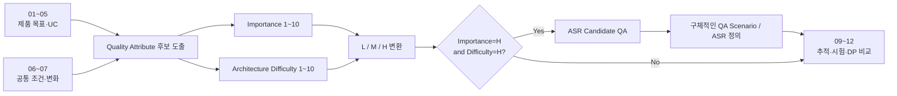

# 8. Architecture Significant Requirements — QA 도출과 ASR 선정

> 상태: **재작성 검토본 — QA 점수 및 ASR 후보 검토 필요**  
> 근거: [01 시스템 정의](./01-system-mission-and-boundary.md) · [02 용어](./02-terms.md) · [03 설계 범위](./03-fixed-architecture-scope.md) · [04 공통 흐름](./04-canonical-interaction-flow.md) · [05 UC](./05-representative-use-cases.md) · [06 비교 조건](./06-fixed-assumptions.md) · [07 변경 집합](./07-intentional-variables.md)

## 8.1 도출 절차

08은 다음 순서로 진행한다.

**Quality Attribute와 ASR은 같은 것이 아니다.**

- **Quality Attribute(QA)**: 시스템 품질을 바라보는 상위 관점이다.
- **ASR Candidate QA**: 중요도와 Architecture 난이도가 모두 H인 QA이다.
- **ASR**: 해당 QA를 Architecture 관점에서 검증할 수 있도록 stimulus, context, response, measure가 구체화된 요구이다.

따라서 H/H QA 하나에서 여러 개의 서로 다른 ASR이 나올 수 있다. 반대로 한 QA가 H/H가 아니면 이번 Architecture 핵심 driver로는 선정하지 않되, 제품 요구와 regression 검증에서는 계속 유지한다.

### Methodology Note

SEI의 QAW는 business/mission driver에서 중요한 Quality Attribute와 scenario를 식별하고 stakeholder가 scenario를 우선순위화·구체화하는 방법을 제공한다. 본 과제의 **1~10 Importance / Difficulty 점수와 L/M/H 구간은 QAW 자체의 표준 점수법이 아니라, VIA에서 판단 기준을 고정하기 위해 채택한 프로젝트 평가 규칙**이다.

- CMU/SEI, *Quality Attribute Workshops (QAWs), Third Edition*
- CMU/SEI, *Quality Attribute Workshop Collection*

---

## 8.2 점수 기준

### Importance — 제품 성공에 얼마나 중요한가

| 점수 | 판단 기준 |
| ---: | --- |
| **1–2** | 현재 제품 Mission/UC와 직접 관계가 거의 없다. 실패해도 핵심 사용자 흐름에 영향이 없다. |
| **3–4** | 있으면 좋거나 미래 범위에는 의미가 있으나, 현재 승인된 제품 범위에서 영향이 제한적이다. |
| **5–7** | 여러 UC 또는 운영에 의미 있는 영향을 주지만, 실패해도 VIA의 핵심 제품 정체성이 전체적으로 무너지지는 않는다. |
| **8–9** | 핵심 UC 여러 개 또는 전략적 제품 방향을 직접 좌우한다. 실패하면 주요 사용자 흐름이나 생태계 전략이 깨진다. |
| **10** | VIA의 Mission 또는 사용자 신뢰를 정의하는 수준이다. 실패하면 제품의 존재 이유 또는 안전한 사용 자체가 성립하지 않는다. |

### Architecture Difficulty — SW 구조로 해결하기 얼마나 어려운가

| 점수 | 판단 기준 |
| ---: | --- |
| **1–2** | 설정값, 단일 함수, 국소 구현 변경으로 해결 가능하다. |
| **3–4** | 하나의 Component/Module 내부 설계가 중심이며 외부 state/lifecycle 영향이 작다. |
| **5–7** | 여러 Component/Interface를 연결해야 하지만 책임·state 범위가 비교적 한정되어 있다. |
| **8–9** | 여러 lifecycle, state authority, runtime 또는 외부 contract가 교차하며 Architecture 책임 배치가 결과를 좌우한다. |
| **10** | 시스템의 근간이 되는 identity/state/orchestration 구조와 여러 QA trade-off를 동시에 좌우하며 국소 수정으로 해결할 수 없다. |

### L / M / H 변환

- **1–4 = L**
- **5–7 = M**
- **8–10 = H**

Importance와 Difficulty는 각각 독립적으로 평가한다. 점수를 곱해 하나의 숫자로 만들지 않는다.

---

# 8.3 VIA Quality Attribute Catalog — 한눈에 보기

01~07을 다시 기준으로 도출한 QA Catalog는 다음 10개이다.

| QA | Quality Attribute | Importance | Level | Difficulty | Level | ASR Candidate? | 핵심 근거 |
| --- | --- | ---: | :---: | ---: | :---: | :---: | --- |
| **QA-01** | **User-Experienced Responsiveness** | **9** | H | **9** | H | **Yes** | Voice/S2S, Direct Response, Agent 결과·interrupt까지 사용자가 느끼는 반응성이 핵심. local/remote model, Context, streaming, orchestration 경계가 지연에 영향 |
| **QA-02** | **Task Completion Effectiveness** | **10** | H | **9** | H | **Yes** | grounding, request refinement, compound request, task association, Agent selection이 틀리면 사용자가 원하는 일을 수행할 수 없음 |
| **QA-03** | **Interaction & Task Continuity** | **10** | H | **10** | H | **Yes** | Direct↔Agent, Voice↔Text, Conversation↔Task, multiple task의 identity/lifecycle 연속성이 VIA 제품 핵심 |
| **QA-04** | **Agent Ecosystem Interoperability & Substitutability** | **9** | H | **9** | H | **Yes** | Agent-neutral이 고정 Architecture Scope. heterogeneous Agent, protocol, lifecycle 계약 변화 대응 필요 |
| **QA-05** | **Evolvability & Maintainability** | **9** | H | **9** | H | **Yes** | Model, Context connector, persistent schema, deployment 변화가 07의 핵심 intentional variable이며 변경 전파를 구조적으로 제어해야 함 |
| **QA-06** | **Cross-Device Portability & Adaptability** | **3** | L | **8** | H | No | 다른 OS/device 이식은 어렵지만 현재 제품 범위는 사용자 PC/Windows reference이며 Mobile/TV/Robot은 명시적으로 제외 |
| **QA-07** | **Compute & Energy Efficiency** | **4** | L | **7** | M | No | Local model/resource는 의미 있으나 target CPU/GPU/RAM, battery, power budget이 아직 제품 constraint로 고정되지 않음 |
| **QA-08** | **Reliability & Recoverability** | **9** | H | **9** | H | **Yes** | async result, cancel, multiple task, failure, process restart 후 재연결이 필수 UC. state authority와 recovery contract 필요 |
| **QA-09** | **Privacy, Security & Action Safety** | **10** | H | **9** | H | **Yes** | 개인 Context, 외부 Model/Agent 전달, Consent, Action Approval이 제품 신뢰와 직접 연결 |
| **QA-10** | **Diagnosability & Operability** | **6** | M | **7** | M | No | trace/evidence는 평가와 문제 분석에 중요하지만 운영조직/SLO/MTTR 목표가 아직 제품 driver로 확정되지 않음 |

### H/H QA — ASR Candidate

따라서 현재 ASR Candidate QA는 **7개**이다.

1. **QA-01 User-Experienced Responsiveness**
2. **QA-02 Task Completion Effectiveness**
3. **QA-03 Interaction & Task Continuity**
4. **QA-04 Agent Ecosystem Interoperability & Substitutability**
5. **QA-05 Evolvability & Maintainability**
6. **QA-08 Reliability & Recoverability**
7. **QA-09 Privacy, Security & Action Safety**

이 일곱 QA 전체를 하나의 ASR로 각각 뭉뚱그리지 않는다. 아래에서 Architecture-driving scenario를 구체적인 ASR로 정의한다.

---

# 8.4 H/H QA에서 도출한 ASR Catalog — 한눈에 보기

| ASR | Parent QA | 구체적인 Architecture Requirement | Representative Measure |
| --- | --- | --- | --- |
| **ASR-01** | QA-01 | VIA가 책임지는 요청/응답 구간의 지연을 낮춘다. | **VIA-added response latency p95 (ms)** |
| **ASR-02** | QA-01 | 사용자가 말로 끼어들면 재생 중 Voice Response를 빠르게 중단한다. | **interrupt-to-audio-stop p95 (ms)** |
| **ASR-03** | QA-02 | 현재 화면 interaction으로 지칭한 대상을 정확하게 resolve한다. | **interaction-grounding exact-match (%)** |
| **ASR-04** | QA-02 | 현재 Request를 No Tracked/New/정확한 Existing Task에 연결한다. | **task-association exact-match (%)** |
| **ASR-05** | QA-02 | 하나의 User Turn에서 의미상 Request 집합을 정확하게 분해한다. | **request-set exact-match (%)** |
| **ASR-06** | QA-02 | Compound Request 사이의 사용자 명시 관계를 정확하게 보존한다. | **request-relation exact-match (%)** |
| **ASR-07** | QA-02 | 위임이 필요한 요청에 요구 capability/policy를 만족하는 Agent를 선택한다. | **valid-agent-selection rate (%)** |
| **ASR-08** | QA-03 | modality/voice connection 전환 후에도 후속 발화가 의도한 이전 Conversation 의미를 이어간다. | **conversation-continuity scenario pass rate (%)** |
| **ASR-09** | QA-03 | follow-up/status/correction에서 Agent run 변화와 무관하게 동일 사용자 업무 identity를 유지한다. | **task-identity continuity pass rate (%)** |
| **ASR-10** | QA-04 | 동일 업무 Agent를 다른 구현체로 교체해도 사용자 Task 의미를 유지하면서 변경 범위를 제한한다. | **changed architecture elements for A-02 (count)** |
| **ASR-11** | QA-04 | 기존 Agent를 유지하면서 다른 protocol의 Agent를 추가해 공존시킨다. | **changed architecture elements for A-03 (count)** |
| **ASR-12** | QA-05 | S2S Model Runtime을 같은 역할의 다른 제공자로 교체할 때 변경 범위를 제한한다. | **changed architecture elements for M-01 (count)** |
| **ASR-13** | QA-05 | Semantic Model Runtime을 같은 역할의 다른 제공자로 교체할 때 변경 범위를 제한한다. | **changed architecture elements for M-02 (count)** |
| **ASR-14** | QA-05 | 같은 Context 종류의 provider contract가 바뀌어도 기능을 유지하면서 변경 범위를 제한한다. | **changed architecture elements for C-01 (count)** |
| **ASR-15** | QA-05 | Conversation/Task persistent state schema가 진화해도 의미와 recovery 관계를 유지한다. | **changed architecture elements for C-06 (count)** |
| **ASR-16** | QA-08 | 비동기 Agent event를 정확한 VIA Task/Execution에 연결한다. | **async-event binding exact-match (%)** |
| **ASR-17** | QA-08 | VIA process restart 후 복구 가능한 Task를 중복 실행 없이 재연결한다. | **restart-recovery scenario pass rate (%)** |
| **ASR-18** | QA-08 | 접수·진행·완료·취소·실패 상태를 확인된 사실보다 앞서거나 다르게 보고하지 않는다. | **truthful-state reporting pass rate (%)** |
| **ASR-19** | QA-09 | Context read/egress가 현재 유효한 policy/consent 범위를 벗어나지 않는다. | **unauthorized access/egress count** |
| **ASR-20** | QA-09 | approval/denial을 정확한 pending Action에만 적용한다. | **approval misbinding count** |

**20개는 20개의 DP나 20개의 가중치가 아니다.** H/H QA에서 나온 구체적인 Architecture scenario catalog이다. 12에서는 각 DP가 실제로 크게 영향을 주는 **Primary ASR 약 3~4개**만 선택한다.

---

# 8.5 ASR 정의 상세

## ASR-01 — VIA-added Response Latency

- **Parent QA:** QA-01 Responsiveness
- **Stimulus:** 사용자가 Voice/Text Request를 완료하거나, Agent 결과가 VIA에 준비된다.
- **Environment:** 06의 고정 network/model/fixture 조건.
- **Response:** VIA가 해당 Request/Result의 유효한 사용자 응답을 시작한다.
- **Measure:** **VIA-added response latency p95 (ms)**.
- **포함:** VIA가 직접 사용하는 S2S/Semantic Model, Context access, orchestration, result binding, response delivery.
- **제외:** Downstream Agent 내부의 실제 research/planning/tool execution 시간.
- **주의:** 업무를 Agent 쪽으로 옮겨 excluded time을 키운 것을 responsiveness 개선으로 간주하지 않는다. FA-12를 적용한다.

## ASR-02 — Voice Interruption Stop Latency

- **Parent QA:** QA-01
- **Stimulus:** Voice Response 재생 중 사용자가 새로운 발화를 시작한다.
- **Response:** 기존 Voice Response 출력이 중단된다.
- **Measure:** **interrupt onset → audio stop p95 (ms)**.
- **제외:** 새로운 발화의 semantic 처리 완료 시간, 진행 중 Agent Task 취소 시간.

## ASR-03 — Interaction Grounding Accuracy

- **Parent QA:** QA-02 Task Completion Effectiveness
- **Stimulus:** 사용자가 selection/pointer/drag/focus와 함께 on-screen 대상 지칭 표현을 사용한다.
- **Response:** VIA가 표현을 실제 대상·집합·영역에 resolve한다.
- **Measure:** **interaction-grounding exact-match test pass rate (%)**.
- **제외:** open-but-not-visible file 검색, Conversation/Task referent, Agent가 대상에 실제 Action을 성공했는지 여부.

## ASR-04 — Task Association Accuracy

- **Parent QA:** QA-02
- **Stimulus:** 새 VIA Request가 현재 Conversation/Task context 안에 들어온다.
- **Response:** VIA가 No Tracked / New / Existing을 판단하고 Existing이면 정확한 VIA Task를 선택한다.
- **Measure:** **task-association exact-match pass rate (%)**.
- **제외:** Agent에게 실제 control command가 성공적으로 전달되었는지 여부.

## ASR-05 — Compound Request Decomposition Accuracy

- **Parent QA:** QA-02
- **Stimulus:** 하나의 User Turn에 둘 이상의 의미상 사용자 Request가 포함된다.
- **Response:** VIA가 의미상 Request 집합을 누락·중복·불필요 분할 없이 식별한다.
- **Measure:** **request-set exact-match pass rate (%)**.
- **제외:** Request 사이 관계의 종류와 Agent workflow planning.

## ASR-06 — Compound Request Relation Accuracy

- **Parent QA:** QA-02
- **Stimulus:** Compound Request에 independent / sequential / data-dependent / conditional 관계가 명시된다.
- **Response:** VIA가 분해된 Request 사이 관계를 사용자 의도대로 표현·보존한다.
- **Measure:** **request-relation exact-match pass rate (%)**.
- **제외:** Request node 자체의 누락 여부(ASR-05), Agent 내부 plan.

## ASR-07 — Agent Selection Correctness

- **Parent QA:** QA-02
- **Stimulus:** Downstream Agent 업무가 필요한 VIA Task와 사용 가능한 Agent capability/policy 목록이 주어진다.
- **Response:** VIA가 요구 capability와 현재 정책 조건을 만족하는 Agent를 선택한다.
- **Measure:** **valid-agent-selection pass rate (%)**.
- **제외:** 선택된 Agent의 domain task quality.

## ASR-08 — Conversation Continuity Correctness

- **Parent QA:** QA-03 Interaction & Task Continuity
- **Stimulus:** Direct Response 후 follow-up, Voice↔Text 전환 또는 Voice Connection 재연결이 발생한다.
- **Response:** 후속 User Turn이 의도한 이전 Conversation content/referent를 계속 참조한다.
- **Measure:** **conversation-continuity scenario pass rate (%)**.
- **제외:** VIA Task identity 유지(ASR-09), process restart recovery(ASR-17).

## ASR-09 — Task Identity Continuity Correctness

- **Parent QA:** QA-03
- **Stimulus:** 기존 업무에 status/follow-up/correction이 발생하거나 Agent 내부 run이 바뀐다.
- **Response:** VIA가 같은 사용자 업무 목표를 동일 VIA Task identity로 유지·연결한다.
- **Measure:** **task-identity continuity scenario pass rate (%)**.
- **제외:** Agent event 자체의 binding 정확도(ASR-16), process restart(ASR-17).

## ASR-10 — Agent Substitutability

- **Parent QA:** QA-04 Agent Ecosystem Interoperability & Substitutability
- **Stimulus:** 같은 사용자 업무 capability를 제공하는 Agent A를 Agent B로 교체한다(A-02).
- **Response:** 기존 VIA Task semantics와 사용자-facing 기능을 유지하도록 Architecture를 변경한다.
- **Measure:** **changed architecture elements for A-02 (count)**.
- **제외:** 새로운 protocol 계열 추가(ASR-11).

## ASR-11 — Agent Protocol Extensibility

- **Parent QA:** QA-04
- **Stimulus:** 기존 Agent protocol은 유지한 채 다른 protocol의 Agent를 추가한다(A-03).
- **Response:** 두 protocol을 동시에 지원하면서 기존 사용자 기능을 유지한다.
- **Measure:** **changed architecture elements for A-03 (count)**.
- **제외:** 같은 protocol 안에서 provider만 교체하는 상황(ASR-10).

## ASR-12 — S2S Runtime Substitutability

- **Parent QA:** QA-05 Evolvability & Maintainability
- **Stimulus:** 동일 역할/배치에서 S2S Model Runtime 제공자를 A→B로 교체한다(M-01).
- **Response:** Voice 기능과 Conversation 연계를 유지하도록 필요한 Architecture 변경만 수행한다.
- **Measure:** **changed architecture elements for M-01 (count)**.
- **제외:** event contract 자체가 달라지는 M-07, deployment 이동 M-04~06.

## ASR-13 — Semantic Model Runtime Substitutability

- **Parent QA:** QA-05
- **Stimulus:** 동일 semantic responsibility/배치에서 Semantic Model Runtime 제공자를 A→B로 교체한다(M-02).
- **Response:** Request refinement/grounding/task association 등 해당 책임 기능을 유지한다.
- **Measure:** **changed architecture elements for M-02 (count)**.
- **제외:** model responsibility 자체 변경, deployment 이동.

## ASR-14 — Context Provider Substitutability

- **Parent QA:** QA-05
- **Stimulus:** 같은 Context 종류의 Provider A를 Provider B로 교체한다(C-01).
- **Response:** Context 의미와 기존 사용자 기능을 유지한다.
- **Measure:** **changed architecture elements for C-01 (count)**.
- **제외:** 새로운 Context 종류 추가, 문서 format parser 확장.

## ASR-15 — Persistent Task-State Schema Evolvability

- **Parent QA:** QA-05
- **Stimulus:** persistent Conversation/Request/Task state schema가 V1→V2로 변경된다(C-06).
- **Response:** 기존 대화 의미, Task identity, recovery 관계를 보존하며 migration한다.
- **Measure:** **changed architecture elements for C-06 (count)**.
- **제외:** User Memory schema(C-04), storage product 교체 자체.

## ASR-16 — Async Agent Event Binding Correctness

- **Parent QA:** QA-08 Reliability & Recoverability
- **Stimulus:** 여러 active Task 중 Agent progress/clarification/result/failure event가 비동기로 도착한다.
- **Response:** VIA가 event를 정확한 VIA Task와 Agent Execution에 연결한다.
- **Measure:** **async-event binding exact-match pass rate (%)**.
- **제외:** event 내용의 domain correctness, 사용자 control direction.

## ASR-17 — Restart Recovery Correctness

- **Parent QA:** QA-08
- **Stimulus:** VIA process memory가 사라진 뒤 process가 재시작된다.
- **Response:** 외부 실행을 확인할 수 있으면 기존 Conversation/Task/Execution 관계를 재연결하고, 확인 불가하면 중복 state-changing Action 없이 불확실성을 알린다.
- **Measure:** **FA-14 restart-recovery scenario pass rate (%)**.
- **제외:** 정상 실행 중 network reconnect만의 처리.

## ASR-18 — User-visible Task State Truthfulness

- **Parent QA:** QA-08
- **Stimulus:** Agent의 접수/진행/완료/취소/실패 event가 도착하거나 상태가 아직 확인되지 않았다.
- **Response:** VIA가 확인된 state보다 앞서거나 다르게 사용자에게 보고하지 않는다.
- **Measure:** **truthful-state reporting scenario pass rate (%)**.
- **제외:** 올바른 Task에 event를 binding했는지 여부(ASR-16).

## ASR-19 — Context Authorization Enforcement

- **Parent QA:** QA-09 Privacy, Security & Action Safety
- **Stimulus:** VIA가 개인 Context를 read하거나 외부 Model/Agent에 전달하려 한다.
- **Response:** 현재 유효한 policy/consent 범위 안에서만 접근·전달한다.
- **Measure:** **unauthorized context access/egress count**.
- **제외:** Action 승인 binding(ASR-20).

## ASR-20 — Action Approval Binding Correctness

- **Parent QA:** QA-09
- **Stimulus:** 하나 이상의 pending state-changing Action approval이 존재하고 사용자가 approve/deny 응답을 한다.
- **Response:** 응답을 정확한 pending Action/VIA Task에만 적용한다.
- **Measure:** **approval misbinding count**.
- **제외:** Agent 내부 authorization enforcement 또는 Action execution success.

---

# 8.6 H/H가 아닌 QA의 처리

H/H가 아니라고 해서 무시하지 않는다.

| QA | 처리 |
| --- | --- |
| **QA-06 Cross-Device Portability** | 현재 제품 범위가 PC/Windows이므로 Core ASR에서는 제외. 향후 scope 변경 시 재평가 |
| **QA-07 Compute & Energy Efficiency** | local resource·memory·energy 자료를 secondary observation으로 기록. 목표 HW/전력 constraint가 정해지면 재평가 |
| **QA-10 Diagnosability & Operability** | 모든 후보가 correlation ID, trace, test evidence를 제공하도록 supporting requirement로 유지. 현재 독립 score/ASR은 만들지 않음 |

---

# 8.7 07 Closed Change Catalog와 ASR 관계

07의 24개 change scenario 모두를 ASR로 만들지 않는다.

- **ASR은 Architecture Driver를 대표하는 좁고 명확한 scenario**이다.
- 나머지 change는 regression/change analysis에서 계속 적용한다.

예:

| Change | 처리 |
| --- | --- |
| M-01 | ASR-12의 primary scenario |
| M-02 | ASR-13의 primary scenario |
| M-03 | QA-05 regression — model capability 차이와 architecture 영향 분리 |
| M-04~09 | QA-05 regression/change analysis |
| A-02 | ASR-10 primary |
| A-03 | ASR-11 primary |
| A-01, A-04~09 | QA-04 regression/change analysis |
| C-01 | ASR-14 primary |
| C-06 | ASR-15 primary |
| C-02~05 | QA-05 regression/change analysis |

따라서 변화 목록의 개수가 ASR 개수를 결정하지 않는다.

---

# 8.8 Representative Metric 원칙

- 각 **ASR에는 대표 metric 하나**를 둔다.
- 동일 ASR metric은 어느 DP에서 사용하든 바꾸지 않는다.
- QA 수준의 종합 점수를 만들 경우에도 ASR raw metric을 임의로 섞지 않고, 11에서 승인한 공통 scoring rule을 사용한다.
- 목표값과 0~5 score boundary는 **후보 최종 결과를 보기 전에 11에서 동결**한다.
- ASR-19·20처럼 safety violation count를 쓰는 경우, 다른 QA의 높은 점수로 위반을 보상하지 않는다.

---

# 8.9 09~12로 넘길 것

## 09 — QA/ASR Traceability

- QA → ASR
- ASR → Primary UC / Regression UC
- ASR → 07 Change Scenario
- 실패 시 사용자 영향

을 한 표에서 연결한다.

## 10 — Architecture Element Definition

ASR-10~15의 change impact를 동일하게 세기 위해 Architecture Element granularity를 확정한다.

## 11 — Test Case & Metric Freeze

각 QA/ASR별로:

- exact test input
- ground truth
- 반복 횟수
- metric 계산법
- **QA 대표 metric의 target**
- **0~5 score boundary**

를 후보 결과 전에 동결한다.

같은 QA에는 모든 DP에서 같은 metric/target/scoring 기준을 사용한다.

## 12 — Architecture Decision Points

각 DP마다 전체 QA/ASR 목록에서 **실제 인과관계가 큰 Primary QA 약 3~4개**를 선택한다.

그 QA에 연결된 ASR scenario와 Test Case로 trade-off를 비교한다. 후보에게 유리하도록 QA 정의나 metric을 바꾸지 않는다.

---

# 8.10 이번 리뷰에서 확인할 것

가장 먼저 **8.3의 QA 10개와 점수**를 검토한다.

1. QA 후보 자체에 빠진 품질이 있는가?
2. Importance 1~10의 판단이 제품 관점에서 납득되는가?
3. Difficulty 1~10의 판단이 실제 Architecture 문제 크기와 맞는가?
4. 따라서 H/H로 선정된 7개 QA가 맞는가?
5. 그 다음에만 8.4~8.5의 ASR이 각 QA를 너무 넓지 않게 구체화했는지 검토한다.

**QA 점수가 잘못되면 ASR 목록도 다시 바뀌어야 한다. 따라서 08은 QA scoring 승인 전에는 닫지 않는다.**
