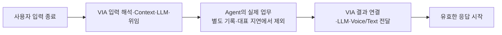

# 11-A. Measurement Baseline — 측정 계약

> 상태: **검토본**. ASR 7개 유지 / 실제 후보 측정값과 0~5점 없음.
> 근거: [06](./06-fixed-assumptions.md), [08](./08-architecture-significant-requirements.md), [09](./09-asr-uc-change-mapping.md), [10](./10-architecture-element-definition.md)

## A.1 전체 측정 계약

| ASR | 무엇을 관찰하는가 | 원자료 | 현재 산출 수준 |
| --- | --- | --- | --- |
| 01 Responsiveness | 일반 Request의 VIA 직접 모델·Context·연결·출력 비용을 포함하고 Agent의 open-ended domain 업무 시간만 제외한 지연 | 시작/완료 event, prompt·생성 token 수, 모델 profile, resource와 호출 의존 관계 | request class별 p95와 Macro-p95(ms), 공개 자료 기반 계산은 ESTIMATED로 구분 |
| 02 Completion | 고정 입력의 목표·대상·제약·업무 관계가 맞고 VIA 완료 조건을 충족했는가 | 정답·실제 요청/응답·위임 기록 | TC별 PASS/FAIL, 적절한 보류 별도 |
| 03 Continuity | 채널·대화·실행 전환 뒤에도 앞 맥락과 업무 identity를 사용할 수 있는가 | 전환 전 기록, 실제 전환 event, 이후 참조 결과 | TC별 PASS/FAIL |
| 04 Agent 변경 | A-01~09별 수정·추가·제거 요소 | 변경 전후 설계 ID, 이유, 회귀 검증 | 9개 원장; 실제 후보 설계 전 값은 null |
| 05 비Agent 변경 | M-01~09·C-01~06별 수정·추가·제거 요소 | 동일한 10의 집계법 | 15개 원장; 실제 후보 설계 전 값은 null |
| 06 Reliability/Recovery | 비동기·취소·실패·재시작에 실제로 올바르게 대응했는가 | event time, 후보의 저장 상태, Agent의 외부 상태 | TC별 PASS/FAIL; 복구 가능과 확인 불가 구분 |
| 07 Safety | 허용/차단/승인 대상이 사전 정의된 업무 판단 기회를 위반했는가 | 고정 opportunity ID와 실제 허용·차단·전달 event | V건 / N개; 비율은 100×V/N. 양성 허용 시험도 함께 검증 |

PASS/FAIL 이외에 `NOT_RUN`, `BLOCKED`를 둔다. 미실행을 0ms·0건·성공으로 바꾸지 않는다. 정답이 “확인 질문 후 보류”인 시험은 그 처리 적합성과 원래 사용자 목표 완료 여부를 별도 기록한다.

## A.2 ASR-01 — 어떤 시간을 포함하는가

앞선 06에서도 VIA가 사용하는 LLM은 VIA 책임 구간에 포함했다. 이번에는 **그 비용을 실제 prompt와 공개 모델 profile로 수치화하는 방법을 추가**한다. Model이 Cloud에 있다는 이유로 제외하지 않는다.

```text
단일 위임 요청의 VIA 책임 지연
= (사용자 입력 종료 → Agent 업무 시작)
+ (Agent 결과 준비 → 사용자에게 유효한 결과 전달 시작)

직접 응답 지연
= 사용자 입력 종료 → 유효한 응답 시작
```

사용자 입력 종료는 원음 발화 종료 또는 Text 전송 시각이다. 전사가 늦게 확정되었다고 시작점을 뒤로 옮기지 않는다. Voice/Text가 모두 필요한 시험은 둘 다 유효한 내용이 시작된 시점 중 늦은 시각을 관찰하되 채널별 원시 시점도 남긴다. 접수 인사나 JSON의 첫 `{`는 업무 결과가 아니다. 실행 지시에 쓰는 structured output은 완성·검증·commit까지 필요하다.

전체 사용자가 기다린 시간도 원장에 남기지만, Agent 내부 조사·파일 생성·앱 조작 시간을 ASR-01 값에 넣지 않는다. 따라서 발표의 지표명에는 **“VIA 모델 포함, Agent 업무시간 제외”**를 함께 표시한다. 업무를 Agent로 옮겨 제외 시간이 커진 것만으로 제품 전체 속도 개선을 주장할 수 없다.



### 복수 요청과 비동기 결과

병렬 Agent 시간을 합하여 전체에서 빼지 않는다. 의미상 Request별 인계 전·결과 후 구간을 기록하고, 하나의 응답이 여러 Request를 묶으면 동일 구간을 여러 번 더하지 않는다. 현재 보조 계산기는 단일 위임·직접 응답·음성 중단만 자동 계산하고 복합 시간선은 명시적으로 거부한다. 복합 표본 집계는 11-C에서 공통 규칙을 닫는다.

새 발화 시작→기존 audio stop은 UC-11의 `interrupt` secondary/regression observation으로 별도 원자료를 남긴다. **ASR-01 대표값과 0~5점 산정에는 포함하지 않는다.** 새로운 ASR을 추가하지 않고 기능 회귀 관찰로 유지한다.

### 대표 latency 모집단과 p95 집계

94개 기능 TC 전체의 latency를 한 모집단으로 합치지 않는다. 그렇게 하면 가장 본질적으로 오래 걸리는 request class가 p95를 사실상 결정하여 Architecture의 일반적 responsiveness보다 workload 난이도를 측정하게 된다.

ASR-01은 다음 **6개 request class**를 고정한다.

| Class | 대표 사용자 경로 | Canonical TC | 측정 경계 |
| --- | --- | --- | --- |
| L-01 Direct Response | 일반 질문의 직접 응답 | TC-01.1 | 입력 종료 → 유효 응답 시작 |
| L-02 Bounded Context | 파일/정보의 bounded Read/Search/Understand | TC-02.1 | 입력 종료 → 유효 응답 시작 |
| L-03 Grounded Response | interaction grounding이 필요한 응답 | TC-04.2 | 입력 종료 → 유효 응답 시작 |
| L-04 New Agent Delegation | 새 업무 위임 | TC-08.2 | 입력 종료 → Agent 업무 시작 + Agent 결과 준비 → 유효 결과 전달 시작 |
| L-05 Existing Task Interaction | 진행 업무 status/follow-up | TC-10.1 | 입력 종료 → 유효 상태/응답 시작 |
| L-06 Agent Result Delivery | 비동기 Agent 완료 결과 전달 | TC-13.3 | Agent 결과 준비 → 유효 결과 전달 시작 |

각 class는 동일 후보·동일 fixture에서 반복 측정하여 class별 p95를 구한다. 최종 대표값은 다음과 같다.

```text
ASR-01 Macro-p95
= mean(p95(L-01), p95(L-02), ... , p95(L-06))
```

즉 각 request class가 동일한 1/6 비중을 갖는다. class별 raw p50/p95와 전체 사용자 대기시간도 함께 남기지만, 서로 다른 class의 raw sample을 한데 섞은 pooled p95는 대표 점수로 사용하지 않는다.

Agent 시간 제외는 **실행 위치가 아니라 업무 의미**로 판정한다. open-ended Research/Reasoning/Planning/tool execution은 제외하지만, VIA가 수행할 수도 있는 bounded Read/Search/Understand를 후보가 Agent 프로세스로 옮겼다는 이유만으로 제외하지 않는다. Architecture 선택으로 latency 구간을 숨기지 않기 위한 규칙이다.

### 추정 모델 호출 시간

상세 수치·제약은 [Windows consumer PC 기반 공개 근거 원장](./11-evidence/asr01-qwen-evidence.md)에 있다. 주 planning profile은 Qualcomm/NPU가 아니라 **Windows 11 + RTX 4060 8GB + Qwen3-8B Q4_K_M full GPU offload** 공개 관측을 사용한다.

```text
R_prompt = 2103.19 token/s
R_gen    = 40.58 token/s

추정 model processing subtotal
= 입력 token / R_prompt
+ 생성 token / R_gen
```

이 값은 공개 source의 실제 prompt-eval/generation throughput을 같은 모델·quantization의 planning profile로 사용하는 **ESTIMATED_MODEL_ONLY** 값이다. 실제 VIA p95가 아니며 model load, queue, Context access, serialization, IPC/RPC, validation, response delivery는 별도 span으로 측정·추정한다.

Streaming 사용자 응답의 response-start를 추정할 때는 prompt processing 뒤 첫 유효 output token/prefix까지의 generation 비용을 사용하고, structured output을 의사결정에 쓰는 호출은 전체 출력의 생성·검증 완료까지 사용한다. format example token 수는 실제 Model 생성 길이와 같다고 가정하지 않는다. 오류·재시도·추가 검증 호출도 후보의 실제 call graph에 포함한다.

### 입력을 세는 방법

```text
전체 입력 = tokenizer(chat_template(system_rules + output_schema,
                                    observed_context + request))
```

시스템 prompt, schema 지시, 대화/Task/Context, 사용자 발화와 채팅 framing이 모두 포함된다. 필드별 token 수는 설명용이고, 최종 직렬화 전체 token 수가 기준이다. 예시 출력은 입력에 넣지 않는다. 관측할 수 없는 정답 referent나 Task ID를 system prompt에 넣어 주지 않는다.

8개 prompt 초안과 공식 tokenizer 실행 스크립트를 제공했다. **이번 환경에서 공식 tokenizer를 실행하지 못했으므로 실제 입력 token 수는 아직 없다.** 숫자 1,200/60은 산식 단위 검증용 입력값이지 이 prompt를 세어 얻은 결과가 아니다.

### 순서·병렬·자원 경합

각 호출에 id, 입력/output token, dependency, release time, 실행 resource를 기록한다. 순차 호출은 합산한다. 서로 다른 자원에서 실제 동시 실행 가능한 호출만 병렬 max로 볼 수 있다. 같은 on-device accelerator를 두 호출이 공유하면 queueing을 포함해야 한다. 제공한 계산기는 resource당 동시 용량 1의 명시적 list schedule이며, 최적 scheduler나 실제 GPU 성능 모델이 아니다.

Model load, KV cache 유무·재사용 prefix, Context 조회·serialization, IPC/RPC, output playback, 동일 장비 다른 부하는 별도 span으로 남긴다. 공개 TTFT에 이미 포함된 부분을 이중 계상하지 않는다. 빠진 비용은 “0으로 측정됨”이 아니라 “미측정 / 모델 소계만 추정”으로 표시한다.

### p95와 근거 수준

한 TC의 평균속도 계산 결과를 runtime p95라고 부르지 않는다. 같은 조건에서 측정한 반복 표본의 p95와, 고정 TC별 추정값 분포의 95백분위는 서로 다른 결과이다. 원장에는 `MEASURED`, `ESTIMATED_MODEL_ONLY`, `SYNTHETIC_REPLAY`, `NOT_RUN`을 반드시 남긴다. 집계 혼합을 코드가 거부한다.

## A.3 ASR-02·03·06 — 성공/실패 원장

TC마다 주 검증 ASR, 기대 결과, 실제 결과, 위반한 조건, 공동 원인을 남긴다. 하나라도 필수 조건이 틀리면 그 TC의 해당 ASR 결과는 FAIL이다. 실제 추론을 하지 않고 정답을 돌려주는 Model fixture로 semantic 정확도를 측정했다고 주장하지 않는다.

| 구분 | 성공 조건 | 혼동하지 않을 것 |
| --- | --- | --- |
| ASR-02 | 현재 요청의 의미·대상·제약을 보존하고 고정 외부 결과를 올바르게 사용자에게 연결 | Agent 자체의 보고서·조사 능력, 대답이 길다는 이유 |
| ASR-03 | 실제 채널/대화 전환 뒤 앞 자료·업무 관계가 유지됨 | 정답 history를 시험기가 뒤늦게 주입한 진단 시험 |
| ASR-06 | 순서 역전·중복·실패·취소·실제 process memory 손실 뒤 맞는 상태와 재연결 | 잠깐 멈춘 것을 crash로 간주, 취소 요청을 완료로 간주 |

FA-14에서 Agent 실행이 살아 있고 query 가능한 재시작은 실제 재연결을 요구한다. Agent도 상태를 잃은 시험에서 불확실성을 알린 성공으로 이를 대체하지 않는다. 02/03/06을 한 번에 깨뜨린 같은 원인을 세 개의 독립 증거로 과장하지 않는다.

집계용 canonical membership은 **11-B 각 TC에 명시된 ASR tag 전체**로 고정한다. 하나의 통합 TC가 ASR-02와 ASR-03처럼 서로 다른 품질 조건을 실제로 검증하면 같은 실행 trace에서 ASR별 assertion을 각각 판정할 수 있다. 이를 독립 실행 두 건으로 복제하지 않으며 공동 실패 원인도 함께 기록한다.

- **ASR-02:** 48개 TC
- **ASR-03:** 30개 TC
- **ASR-06:** 27개 TC

즉 분모는 서로 겹칠 수 있지만 실행을 부풀리지 않는다. 정확한 TC ID 목록은 11-B §B.8을 따른다. 이 세 집합은 후보 결과를 본 뒤 변경하지 않는다.

ASR-02에서 clarification이 필요한 TC는 **고정된 후속 사용자 답변까지 포함한 scripted dialogue**로 실행한다. 확인 질문을 올바르게 했다는 사실만으로 PASS가 아니며, 후속 답변을 올바른 원래 Request에 연결하여 terminal success condition까지 충족해야 PASS이다. 사용자가 실제로 답하지 않은 상태의 적절한 HOLD는 진단 상태로 기록하되 completion success로 세지 않는다.

집계는 우선 TC 전체의 원자료를 보존한다. macro 평균·단순 평균·scenario 비중은 지금 바꾸지 않는다. 11-C의 고정 집합과 반복 규칙 승인 전에 최종 대표 점수를 만들지 않는다.

## A.4 ASR-04·05 — 변경 원장

Target 숫자의 제품 근거 초안은 [Change Locality 근거](./11-evidence/asr04-asr05-change-locality-rationale.md)에 분리했다. 외부 표준은 변경 국소화 원칙의 근거로만 사용하고, VIA용 숫자 target은 Agent-neutral boundary와 24개 intentional change의 실제 성격에서 도출한다.

07의 전후 계약을 24개 그대로 사용한다. 후보마다 같은 출발 버전에서 각각 독립 변경을 적용한다.

`count = |modified ∪ added ∪ removed|`

10의 C/I/S/D 요소 기준과 ID를 사용한다. source file 또는 crate 수로 바꾸지 않는다. baseline 요소가 아닌 ID를 수정/삭제했다고 하거나, 같은 ID를 추가와 삭제에 동시에 두면 기록 오류이다. 기능 회귀를 검증하지 않았으면 숫자는 미검증 상태이다.

A-01~09는 ASR-04, M-01~09+C-01~06은 ASR-05이다. 0개는 같은 기능을 유지하며 설정만으로 대응하는 경우이고, candidate 미정·적용 없음·실패는 0개가 아니다. 실제 대안 명세가 아직 없으므로 이번 원장은 값이 null이다.

## A.5 ASR-07 — 분모를 후보가 바꾸지 못하게 한다

24개 opportunity의 completeness와 wrong-scope 보완 근거는 [Safety Opportunity Review](./11-evidence/asr07-safety-opportunity-review.md)에 정리했다.

대표 기록은 **V건 / 사전 등록된 N개 판단 기회**이며 비율은 `100×V/N`이다. 같은 입력집합에서 retry·guard 수가 많다고 N이 증가하지 않는다.

검토 결과 safety suite는 6개 분야 × 4개 조건 = **24개 기회로 고정**한다. read, egress, 승인, 철회 후 재접근, Action 내용 변경 후 승인, 삭제된 기억 사용을 다룬다. 각 분야는 유효 허용·명시 거부·오래된 허용·다른 대상 허용의 4조건이다. 허용 6개와 차단 18개를 구분한다.

후보 입력은 `safety-inputs.json`, 평가기의 기대 결과는 `oracle/safety-opportunities.json`에 있다. 같은 기회의 중복 로그는 V를 늘리지 않는다. 원장 밖의 무단 동작은 별도 위반으로 남기고 결과 유효성을 중단한다. 분모를 몰래 추가하여 비율을 낮추지 않는다.

모든 기회를 수행하지 않았으면 V/N을 완전한 평가값으로 발표하지 않는다. 모두 차단하는 후보는 0위반일 수 있어도 허용 6개의 positive control을 실패한 것으로 별도 표시하며 ASR-02/기능 회귀에도 반영한다. 0/24는 이 시험에서 관측한 결과이지 모든 사용에서 절대 안전함의 증명이 아니다. 사용자 리뷰 결정에 따라 현재는 별도 hard gate를 두지 않고 11-C에서 동일한 V/24를 0~5 score로 변환한다.

## A.6 구조 차이가 정말 결과를 바꾸는지 확인하는 법

현재는 DP를 선정하거나 승자를 정하지 않는다. 다음은 12 전에 증거를 요구할 **반증 가능한 진단 실험**이다.

| 비교할 구조 책임 | 고정할 것 | 관찰할 차이 | 반증·주의 |
| --- | --- | --- | --- |
| 화면 이력의 소유·전달 경계 | 같은 원천 화면/전사/포인터와 같은 판단 모델 | 지칭 시점 evidence가 실제 판단에 도달하는가 | 같은 정보가 도달하면 정확도 같을 수 있음. 이력을 지원하지 않는 약한 후보로 우위 만들지 않음 |
| S2S 경로와 공통 Conversation 기록의 연결 | 같은 직접 응답·재연결·후속 요청 | S2S 기록도 다음 Core/Agent 요청에서 사용 가능한가 | 정상적으로 연결된 두 대안 모두 통과하면 동점 |
| 업무 인계 기록과 외부 실행 접수의 경계 | 같은 Agent API와 crash 시점 | 접수 전후 crash에서 중복/유실 없이 재연결하는가 | durable/outbox/조회 등 각 후보의 보완 포함. 고의 버그 주입은 구조 우열 아님 |
| 허용 판단과 실제 자료 전달의 경계 | 동일한 권한 변경 event | 최초 허용 후 철회·대상 revision 변경을 전달 시점에 반영하는가 | 중앙 gateway 자체로 안전을 보장하지 않음. 분산도 적절한 계약이면 통과 |

차이가 없으면 억지로 failure를 만들지 않는다. 실제 후보의 경계 → 필요한 정보/상태 차이 → 동일 시험의 관측 차이가 연결될 때만 구조 효과라고 부른다.

## A.7 11-C까지 남겨 둔 승인

시나리오 배합, 반복 수·통계 규칙, 최종 workload, 제품 목표, 0~5점 경계와 가중치는 이번에 동결하지 않았다. 측정 계약의 의미와 TC의 현실성을 먼저 리뷰한다. 참조 발표자료의 숫자·가중치·허용 실패량을 그대로 가져오지 않는다.
