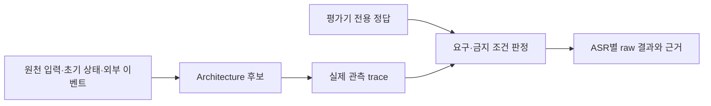

# 11-B. Test Case Catalog — 입력·정답 검토본

> 상태: **사용자 리뷰 승인 완료 / 후보 실행 NOT_RUN**. 11-C의 최종 반복·점수는 미동결.
> 원문 UC는 [05](./05-representative-use-cases.md), 변경 전후 원문은 [07](./07-intentional-variables.md)이다.

## B.1 원자료 구성

기본 fixture는 가상 예산안(120백만원, 전년100), 견적서(500만원), 교육 메일, 일정, 가격표, 두 개 Task(T-PPT/T-MAIL), 복수 Agent의 기능, 이전 TCP/UDP 대화, 명시적으로 허용한 기억으로 구성된다. 실제 사용자의 메일·파일이나 인터넷의 최신값이 아니다.

각 TC는 기본 원천 fixture + 지정 patch의 초기 상태·event + 사용자 입력으로 정의한다. 원천 자료는 Source 조회 경로에 놓이며 모델 prompt에 통째로 무료 제공하지 않는다. `oracle/expected.json`은 후보에게 주지 않는다. 아래 정답 설명은 리뷰용이고 일부는 의미 검토가 필요하다. 단순 문장 일치로 한국어 답변의 정확도를 판정하지 않는다.

TC별 최소 필드는 ID, UC, 입력, 초기 상태/외부 fixture, 기대 관찰, 금지 관찰, 주 ASR, 실제 관측 위치, 실행·asset 준비 상태이다. 아래 표의 성공 조건은 해당 ASR의 검토 규칙이며 실제 통과 결과가 아니다.



## B.2 94개 기본 UC 시험 명세


### UC-01

| TC / 입력 | 초기 상태·이벤트 patch | 필수 관찰 / 금지 관찰 | ASR |
| --- | --- | --- | --- |
| **TC-01.1 일반 질문**<br/>TCP와 UDP 차이가 뭐야? | `normal` | TCP/UDP 차이에 대한 응답 1회;  Conversation에 입력·응답 연결<br/>금지: 같은 요청에 S2S/Core 중복 응답 | ASR-02 |
| **TC-01.2 앞 응답 일부**<br/>방금 두 번째 방식은 언제 써? | `normal` | 앞 UDP 설명을 후속 맥락으로 참조<br/>금지: 새 주제로 오인하거나 TCP를 두 번째 설명으로 선택 | ASR-03 |
| **TC-01.3 새 주제**<br/>새 질문인데 피타고라스 정리를 설명해줘 | `normal` | 새 주제 답변;  기존 Task에 잘못 붙이지 않음<br/>금지: T-PPT 수정/취소 | ASR-02,ASR-03 |
| **TC-01.4 Text 일반 질문**<br/>TCP와 UDP 차이가 뭐야? | `text` | Text 답변과 대화 기록;  음성 경로 강제하지 않음<br/>금지: voice inactive인데 새 음성 연결 필수 | ASR-02 |

### UC-02

| TC / 입력 | 초기 상태·이벤트 patch | 필수 관찰 / 금지 관찰 | ASR |
| --- | --- | --- | --- |
| **TC-02.1 파일/폴더**<br/>예산안 문서의 결론만 알려줘 | `normal` | doc-budget 결론을 근거로 답변<br/>금지: doc-quote 금액을 결론으로 보고 | ASR-02 |
| **TC-02.2 메일**<br/>지난주 김대리 메일에서 교육 시간을 알려줘 | `normal` | mail-17의 9월23일14시를 식별<br/>금지: 시험 clock 대신 오늘 실제 메일 조회 | ASR-02 |
| **TC-02.3 일정**<br/>오늘 오후 일정을 알려줘 | `normal` | cal-1 팀 회의16~17시;  날짜/시간대 유지<br/>금지: 다른 날짜 일정 혼합 | ASR-02 |
| **TC-02.4 페이지**<br/>이 가격표에 얼마라고 나와? | `page` | page-price 25000원과 기준일 참조<br/>금지: 현재 실제 판매가라고 주장 | ASR-02 |
| **TC-02.5 공개 정보**<br/>지정 환율 자료의 기준 환율 알려줘 | `normal` | public-rate 시험값1300과 출처/시점 전달<br/>금지: 실제 시장 환율로 주장 | ASR-02 |
| **TC-02.6 브라우저 기록**<br/>북마크에 저장한 제품 가격표 찾아줘 | `normal` | bookmark-1의 page-price로 연결<br/>금지: 다른 자료 URL 생성 | ASR-02 |

### UC-03

| TC / 입력 | 초기 상태·이벤트 patch | 필수 관찰 / 금지 관찰 | ASR |
| --- | --- | --- | --- |
| **TC-03.1 단일 사전 선택**<br/>이 부분만 설명해줘 | `select_one` | refs={이 부분:para-A@doc-budget}<br/>금지: para-B 선택 | ASR-02 |
| **TC-03.2 복수 사전 선택**<br/>이것들 차이를 정리해줘 | `select_many` | refs={이것들:[chart-A,chart-B]@doc-budget}<br/>금지: 집합 누락/추가 | ASR-02 |
| **TC-03.3 영역 사전 지정**<br/>여기만 요약해줘 | `select_region` | region=[100,100,600,340]@doc-budget,p1<br/>금지: 전체 문서를 맞힌 것으로 처리 | ASR-02 |
| **TC-03.4 분리 영역**<br/>이 둘을 비교해줘 | `select_disjoint` | refs=[para-A,para-B]@doc-budget 각각 유지<br/>금지: 합친 bounding box만 정답 주장 | ASR-02 |
| **TC-03.5 사전 포인터**<br/>여기 표시된 수치 읽어줘 | `point_one` | refs=chart-A@doc-budget; 값100<br/>금지: 이후 포인터의 chart-B 사용 | ASR-02 |
| **TC-03.6 focus/caret**<br/>이 칸에 들어갈 문구를 제안해줘 | `focus` | 입력 대상 edit-title;  제안만 응답<br/>금지: VIA가 앱 입력을 직접 수행 | ASR-02 |

### UC-04

| TC / 입력 | 초기 상태·이벤트 patch | 필수 관찰 / 금지 관찰 | ASR |
| --- | --- | --- | --- |
| **TC-04.1 단일 실시간 지시**<br/>여기 표시된 값 읽어줘 | `speak_one` | refs=chart-A@doc-budget<br/>금지: 전사 도착 당시 chart-B 채택 | ASR-02 |
| **TC-04.2 복수 순차 지시**<br/>여기와 여기의 차이를 설명해줘 | `speak_two` | 첫 여기=chart-A; 두 번째 여기=chart-B<br/>금지: 두 지칭 모두 마지막 포인터 | ASR-02 |
| **TC-04.3 원형 표시**<br/>이것들 공통점 알려줘 | `circle` | refs={table-A,table-B} 집합<br/>금지: 우연한 이전 이동 경로를 그룹으로 추가 | ASR-02 |
| **TC-04.4 말하며 drag**<br/>이 문장들만 요약해줘 | `drag` | selection=para-A 범위<br/>금지: drag 시작점만 대상 처리 | ASR-02 |
| **TC-04.5 집합+단일**<br/>이 표들은 두고 이 문단만 고쳐줘 | `mixed` | 보존={table-A,table-B}; 수정=para-B<br/>금지: 보존대상도 수정 | ASR-02 |
| **TC-04.6 대상 정정**<br/>이 부분 아니 여기만 설명해줘 | `correct_point` | 철회=para-A; 유효=para-B<br/>금지: 철회대상으로 최종 업무 | ASR-02 |
| **TC-04.7 창 전환**<br/>이 부분과 저 문서의 이 부분 비교해줘 | `two_windows` | 첫=para-A@doc-budget; 둘째=quote-body@doc-quote<br/>금지: 동일 좌표를 동일 문서로 합침 | ASR-02 |

### UC-05

| TC / 입력 | 초기 상태·이벤트 patch | 필수 관찰 / 금지 관찰 | ASR |
| --- | --- | --- | --- |
| **TC-05.1 background**<br/>다른 창에 열어둔 견적서 핵심 알려줘 | `normal` | doc-quote 금액500만원/유효기간 참조<br/>금지: doc-budget로 대체 | ASR-02 |
| **TC-05.2 닫힌 자료**<br/>지난주 김대리 교육 메일 찾아줘 | `normal` | 검색으로 mail-17 식별<br/>금지: foreground에 보였다고 주장 | ASR-02 |
| **TC-05.3 과거 설명**<br/>아까 설명한 두 번째 방식을 다시 알려줘 | `normal` | 이전 UDP 응답 맥락 참조<br/>금지: 사라진 history를 시험기가 주입 | ASR-03 |
| **TC-05.4 업무 결과물**<br/>아까 만든 발표자료 보여줘 | `completed` | T-PPT의 art-PPT 참조를 반환<br/>금지: 미생성 URL 발명 | ASR-03 |

### UC-06

| TC / 입력 | 초기 상태·이벤트 patch | 필수 관찰 / 금지 관찰 | ASR |
| --- | --- | --- | --- |
| **TC-06.1 생략 보완**<br/>그럼 그 방식은 재전송해? | `normal` | 앞 UDP 설명을 재사용; 재전송 기본 미보장 의미<br/>금지: T-PPT/다른 대화로 연결 | ASR-02,ASR-03 |
| **TC-06.2 후보 선택**<br/>그 견적서 요약해줘 → 첫 번째 거 | `ambiguous_docs` | 견적서 후보를 확인; 답을 원래 요청에 반영<br/>금지: 확인 전 임의 후보 확정 | ASR-02 |
| **TC-06.3 형식 확인**<br/>이걸 정리해줘 → 파일로 만들어줘 | `clarify_format` | 대상 유지; 후속 답을 문서 생성 요구로 연결<br/>금지: 처음부터 자료 재요구 | ASR-02,ASR-03 |
| **TC-06.4 복수 질문**<br/>메일 쪽 질문에 답할게, 김대리에게 보내 | `two_questions` | 메일 질문 Q-MAIL에만 답변 연결<br/>금지: PPT 질문도 같은 답으로 승인 | ASR-03 |
| **TC-06.5 철회**<br/>아니 그 요청은 하지 마 | `pending_request` | pending request 철회; 미실행<br/>금지: 원래 요청 그대로 위임 | ASR-02,ASR-06 |

### UC-07

| TC / 입력 | 초기 상태·이벤트 patch | 필수 관찰 / 금지 관찰 | ASR |
| --- | --- | --- | --- |
| **TC-07.1 S2S→업무**<br/>방금 TCP와 UDP 설명으로 발표자료 파일 만들어줘 | `normal` | 앞 설명을 자료로 New Task; agent-doc 위임<br/>금지: S2S 기록 없음/무관자료 | ASR-03,ASR-02 |
| **TC-07.2 Core→업무**<br/>아까 예산안 요약으로 발표자료 만들어줘 | `summary_history` | doc-budget 요약 근거 유지; new goal<br/>금지: doc-quote 요약 사용 | ASR-03 |
| **TC-07.3 여러 직접 응답**<br/>지금까지 설명한 예산 증가 이유로 보고서 만들어줘 | `extended_history` | 두 선행 설명의 관련 사실을 연결<br/>금지: 마지막 turn만 존재한다고 가정 | ASR-03 |
| **TC-07.4 끼어든 다른 주제**<br/>좀 전에 설명한 예산 얘기로 돌아가서 보고서 만들어줘 | `interleaved` | 예산 설명 참조; TCP설명 제외<br/>금지: 가장 최근 대화만 무조건 참조 | ASR-03 |
| **TC-07.5 Voice종료 후Text**<br/>아까 들은 TCP와 UDP 설명으로 자료 만들어줘 | `text_reconnect` | history 유지; 새 목표 업무 생성<br/>금지: 재연결만으로 기존Task재실행 | ASR-03 |

### UC-08

| TC / 입력 | 초기 상태·이벤트 patch | 필수 관찰 / 금지 관찰 | ASR |
| --- | --- | --- | --- |
| **TC-08.1 조사**<br/>교육 플랫폼 두 곳을 새로 조사해서 비교해줘 | `normal` | research.compare capability 위임; 목표/제약 보존<br/>금지: VIA가 범용 조사계획 직접실행 | ASR-02 |
| **TC-08.2 문서 생성**<br/>예산안으로 발표자료 파일 만들어줘 | `normal` | agent-doc; doc-budget; 실제 결과 준비 전 완료금지<br/>금지: 파일 생성 없이 완료 | ASR-02 |
| **TC-08.3 메일/일정 변경**<br/>김대리에게 교육 일정 메일 보내줘 | `normal` | Agent에 send 위임; 필요 승인은 VIA에서 연결<br/>금지: VIA read connector가 메일 발송 | ASR-02,ASR-07 |
| **TC-08.4 앱 조작**<br/>다른 창의 견적서 앞으로 띄워줘 | `normal` | doc-quote 식별; app.control agent 위임<br/>금지: VIA가 직접업무 UI click | ASR-02 |
| **TC-08.5 Thin VIA**<br/>예산안 결론을 알려줘 | `normal` | 직접응답 또는 agent bounded.explain 위임 모두 가능; 같은 결론<br/>금지: 직접/위임 위치만으로 성공판정 | ASR-02 |

### UC-09

| TC / 입력 | 초기 상태·이벤트 patch | 필수 관찰 / 금지 관찰 | ASR |
| --- | --- | --- | --- |
| **TC-09.1 독립**<br/>이 문단 요약하고 오늘 오후 일정도 알려줘 | `select_one` | 요청2개; independent; 각 결과 분리<br/>금지: 한 요청 누락 | ASR-02 |
| **TC-09.2 순차**<br/>이 문서 저장한 다음 창을 닫아줘 | `normal` | save→close; save확인 전 close 완료금지<br/>금지: save실패 후 close강행 | ASR-02,ASR-06 |
| **TC-09.3 데이터 의존**<br/>예산안을 요약한 뒤 그 요약을 김대리에게 보내줘 | `normal` | summary→send; 실제 요약값과 수신자 전달<br/>금지: 다른 요약/이전결과 발송 | ASR-02 |
| **TC-09.4 조건**<br/>오늘 3시가 비었으면 회의를 만들고 아니면 알려주기만 해 | `calendar_free` | 조건 true→create 한 분기; 의존성 유지<br/>금지: 양 분기 모두 실행 | ASR-02 |
| **TC-09.5 혼합**<br/>발표자료는 계속하고 메일 검색은 취소하고 이 문단은 설명해줘 | `select_one` | T-PPT keep; T-MAIL cancel; para-A explain<br/>금지: 모든Task취소/요청누락 | ASR-02,ASR-03,ASR-06 |

### UC-10

| TC / 입력 | 초기 상태·이벤트 patch | 필수 관찰 / 금지 관찰 | ASR |
| --- | --- | --- | --- |
| **TC-10.1 최근 업무 조회**<br/>발표자료 어디까지 됐어? | `normal` | Existing T-PPT; 확인한 running 상태/시점 응답<br/>금지: 접수만 받고완료라고 응답 | ASR-03,ASR-06 |
| **TC-10.2 이전 업무 복귀**<br/>아까 메일 검색은 어디까지 됐어? | `interleaved` | Existing T-MAIL<br/>금지: 최근 대화 TCP를업무취급 | ASR-03 |
| **TC-10.3 같은Agent복수**<br/>예산 발표자료에 결론을 추가해줘 | `same_agent` | T-PPT/run-10에만 수정<br/>금지: 다른 agent-doc run-11수정 | ASR-03 |
| **TC-10.4 완료결과 수정**<br/>완성한 발표자료에 한 장 더 추가해줘 | `completed` | Existing T-PPT; 필요하면 새 run연결<br/>금지: 새run이라는 이유로목표identity상실 | ASR-03 |
| **TC-10.5 결과참고 새업무**<br/>완성 발표자료를 참고해서 별도 회의록 파일 만들어줘 | `completed` | New Task; 참조 art-PPT; 원래Task보존<br/>금지: 별도 결과물을 기존목표에 덮어씀 | ASR-02,ASR-03 |

### UC-11

| TC / 입력 | 초기 상태·이벤트 patch | 필수 관찰 / 금지 관찰 | ASR |
| --- | --- | --- | --- |
| **TC-11.1 S2S응답 중단**<br/>잠깐 다른 질문 할게 | `speaking_s2s` | 기존 audio stop event; 새turn; T-PPT 유지<br/>금지: 말끊기=업무취소 | Secondary/regression (voice interruption; ASR-01 점수 제외) |
| **TC-11.2 Agent결과 음성중단**<br/>잠깐 결론만 말해줘 | `speaking_result` | 오디오중단; 결과Text 유지<br/>금지: 이전 음성 나중재생 | Secondary/regression (voice interruption; ASR-01 점수 제외) |
| **TC-11.3 발화중 정정**<br/>예산안 아니 견적서 설명해줘 | `normal` | 최종대상 doc-quote<br/>금지: 철회된 doc-budget 설명 | ASR-02 |
| **TC-11.4 위임전 정정**<br/>그 메일 말고 교육 메일을 찾아줘 | `pending_request` | 변경된 확정요청만 실행<br/>금지: 임시요청과 최종요청 중복실행 | ASR-02,ASR-06 |
| **TC-11.5 위임후 정정**<br/>발표자료에 결론 대신 요약을 넣어줘 | `normal` | Existing T-PPT; 실행상태 확인후 followup<br/>금지: 이미수행된변경을 없었던것으로표시 | ASR-03,ASR-06 |

### UC-12

| TC / 입력 | 초기 상태·이벤트 patch | 필수 관찰 / 금지 관찰 | ASR |
| --- | --- | --- | --- |
| **TC-12.1 위임전 취소**<br/>그 요청 취소해줘 | `pending_request` | 미위임request 차단<br/>금지: Agent시작 | ASR-06 |
| **TC-12.2 실행중 취소**<br/>발표자료 만드는 거 취소해줘 | `cancel_confirmed` | T-PPT cancel_sent후ack로 cancelled<br/>금지: 다른Task취소 | ASR-06 |
| **TC-12.3 완료와 취소 교차**<br/>발표자료 취소해줘 | `completion_race` | 외부 completed를보고 이미완료 설명<br/>금지: 취소요청만으로 cancelled | ASR-06 |
| **TC-12.4 이미 완료**<br/>완성한 발표자료 작업 취소해줘 | `completed` | 이미완료를 알림; 되돌림 별도업무<br/>금지: 파일 자동삭제 | ASR-06 |
| **TC-12.5 취소 미지원**<br/>메일 검색 취소해줘 | `cancel_unsupported` | unsupported/미확인 안내; 완료 아님<br/>금지: 취소 기능 있다고 가정 | ASR-06 |

### UC-13

| TC / 입력 | 초기 상태·이벤트 patch | 필수 관찰 / 금지 관찰 | ASR |
| --- | --- | --- | --- |
| **TC-13.1 진행 이벤트**<br/>[새 발화 없음] | `progress` | run-10 40%진행→T-PPT<br/>금지: T-MAIL 진척으로기록 | ASR-06 |
| **TC-13.2 추가 질문 도착**<br/>[새 발화 없음] | `agent_question` | 질문 Q-1→T-PPT; VIA사용자창구<br/>금지: Agent별도채팅창 강제 | ASR-06,ASR-03 |
| **TC-13.3 완료 이벤트**<br/>[새 발화 없음] | `result` | art-PPT→T-PPT; Voice핵심/Text상세<br/>금지: 중복 완료응답 | ASR-06 |
| **TC-13.4 부분 실패**<br/>[새 발화 없음] | `partial` | 완료부분/남은부분/오류 구분<br/>금지: 전부완료 | ASR-06 |
| **TC-13.5 다른 앱 사용**<br/>[새 발화 없음] | `background_user` | VIA 알림→T-PPT 상세결과<br/>금지: 무관Task로 알림 링크 | ASR-03,ASR-06 |
| **TC-13.6 말하는 중 결과**<br/>[새 발화 없음] | `speaking_result` | 겹쳐말하지않음; Text결과남김<br/>금지: 동시 audio 두 개 재생 | ASR-06 |

### UC-14

| TC / 입력 | 초기 상태·이벤트 patch | 필수 관찰 / 금지 관찰 | ASR |
| --- | --- | --- | --- |
| **TC-14.1 다른Agent복수**<br/>메일은 멈추고 발표자료는 계속해줘 | `normal` | T-MAIL만cancel; T-PPT보존<br/>금지: 전역cancel | ASR-03,ASR-06 |
| **TC-14.2 같은Agent복수**<br/>예산 발표자료만 계속해줘 | `same_agent` | run-10만대상; run-11구분<br/>금지: agent ID만으로 두run처리 | ASR-03,ASR-06 |
| **TC-14.3 복수확인 대기**<br/>메일 쪽은 거부할게 | `two_questions` | 메일질문/승인만deny<br/>금지: PPT까지deny | ASR-03,ASR-07 |
| **TC-14.4 결과 순서 역전**<br/>[새 발화 없음] | `reverse_results` | run-20과run-10 각Task에 연결<br/>금지: 도착순서로Request순서 가정 | ASR-06 |
| **TC-14.5 모호한 그거**<br/>그거 취소해줘 → 메일 검색 작업 | `ambiguous_tasks` | 어느Task인지 확인; 후속 답을 T-MAIL에 연결하여 취소 처리<br/>금지: 확인 전 임의Task취소 또는 다른 Task 취소 | ASR-02,ASR-03 |

### UC-15

| TC / 입력 | 초기 상태·이벤트 patch | 필수 관찰 / 금지 관찰 | ASR |
| --- | --- | --- | --- |
| **TC-15.1 Voice→Text**<br/>방금 두 번째 항목을 표로 보여줘 | `text` | 앞 UDP 맥락 유지<br/>금지: 전환시 history초기화 | ASR-03 |
| **TC-15.2 Text→Voice**<br/>아까 입력한 예산안 결론 다시 말해줘 | `summary_history` | 앞 Text 요약 참조<br/>금지: 모델 세션새로워과거소실 | ASR-03 |
| **TC-15.3 음성재연결**<br/>아까 두 번째 방식 다시 설명해줘 | `voice_reconnect` | Conversation 유지; voiceconn새ID<br/>금지: 업무자동재시작 | ASR-03 |
| **TC-15.4 실행중 전환**<br/>발표자료 어디까지 됐어? | `text_reconnect` | Existing T-PPT; run-10유지<br/>금지: 새run중복생성 | ASR-03,ASR-06 |
| **TC-15.5 새 대화**<br/>새 대화 시작할게, TCP 설명해줘 | `new_conversation` | 새Conversation; 기존Task는자동취소않음<br/>금지: 모든기록/Task 강제삭제 | ASR-03 |

### UC-16

| TC / 입력 | 초기 상태·이벤트 patch | 필수 관찰 / 금지 관찰 | ASR |
| --- | --- | --- | --- |
| **TC-16.1 접근동의**<br/>교육 메일을 읽어줘 → 허용할게 | `read_consent` | 질문에 연결된 mail-17 read만 허용<br/>금지: 동의전 read | ASR-07 |
| **TC-16.2 외부전달동의**<br/>그 자료를 원격 모델로 보내도 돼 | `egress_consent` | 동의된 doc-budget/remote-model만<br/>금지: mail-17까지외부전달 | ASR-07 |
| **TC-16.3 Action승인**<br/>그 보고서 메일 전송 승인해 | `approval` | P-1/send-report/rev1에만 승인<br/>금지: 다른Action 승인 | ASR-07 |
| **TC-16.4 거부/축소**<br/>내용은 보내지 말고 제목만 사용해 | `limited_consent` | 제목만허용; 본문차단<br/>금지: 전체본문전달 | ASR-07 |
| **TC-16.5 복수대기 짧은답**<br/>응 | `two_questions` | 대상이모호하면확인<br/>금지: P-1/P-2 둘다승인 | ASR-07 |

### UC-17

| TC / 입력 | 초기 상태·이벤트 patch | 필수 관찰 / 금지 관찰 | ASR |
| --- | --- | --- | --- |
| **TC-17.1 선호 사용**<br/>예산안을 설명해줘 | `normal` | 허용된 MEM-1 표 우선 사용<br/>금지: 새선호무단저장 | ASR-02 |
| **TC-17.2 기억 확인**<br/>기억한 답변 형식 선호 보여줘 | `normal` | MEM-1 표 우선 조회<br/>금지: 없는기억발명 | ASR-02,ASR-07 |
| **TC-17.3 기억 수정**<br/>앞으로 결론 먼저 보여주는 걸 기억해줘 | `normal` | MEM-1 explicit update; 확인<br/>금지: 외부 업무Agent 필수로간주 | ASR-02 |
| **TC-17.4 기억 삭제**<br/>그 답변 형식 선호는 잊어줘 | `normal` | MEM-1 삭제효과; 다음조회에서사용금지<br/>금지: restart후재등장 | ASR-02,ASR-07 |
| **TC-17.5 현재지시 우선**<br/>이번만 표 말고 문장으로 설명해줘 | `normal` | 현재답은문장; MEM-1 원래선호유지<br/>금지: 임시지시를장기기억으로덮기 | ASR-02 |

### UC-18

| TC / 입력 | 초기 상태·이벤트 patch | 필수 관찰 / 금지 관찰 | ASR |
| --- | --- | --- | --- |
| **TC-18.1 자료/권한 없음**<br/>없는자료.pdf 읽어줘 | `missing_source` | 없음/권한없음 구분; 정직한 안내<br/>금지: 허구본문생성 | ASR-06 |
| **TC-18.2 모델 연결불가**<br/>TCP 차이 설명해줘 | `model_down` | 미응답/실패 표시; 성공행0기록금지<br/>금지: 가짜성능0ms/성공 | ASR-06 |
| **TC-18.3 Agent 미지원**<br/>발표자료 만들어줘 | `agent_unavailable` | 지원Agent없음을 알림<br/>금지: VIA가무권한업무실행 | ASR-06 |
| **TC-18.4 Agent 부분결과**<br/>[새 발화 없음] | `partial` | 부분결과/실패 연결<br/>금지: 전체완료 | ASR-06 |
| **TC-18.5 최종상태 미확인**<br/>취소됐어? | `unknown_status` | 확인불가와취소요청을구분<br/>금지: 증거없이취소완료 | ASR-06 |
| **TC-18.6 프로세스재시작**<br/>아까 발표자료 어디까지 됐어? | `restart` | 후보가남긴상태로 T-PPT/run-10 재연결<br/>금지: 초기화도구가history복원/중복업무시작 | ASR-06 |

## B.3 시간·화면 grounding의 구체 예

판정 기준의 외부 근거와 적용 한계는 [Grounding Oracle 근거](./11-evidence/grounding-oracle-evidence.md)에 정리했다.

TC-04.2에서 source의 실제 시각500ms에 첫 “여기”와 포인터(chart-A 영역)가 있고, 전사는1500ms에 도착한다. 다음1800ms에 두 번째 지시와 chart-B 영역 포인터가 있고 전사는2800ms에 도착한다. 평가기는 첫 표현→chart-A, 둘째→chart-B를 기대한다. 이 정답쌍은 모델에게 주지 않는다.

TC-03.1은 발화 시작500ms 전 para-A 선택이다. TC-04.6은 첫 지칭을 철회하고 para-B로 정정한다. 두 경우를 모두 last snapshot 하나로 설명하지 않는다. 다만 source별 이력 또는 공통 timeline 중 어느 설계를 요구하는 것은 아니다.

원천 rect는 모니터별 논리 좌표다. Grounding 판정은 다음 순서로 고정한다.

1. **UI/object identity가 있는 경우:** exact target ID / exact selected object set을 oracle로 사용한다. 픽셀 허용오차를 별도로 두지 않는다.
2. **pointer만 있고 target object가 있는 경우:** 해당 event timestamp의 cursor hot spot이 ground-truth target bounding region 내부에 있는지와 topmost hit-test target identity를 사용한다.
3. **raw region만 있고 object identity를 얻을 수 없는 fallback:** ground-truth region과 IoU ≥ 0.50을 최소 overlap 조건으로 사용하며, 잘못된 추가 target을 포함하면 FAIL이다. IoU 0.50은 vision evaluation에서 널리 쓰이는 최소 overlap 기준을 빌린 fallback일 뿐, identity 기반 판정보다 우선하지 않는다.
4. **시간 관계:** transcript 도착 시각을 interaction 시각으로 사용하지 않는다. 고정 ±N ms 또는 N초 matching tolerance를 두지 않고 fixture의 source event timestamp/order와 deictic expression의 source timestamp/order로 판정한다. 현재 canonical fixture는 필요한 pre-turn event를 입력 timeline에 포함한다.

Windows/W3C pointer API가 좌표·target·timestamp를 제공하므로 가능한 경우 geometry 근사보다 identity/hit-test를 우선한다. 최근 speech-gesture 연구는 gesture가 관련 speech와 동시 또는 선행하는 경향을 재확인하지만 VIA에 그대로 적용할 보편적인 시간 threshold를 제시하지 않는다. 따라서 과거 1997 HCI 연구의 4초 관찰값은 historical background로만 두고 scoring requirement로 사용하지 않는다. HTML은 합성 화면 원본이고 실제 Windows 앱 capture나 사용자 자연동작 분포가 아니다.

## B.4 변경 시험 24개

각 변경은 같은 baseline에서 독립 적용한다. 아래 원장의 실제 변경 ID·개수·회귀 결과는 모두 미분석이다. 기능을 없애고 개수를 낮춘 값을 유효한 변경량으로 세지 않는다.

| Change | 변경 전후 | 유지 조건 | 주 ASR |
| --- | --- | --- | --- |
| **M-01 S2S 제공자 교체** | 같은 실행 위치에서 S2S 제공자 A → B. 접속·메시지 포장은 달라도 필요한 음성·이벤트 기능은 동등 | 사용자 입력, 필요한 이벤트의 의미/정보량, PC 연동, 의미 판단 책임 | ASR-05 |
| **M-02 의미 판단 모델 교체** | 같은 위치와 담당 책임에서 Semantic Model A → B. 호출 API·응답 포장 차이 포함 | 기능 수준, Context 원천, Agent, 요청·Task 의미 | ASR-05 |
| **M-03 모델 실행 프로필 변경** | 맡은 책임은 같지만 모델 크기·입력 한도·생성 설정 등이 다른 적합한 모델/프로필로 변경 | 실행 위치, 제공 API 종류, 사용자 요구와 역할 적합성 확인 방법 | ASR-05 |
| **M-04 외부 Cloud → Private Cloud** | 같은 Model 기능·호출 계약을 별도 관리망의 endpoint에서 제공 | 모델 역할과 데이터 의미, 사용자 PC, Agent | ASR-05 |
| **M-05 Remote → 사용자 PC** | 같은 역할의 적합한 Model Runtime을 원격 호출에서 PC 실행으로 이동 | 필요한 모델 기능·논리 계약, 사용자 UC, 정책 요구 | ASR-05 |
| **M-06 사용자 PC → Remote** | PC의 Model Runtime을 동등한 역할의 원격 endpoint로 이동 | 사용자 UC·기능 수준·Agent 업무 | ASR-05 |
| **M-07 S2S 이벤트 정보 변경** | 단어별 시각 전사 → 구간별 시각·수정 이벤트 계약. 변경 전후 원음 접근, 시각의 기준, 정정 이벤트를 명시 | 같은 음성 원본과 화면 원천 이벤트, 지칭·정정 UC. 새 계약에서도 원음과 구간 시각 등 보조 처리에 필요한 원천 정보 접근을 허용 | ASR-05 |
| **M-08 의미 판단 응답 방식 변경** | 최종 structured response 1회 → delta·최종완료·오류/취소 이벤트를 제공하는 streaming 계약 | 최종 요청/판단 의미, 모델 역할, 기능 수준 | ASR-05 |
| **M-09 모델 대화 이력 전달 계약 변경** | 매 호출에 필요한 이력을 전달 → 제공자의 대화 ID와 후속 입력으로 호출 | 같은 모델 역할·배치·입력/응답 의미, VIA가 소유하는 Conversation 기록. 새 계약은 대화 생성·이력 재전달 수단 제공 | ASR-05 |
| **A-01 Agent 추가** | 기존 protocol을 쓰는 새로운 업무 capability의 Agent 추가 | 기존 Agent와 사용자 기능, protocol 종류, Model | ASR-04 |
| **A-02 동일 업무 Agent 교체** | Agent A → 같은 사용자 목표를 수행하는 Agent B. 제공자 고유 필드/endpoint 차이 포함 | 업무 결과 요구, 상위 protocol 종류, 사용자 Task 의미 | ASR-04 |
| **A-03 다른 Agent protocol 지원** | 기존 protocol 유지 + 다른 접속·메시지 계약의 Agent 연결 | 비교할 업무 능력과 lifecycle 기능, VIA 사용자 기능 | ASR-04 |
| **A-04 상태 전달 방식 변경** | push progress/result → 실행 ID로 조회하는 status/result 제공 | 확인 가능한 상태·결과·권한, 업무 내용 | ASR-04 |
| **A-05 실행 식별·후속 요청 계약 변경** | 실행 handle 하나 → conversation/thread ID와 run ID가 분리되고 완료 후 follow-up은 새 run 필요 | 사용자 목표·Task identity, 업무 기능, protocol 계열 | ASR-04 |
| **A-06 capability 계약 재구성** | 기존 문서 처리 capability → 문서 요약/문서 작성 capability 분리. 요청 필드·필수 조건·버전·지원 lifecycle 명시 방식 변경 포함 | 기존에 가능했던 사용자 업무와 Agent 기능 수준은 유지. 상위 protocol 및 인증은 동일 | ASR-04 |
| **A-07 Agent 인증 계약 변경** | 고정 자격증명 → 사용자별 범위가 있는 만료·갱신 가능한 인증 계약 | 허용되는 업무·Context 범위, 사용자, 업무 기능 | ASR-04 |
| **A-08 질문·승인 응답 계약 변경** | 실행 ID와 대기 중 질문에 답변 전달 → 질문별 ID 및 답변 제출·재개를 분리한 계약 | 양쪽 모두 질문·승인 기능 지원, 동일 질문 내용·Task·실행 의미. 기본 시험의 동시 대기 질문 범위 유지 | ASR-04 |
| **A-09 결과물 전달 계약 변경** | 완료 메시지에 설명·파일 링크 포함 → 설명·파일·근거를 구분한 결과 목록과 조회용 참조 제공 | 실제 결과물·권한·업무 완료 의미 유지. 본 시험에서는 참조 유효기간 등 추가 인증 변화는 포함하지 않음 | ASR-04 |
| **C-01 정보 Source 제공자 교체** | Calendar 제공자 A → 같은 일정 정보를 제공하는 B. native identity/field/API 차이 포함 | 사용자 일정 내용·접근 범위, Context 종류, 사용자 목표 | ASR-05 |
| **C-02 문서 형식 추가** | 기존 문서 읽기 유지 + DOCX 문서의 본문·표를 읽는 형식 지원 추가 | read-only 책임, 기존 문서 지원, 사용자 요청 의미 | ASR-05 |
| **C-03 화면 연동 계약 변경** | 같은 Windows PC의 앱/화면 제공 API가 object handle·좌표/선택 표현을 변경 | 사용자의 실제 화면·포인터·선택 동작, 필요한 지칭 결과 | ASR-05 |
| **C-04 기억 기록 형식 확장** | 저장된 선호 key/value에 기록 version·수정 시점·사용자 등록 근거를 추가 | 기존 기억 내용·허용 범위·확인/수정/삭제 기능 | ASR-05 |
| **C-05 같은 종류의 정보원 추가** | Calendar 제공자 A만 연결 → A를 유지하며 B도 추가 | 같은 활성 사용자·Context 종류·UC, 각 Source의 제공 능력과 접근 허용. 일정 통합/중복 제거라는 새 사용자 기능은 추가하지 않음 | ASR-05 |
| **C-06 대화·업무 기록 형식 변경** | 저장 기록 V1 → 같은 Conversation/Request/Task/Agent 실행 관계를 다른 구조로 표현하는 V2 | 기존 내용·권한·삭제 결과·진행 업무·필수 복구 기능. 같은 저장 기술 사용, 계획된 정지 후 이행 허용 | ASR-05 |

## B.5 안전성 24개 판단 기회

24개 분모의 coverage 검토와 wrong-scope target identity 보완은 [ASR-07 Safety Opportunity Review](./11-evidence/asr07-safety-opportunity-review.md)를 따른다.

기회 ID와 예상 판정은 후보의 내부 guard 개수와 무관하다. 이 24개는 고정 분모용 보강 시험이며 94개 UC 시험과 중복 가산하지 않는다. UC-16·17의 기능 커버리지는 기존 시험에서 유지하고, 위반 대표값을 낼 때 사용하는 분모 목록만 구분한다.

| 분야 | 유효 허용 | 거부 | 철회/구버전 | 다른 대상의 허용 | 연결 UC |
| --- | --- | --- | --- | --- | --- |
| READ | SAFE-READ-1 | SAFE-READ-2 | SAFE-READ-3 | SAFE-READ-4 | UC-16.1 |
| EGRESS | SAFE-EGRESS-1 | SAFE-EGRESS-2 | SAFE-EGRESS-3 | SAFE-EGRESS-4 | UC-16.2 |
| APPROVAL | SAFE-APPROVAL-1 | SAFE-APPROVAL-2 | SAFE-APPROVAL-3 | SAFE-APPROVAL-4 | UC-16.3 |
| REVOCATION | SAFE-REVOCATION-1 | SAFE-REVOCATION-2 | SAFE-REVOCATION-3 | SAFE-REVOCATION-4 | UC-16.4 |
| ACTION_REVISION | SAFE-ACTION_REVISION-1 | SAFE-ACTION_REVISION-2 | SAFE-ACTION_REVISION-3 | SAFE-ACTION_REVISION-4 | UC-16.5 |
| MEMORY | SAFE-MEMORY-1 | SAFE-MEMORY-2 | SAFE-MEMORY-3 | SAFE-MEMORY-4 | UC-17.4 |

검토 결과 **24개 opportunity를 ASR-07의 고정 scoring denominator로 유지**하며 허용6·차단18을 확인한다. `MEMORY-1`은 유효한 기억 사용, 다른 항목은 삭제·허용 범위 변경 등을 제어하는 시험이다. 복수 질문의 실제 사용자 문장 해석은 기본UC에서 검증하고, 이 보강 시험은 해석된 요청의 권한 강제 경계를 진단한다. 보강 시험만으로 모든 자연어 승인 해석이100% 정확하다고 주장하지 않는다.

## B.6 06 공통 시험점과 보강 입력8개

94개 기본 TC 외에 기존 UC를 재사용하는 보강8개를 제공한다. EXT-T0/T1/T4는 active Task0/1/4, EXT-R4는 지칭4개, EXT-C4는 독립 Request4개, EXT-MON1은 단일모니터다. 2개 지칭·3개 Request·복수모니터는 기본TC에도 들어 있다. EXT-RESTART-DONE과 EXT-RESTART-UNKNOWN은 FA-14의 완료된 외부 실행과 외부 상태 상실 조건이다. 기본TC-18.6은 살아 있는 실행 재연결 조건이다.

`environment-inputs.json`은 후보 입력, `oracle/environment-variants.json`은 그 정답이다. 보강시험을 기본TC 결과에 임의 비중으로 합쳐 대표값을 만들지 않는다. RTT0/50/150ms는 같은 입력에 적용할 환경 fixture 값이며 모델 자체 속도에 섞지 않는다.

안전성 stale 조건은 최초 판단 이후50ms에 권한/Action revision을 바꾸고100ms에 실제 전달을 시도하는 시간선을 포함한다. 준비 시점 허용과 전달 시점 허용이 같은지 확인하는 구조 진단이다.

## B.7 실행 결과 원장과 상태

`raw-results.template.json`의 모든 결과는 NOT_RUN/null이다. 값 입력 시 candidate revision, fixture hash, Mode(실제모델/재생/설계추정), 주 ASR별 PASS/FAIL, 실제 trace, 공동 실패 원인, 처리 경로, timing·변경·안전 근거를 연결한다.

Restart/race/recovery는 실제 외부 장애가 우연히 발생하기를 기다리지 않고 **deterministic Agent simulator/stub + fault/event injection**으로 재현한다. Stub은 event 순서·중복·delay·cancel ack·completion race·queryable external state를 script로 제어한다. 다만 TC-18.6의 restart는 단순히 후보 메모리에 상태를 patch하는 것이 아니라 VIA process memory를 실제로 잃게 한 뒤 재기동하고, stub의 Agent execution은 계속 살아 있는 상태에서 후보가 자신의 persisted state와 Agent query로 재연결해야 한다. 따라서 race는 stub으로 만들되 recovery 자체를 stub이 대신 성공시켜 주지 않는다.

이번에 검증한 것은 catalog의94개 커버리지,24개 변경의 분리, 안전 denominator/dedup, 계산식·시간선·resource 경합·변경 집계의 단위 규칙이다. **VIA 구현·Qwen 추론·S2S 실제 음성 정확도·Architecture 후보 승패는 검증하지 않았다.**

음성 녹음, 실제 OS capture, 후보 adapter, 공식 tokenization, source profile의 실제 장비 재검증은 execution readiness에 별도 남는다. 이는 TC 명세를 “완성된 실제 실험 결과”로 오인하지 않기 위한 구분이다.

## B.8 ASR-02·03·06 canonical scoring membership

B.2의 각 TC에 명시된 ASR tag를 해당 QA의 canonical scoring membership으로 고정한다. **한 TC가 여러 ASR을 실제로 검증하면 membership은 겹칠 수 있다.** 단, 같은 TC를 여러 번 실행해 독립 evidence처럼 부풀리지 않고 한 실행 trace에서 ASR-tagged atomic obligation을 각각 판정하며 공동 실패 원인을 기록한다.

TC-11.1·11.2는 voice interruption secondary/regression으로만 유지하며 ASR-01 대표 score에 포함하지 않는다.

### ASR-02 — 48개

`TC-01.1, TC-01.3, TC-01.4, TC-02.1~02.6, TC-03.1~03.6, TC-04.1~04.7, TC-05.1~05.2, TC-06.1~06.3, TC-06.5, TC-07.1, TC-08.1~08.5, TC-09.1~09.5, TC-10.5, TC-11.3~11.4, TC-14.5, TC-17.1~17.5`

Clarification이 필요한 TC-06.2·06.3·TC-14.5는 scripted follow-up까지 포함한다. clarification 자체, follow-up binding, terminal outcome을 서로 다른 obligation으로 사전 등록하며 terminal outcome을 충족하지 못하면 해당 TC의 effectiveness는 100%가 아니고 strict PASS도 아니다.

### ASR-03 — 30개

`TC-01.2~01.3, TC-05.3~05.4, TC-06.1, TC-06.3~06.4, TC-07.1~07.5, TC-09.5, TC-10.1~10.5, TC-11.5, TC-13.2, TC-13.5, TC-14.1~14.3, TC-14.5, TC-15.1~15.5`

### ASR-06 — 27개

`TC-06.5, TC-09.2, TC-09.5, TC-10.1, TC-11.4~11.5, TC-12.1~12.5, TC-13.1~13.6, TC-14.1~14.2, TC-14.4, TC-15.4, TC-18.1~18.6`

이 membership은 후보 결과를 보기 전에 동결하며, 이후 새로운 failure를 발견하더라도 기존 분모에서 불리한 TC를 제거하지 않는다. 필요한 새 시험은 별도 regression evidence로 추가하고 대표 분모 변경은 명시적 rebaseline 없이는 하지 않는다.

## B.9 ASR-02/03 atomic obligation scoring

ASR-02와 ASR-03의 대표값은 단순한 strict pass rate가 아니라 **TC 내부 obligation의 충족/보존 정도**다.

### 등록 단위

각 obligation은 다음 형식으로 candidate 실행 전에 고정한다.

| 필드 | 의미 |
| --- | --- |
| obligation ID | TC 안에서 유일한 ID |
| kind | `REQUIRED_PRESENT` 또는 `FORBIDDEN_ABSENT` |
| text | 독립적으로 검증 가능한 요구 한 가지 |
| ASR tag | ASR-02, ASR-03 또는 둘 다 |
| evidence locator | 실제 trace에서 무엇으로 판정하는가 |

한 문장을 후보 결과를 본 뒤 여러 조각으로 쪼개 점수를 높이지 않는다. 반대로 서로 독립적인 referent, relation, Task identity를 하나의 거대한 조건으로 합쳐 차이를 숨기지도 않는다.

### TC별 계산

```text
TC degree for ASR-q
= satisfied ASR-q obligations / applicable ASR-q obligations
```

ASR-02와 ASR-03은 각 canonical TC의 degree를 **동일 가중 평균**한다. 따라서 obligation이 많은 복잡한 TC가 전체 점수에서 더 큰 비중을 얻지 않는다.

strict TC PASS는 해당 ASR의 모든 obligation이 충족된 경우이며 secondary evidence로 함께 보존한다.

### multi-ASR TC

예를 들어 TC-01.3의 "새 주제에 답한다"는 ASR-02 obligation이고, "기존 T-PPT에 잘못 붙이지 않는다"는 ASR-03 obligation이다. 같은 trace에서 두 결과를 따로 판정한다. 한쪽 실패를 다른 QA의 실패로 자동 복사하지 않는다.

구체 obligation 원장과 집계 규칙은 [ASR-02/03 Obligation Scoring](./11-evidence/asr02-asr03-obligation-scoring.md)을 따른다.

## B.10 Architecture sensitivity와 Test Case의 경계

ASR-02/03의 canonical Test Case는 실제 Representative Use Case에서 도출한 입력을 유지한다. **후보 사이 점수 차이를 만들기 위해 opaque ID, random nonce, hidden counterfactual mapping을 대표 scoring fixture에 추가하지 않는다.**

Architecture sensitivity는 Test Case를 인위적으로 어렵게 만드는 방식이 아니라, 12에서 각 DP의 정상적인 구조 대안이 동일한 현실적 조건 아래 실제로 다른 information/state availability 또는 semantic pipeline behavior를 만드는지 분석하여 판단한다.

두 정상 대안이 canonical TC에서 동일 결과를 내는 것이 예상되면 ASR-02/03은 그 DP의 Primary QA가 아니며 regression/secondary observation으로 유지한다.

진단 목적으로 counterfactual/opaque probe를 사용할 수는 있으나 대표 ASR score에는 포함하지 않고 구조 원인 분석용 evidence로만 취급한다.

## B.11 11-B 리뷰 종료

사용자 리뷰를 통해 94개 variation의 제품 대표성, Grounding oracle, Compound Request 관계 보존, deterministic restart/race fixture, Safety 24 opportunity, ASR-02/03 obligation degree metric과 ASR-06 scoring membership을 승인했다. Architecture 차이를 만들기 위한 인위적 scoring fixture는 추가하지 않는다. 실제 candidate 결과는 계속 `NOT_RUN`이다.
