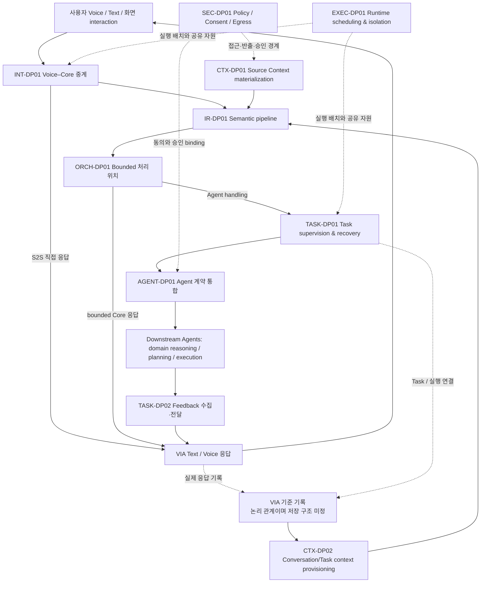

# 12-01. DP Master Catalog — Gate 1

> 버전: **W12-G1-v1.1 / 첫 번째 사용자 리뷰 — semantic DP ID 적용**.
> 범위: **25개 구조·설계 주제 분류 → 주요 비교 질문 10개**. Candidate family 26개는 상세설계 전 탐색 범위이며, 확정 후보·승자·점수가 아니다.
> 원천: 03 §3.9의 열린 구조 질문, 04의 논리 흐름, 05 UC 18개, 06 공통 조건, 07 변화 24개, 10 RC-01~18.

## 0. DP ID 체계

DP ID는 전역 순번이 아니라 **설계 concern을 드러내는 semantic prefix**를 사용한다.

| Prefix | Concern |
|---|---|
| `INT` | Interaction / Voice–Core mediation |
| `CTX` | Context access & provisioning |
| `IR` | Interpretation & Refinement |
| `ORCH` | Request handling / orchestration |
| `TASK` | Task lifecycle, supervision & feedback |
| `AGENT` | Agent integration contract |
| `SEC` | Policy, consent, privacy/security enforcement |
| `EXEC` | Execution runtime, scheduling & isolation |

따라서 `CTX-DP01`과 `CTX-DP02`는 같은 Context concern의 서로 다른 결정점이고, `TASK-DP01`과 `TASK-DP02`도 같은 Task-lifecycle concern 안에서 구분된다. 반면 `SEC-DP01`과 `EXEC-DP01`의 `01`은 서로의 선후·우선순위를 뜻하지 않는다.

## 1. 이번 리뷰에서 결정할 것

이 10개가 VIA의 주요 구조 질문인지, boundary가 중복되거나 빠진 곳이 없는지 검토한다. 상세 component/계약/E-ID와 숫자 비교는 Gate 2 이후다. 지금의 W-ASR 연결은 **관찰 우선 가설**이며 Primary 확정이 아니다. 특정 ASR을 살리기 위해 DP를 만든 것이 아니라 먼저 열린 설계 질문을 분류했다.

### 고정 경계

VIA는 PC 기반 Agent-neutral Interaction & Orchestration이다. 외부 domain reasoning/planning/tool execution과 상태 변경은 Downstream Agent 책임이다. Voice Runtime은 VIA 내부이고 두 모델 역할은 dependency다. S2S 직접 응답의 기록, User Memory 관리, 재시작 재연결, compound 네 관계를 모든 후보가 지원한다. 필요 기능을 구현하지 않은 안은 후보로 비교하지 않는다.

## 2. 한눈에 보는 비교 질문

| DP | 구조 질문 | 합리적 family 범위 | 관찰 우선 W-ASR 가설 |
|---|---|---|---|
| **INT-DP01 음성·Core 처리 중계** | S2S의 직접 응답과 VIA Core 처리를 어느 중계 구조에서 조정할 것인가? | A. Voice-led mediation B. Core-led mediation | W-01, W-02, W-08 |
| **CTX-DP01 Context 조회·구체화** | Context Source의 실제 내용을 누가, 언제 읽어 어떤 표현으로 소비자에게 제공할 것인가? | A. Broker-materialized context B. Handle-led demand resolution C. Typed hybrid | W-01, W-05, W-08, W-11 |
| **IR-DP01 요청 해석 단계 구성** | Referent·Request·Task·처리 경로·Agent 판단을 어떻게 묶거나 나눌 것인가? | A. Joint interpretation B. Staged revisable pipeline C. Grouped interpretation | W-01, W-02, W-05, W-08 |
| **CTX-DP02 과거 대화·업무 맥락 제공** | 보존한 Conversation/Task 기록 중 무엇을 현재 Model 입력으로 구성할 것인가? | A. Canonical context reconstruction B. Indexed retrieval with provenance C. Summary plus selective replay | W-01, W-06, W-08, W-11 |
| **ORCH-DP01 제한된 정보 요청 처리 위치** | VIA가 직접 처리해도 되는 Read/Search/Understand를 Core와 Agent 중 어디에 배치할 것인가? | A. Core bounded service B. Downstream bounded delegation | W-01, W-07, W-08, W-11 |
| **TASK-DP01 업무 상태 관리·재시작 복구** | VIA Task의 상태와 실행 연결을 어느 단위가 관리하고, 재시작 때 어떻게 복원할 것인가? | A. Shared transactional supervision B. Durable per-task supervision | W-02, W-04, W-09, W-08 |
| **AGENT-DP01 Agent 계약 통합** | 서로 다른 Agent의 capability·실행·질문·결과 계약을 어디서 어떻게 정규화할 것인가? | A. Capability-specific integration gateways B. Canonical agent port with adapters C. Stable kernel with typed extensions | W-07, W-02, W-03, W-08 |
| **TASK-DP02 업무 이벤트 수집·전달** | Agent 상태·질문·결과를 언제 수집하고 사용자 전달까지 어떤 event 경로를 둘 것인가? | A. Scheduled reconciliation B. Streaming intake with reconciliation | W-03, W-04, W-07, W-09 |
| **SEC-DP01 권한·동의·정보 반출 통제** | 접근/반출 허용과 pending Action 승인을 실제 사용 경계에 어떻게 연결할 것인가? | A. Central mediation gateway B. Distributed boundary guards C. Scoped capability enforcement | W-02, W-08, W-11, W-12 |
| **EXEC-DP01 실행 스케줄링·장애 격리** | Voice/Core/연동 작업을 어떤 queue·worker·process 경계에 배치해 간섭과 장애 전파를 제한할 것인가? | A. Single-process partitioned async runtime B. Interaction/core and integration workers C. Per-provider fault domains | W-01, W-04, W-10, W-09 |

## 3. 경계 그림

아래는 비교할 책임 경계의 **지도**이며 최종 component 구조나 고정 호출 순서가 아니다.

SEC-DP01 / EXEC-DP01은 cross-cutting이지만, 각각 **권한 강제 위치 / 실행·자원 배치**라는 독립 질문을 소유한다. 모든 arrow가 별도 IPC/LLM 호출을 뜻하지 않는다.

## 4. DP 상세 카드

### INT-DP01 — Voice–Core Interaction Mediation

**질문:** S2S의 직접 응답과 VIA Core 처리를 어느 중계 구조에서 조정할 것인가?

**Scope / boundary:** Voice Runtime→S2S/Core 간 입력·semantic event·응답 소유권 및 중복방지. 음성 재생 buffer 수치나 모델 학습은 제외.

| Family | 채택 가능한 구조 방향 |
|---|---|
| A. Voice-led mediation | Voice Runtime이 S2S 직접 응답/이관 이벤트를 해석하고, Core 처리 요청을 넘기는 중계 책임을 소유. |
| B. Core-led mediation | Voice는 입출력 adapter이며 VIA Interaction Coordinator가 S2S 직접 응답 허용과 Core dispatch를 조정. |

**구조 영향 가설 — 결과가 아니라 검증할 인과관계:**

| W-ASR 전체 명칭 | 확인할 구조→metric 경로 |
|---|---|
| W-01 Conversational Reaction Responsiveness | Core 사전 왕복·동기화가 첫 응답 경로에 들어가는지 |
| W-02 Task Handoff Responsiveness | Core handoff 전 해석과 전달 단계가 어디서 중복되는지 |
| W-08 Evolvability & Maintainability | S2S 이벤트/대화 계약 변경이 다른 책임으로 얼마나 퍼지는지 |

**연결:** UC-01, UC-04, UC-07, UC-11, UC-15 / RC-01, RC-08, RC-09, RC-12, RC-14 / M-01, M-07, M-09.

**Highlight / 공정성 조건:** S2S Direct Response와 그 Conversation 기록은 모든 후보 필수. provider history만 있는 약한 후보는 제외. Qwen3-Omni의 단어 시각·tool/event 계약을 확인하지 않고 지원된다고 가정하지 않음. 필요한 helper의 비용은 해당 후보에 포함. 물리적 프로세스 격리는 EXEC-DP01; Semantic 판단의 단계 구성은 IR-DP01.

### CTX-DP01 — Context Access & Materialization

**질문:** Context Source의 실제 내용을 누가, 언제 읽어 어떤 표현으로 소비자에게 제공할 것인가?

**Scope / boundary:** Source→VIA 소비자 경계. interaction 시점 evidence, 자료 버전, source handle, materialization 수명. 과거 대화 선택은 CTX-DP02, 허용 판정은 SEC-DP01.

| Family | 채택 가능한 구조 방향 |
|---|---|
| A. Broker-materialized context | 공통 Context Broker가 요청에 필요한 source를 조회·정규화하여 bounded context snapshot을 제공. |
| B. Handle-led demand resolution | 공통 source identity/권한 계약을 두고 소비자가 필요할 때 versioned handle을 resolve. 필요한 시점 이력은 유지. |
| C. Typed hybrid | 시간 민감 Interaction evidence는 snapshot, 문서/메일 등은 scoped handle과 요청 시 materialization으로 구분. |

**구조 영향 가설 — 결과가 아니라 검증할 인과관계:**

| W-ASR 전체 명칭 | 확인할 구조→metric 경로 |
|---|---|
| W-01 Conversational Reaction Responsiveness | 응답 전 자료 조회·직렬화·캐시 검증의 critical path |
| W-05 Task Completion Effectiveness | 참조 당시 자료와 현재 자료를 구분하고 필요한 evidence를 소비자에게 전달하는 정도 |
| W-08 Evolvability & Maintainability | Source/형식/API 변화의 소비자 파급 |
| W-11 Privacy Exposure Minimization | 전체 payload와 scoped 자료가 외부에 노출하는 정보 범위 |

**연결:** UC-02, UC-03, UC-04, UC-05, UC-06, UC-16 / RC-03, RC-04, RC-05 / C-01, C-02, C-03, C-05.

**Highlight / 공정성 조건:** Eager는 모든 개인자료를 무차별 읽는다는 뜻이 아님. 세 후보 모두 필요 범위와 허용조건을 준수. Handle 자체의 bytes가 아니라 실제 열어주는 범위를 W-11에서 셈. 과거 IR/CE 이름을 재사용해 같은 경계를 이중 DP로 만들지 않음.

### IR-DP01 — Semantic Interpretation Pipeline

**질문:** Referent·Request·Task·처리 경로·Agent 판단을 어떻게 묶거나 나눌 것인가?

**Scope / boundary:** 정리된 요청 산출까지의 의미 처리 graph. 사용자 명시 compound 관계 보존 포함. Agent 내부 domain planning은 제외.

| Family | 채택 가능한 구조 방향 |
|---|---|
| A. Joint interpretation | 하나의 판단 단위가 관련 evidence와 상태를 함께 보고 structured decision을 생성. |
| B. Staged revisable pipeline | 지칭/요청/Task/Agent 판단을 분리하되 provenance, source 재조회와 앞 단계 수정 경로를 제공. |
| C. Grouped interpretation | 결정적으로 얻을 수 있는 evidence를 먼저 준비하고 서로 강하게 결합된 의미 판단만 한 단계로 묶음. |

**구조 영향 가설 — 결과가 아니라 검증할 인과관계:**

| W-ASR 전체 명칭 | 확인할 구조→metric 경로 |
|---|---|
| W-01 Conversational Reaction Responsiveness | 대화 응답까지 필요한 Model call graph의 길이 |
| W-02 Task Handoff Responsiveness | 위임 확정까지 의미 호출·검증의 직렬 경로 |
| W-05 Task Completion Effectiveness | 집중된 단계 판단의 이익과 중간 표현/오류 전파의 손익 |
| W-08 Evolvability & Maintainability | 의미 책임·출력 계약 변경의 국소성 |

**연결:** UC-03, UC-04, UC-06, UC-07, UC-08, UC-09, UC-10, UC-14 / RC-05, RC-06, RC-07, RC-08, RC-10 / M-02, M-03, M-08, A-06.

**Highlight / 공정성 조건:** Staged 후보의 source/provenance를 고의로 삭제하지 않음. 실제 사용한 재조회·수정의 비용도 기록. 같은 역할은 같은 모델; 프롬프트 문자열/호출 수를 동일하게 강제하지 않음. W-05의 수치 차이는 실제 모델 실행 전에는 가설이며, 임의 오류율로 만들지 않음.

### CTX-DP02 — Conversation & Task Context Provisioning

**질문:** 보존한 Conversation/Task 기록 중 무엇을 현재 Model 입력으로 구성할 것인가?

**Scope / boundary:** VIA 기준 기록→S2S/Semantic Model 입력 경계. 영구 state authority/복구는 TASK-DP01과 구분.

| Family | 채택 가능한 구조 방향 |
|---|---|
| A. Canonical context reconstruction | 매 요청에 필요한 최근 기록과 명시 참조를 기준 기록에서 재구성해 전달. |
| B. Indexed retrieval with provenance | Conversation/Task별 인덱스로 관련 이력을 찾고 원문/결과 참조를 함께 제공. |
| C. Summary plus selective replay | 계층적 요약을 기본 제공하되 detail 요청·정정 시 원문과 Task 기록을 선택 재전달. |

**구조 영향 가설 — 결과가 아니라 검증할 인과관계:**

| W-ASR 전체 명칭 | 확인할 구조→metric 경로 |
|---|---|
| W-01 Conversational Reaction Responsiveness | 이력 조회·요약·prompt prefill의 비용 |
| W-06 Interaction & Task Continuity | 짧은 후속 지시·대화 전환에서 필요한 과거 정보의 보존 정도 |
| W-08 Evolvability & Maintainability | 모델 이력 계약/저장 기록 변경의 소비자 영향 |
| W-11 Privacy Exposure Minimization | 요약·선택 전달로 줄거나 새로 생기는 민감 정보 노출 |

**연결:** UC-01, UC-05, UC-06, UC-07, UC-10, UC-14, UC-15, UC-17 / RC-07, RC-12, RC-16 / M-03, M-09, C-04, C-06.

**Highlight / 공정성 조건:** 모든 후보가 원문 Conversation과 Task identity를 보존. 요약만 저장해서 원문을 잃는 대안은 아님. 현재 짧은 canonical TC만으로 장기대화의 성능 차이를 입증할 수 없다는 위험을 명시. 추가 장기 workload는 진단용으로만 두며 점수에 몰래 추가하지 않음. Provider conversation cache는 세 후보에 적용 가능한 tactic이며 기준 기록의 대체물이 아님.

### ORCH-DP01 — Bounded Request Execution Placement

**질문:** VIA가 직접 처리해도 되는 Read/Search/Understand를 Core와 Agent 중 어디에 배치할 것인가?

**Scope / boundary:** 지정 자료 조회·설명/요약 등 bounded 업무의 실행 경계. 일반 지식 S2S 직접 응답은 공통 유지.

| Family | 채택 가능한 구조 방향 |
|---|---|
| A. Core bounded service | VIA가 제한된 읽기·설명을 직접 처리. 외부 상태 변경과 open-ended 업무는 Agent에 위임. |
| B. Downstream bounded delegation | VIA는 지칭·요청·결과를 연결하고 지정 자료의 bounded 처리도 적합한 Agent에 위임. |

**구조 영향 가설 — 결과가 아니라 검증할 인과관계:**

| W-ASR 전체 명칭 | 확인할 구조→metric 경로 |
|---|---|
| W-01 Conversational Reaction Responsiveness | 같은 bounded 답변을 얻는 전체 대기 경로의 차이 |
| W-07 Agent Ecosystem Interoperability & Substitutability | bounded 기능 Agent의 추가·교체가 VIA에 주는 변경 |
| W-08 Evolvability & Maintainability | Core 기능·Model·문서 형식 변화가 퍼지는 범위 |
| W-11 Privacy Exposure Minimization | 자료를 전달받는 실행 경계와 최소 context package |

**연결:** UC-02, UC-05, UC-07, UC-08, UC-09 / RC-04, RC-08, RC-14 / A-01, A-02, A-06, M-02, C-02.

**Highlight / 공정성 조건:** Agent로 옮긴 bounded 처리시간도 W-01에는 포함. 프로세스 이름만 바꾸어 제외시간을 늘리지 않음. 고정 Agent fixture의 업무 능력은 동일. 실제 Agent 지능 차이를 구조의 W-05 이익으로 주장하지 않음. 선택적 로컬 fast path와 별도 local tracked-task 필요 여부는 이 DP의 후보 상세에서 검토하며 기본 요구로 강제하지 않음.

### TASK-DP01 — Task Supervision & Durable Recovery

**질문:** VIA Task의 상태와 실행 연결을 어느 단위가 관리하고, 재시작 때 어떻게 복원할 것인가?

**Scope / boundary:** VIA Task/Request/Agent execution correlation, compound 의존 상태, pending 제어, durable handoff. Agent 내부 실행 workflow는 제외.

| Family | 채택 가능한 구조 방향 |
|---|---|
| A. Shared transactional supervision | 공유 Task service와 트랜잭션 저장소가 상태 전이·handoff 기록·복구를 조정. |
| B. Durable per-task supervision | Task별 supervisor/mailbox가 상태 전이를 소유하고 공통 durable 저장 계약과 조회 index를 제공. |

**구조 영향 가설 — 결과가 아니라 검증할 인과관계:**

| W-ASR 전체 명칭 | 확인할 구조→metric 경로 |
|---|---|
| W-02 Task Handoff Responsiveness | Agent 접수와 재연결 정보 보존까지의 조정 비용 |
| W-04 Concurrent Task Performance Isolation | 동시 Task의 state contention과 작업별 진행 독립성 |
| W-09 Recovery Timeliness & Recoverability | 올바른 상태·제어가 다시 가능해지는 복구 critical path |
| W-08 Evolvability & Maintainability | 저장·correlation schema 변화의 변경 전파 |

**연결:** UC-06, UC-09, UC-10, UC-12, UC-13, UC-14, UC-15, UC-17, UC-18 / RC-06, RC-12, RC-13, RC-16, RC-17 / A-04, A-05, A-08, C-04, C-06.

**Highlight / 공정성 조건:** 두 후보 모두 원자적 저장·중복방지·취소 race·재연결을 구현. in-memory-only 후보는 제외. Event journal vs snapshot은 별도 직교 tactic이다. 중앙/분산 ownership과 한 후보에 임의로 묶지 않고 Gate 2에서 교차 영향을 확인. W-08은 추가된 기본 요소 수가 아니라 15개 변화에 따른 변경 ID 수만 측정.

### AGENT-DP01 — Agent Contract Integration

**질문:** 서로 다른 Agent의 capability·실행·질문·결과 계약을 어디서 어떻게 정규화할 것인가?

**Scope / boundary:** VIA orchestration→Agent integration 경계. 공통 task identity는 유지. event 운반 방식은 TASK-DP02.

| Family | 채택 가능한 구조 방향 |
|---|---|
| A. Capability-specific integration gateways | 업무 capability별 gateway가 native Agent 계약을 흡수하고 필요한 VIA use-case 계약을 제공. |
| B. Canonical agent port with adapters | 하나의 중립 lifecycle/capability port와 provider/protocol adapter들이 정규화 책임을 소유. |
| C. Stable kernel with typed extensions | 공통 identity/state/approval 핵심은 고정하고 provider capability 차이는 명시적 extension 계약으로 전달. |

**구조 영향 가설 — 결과가 아니라 검증할 인과관계:**

| W-ASR 전체 명칭 | 확인할 구조→metric 경로 |
|---|---|
| W-07 Agent Ecosystem Interoperability & Substitutability | 9개 Agent 계약 변화가 gateway/adapter/소비 계약에 주는 변경 |
| W-02 Task Handoff Responsiveness | 인계 시 변환·검증·접속 계층의 비용 |
| W-03 Task Feedback Responsiveness | 이벤트·질문·결과 정규화의 경로 비용 |
| W-08 Evolvability & Maintainability | 공유 연동 기반이 Model/Context 변화와 결합되는 정도 |

**연결:** UC-08, UC-10, UC-12, UC-13, UC-14, UC-16, UC-18 / RC-09, RC-10, RC-11 / A-01, A-02, A-03, A-04, A-05, A-06, A-07, A-08, A-09.

**Highlight / 공정성 조건:** Native API를 Core 전체에 무차별 노출하는 안은 fixed Agent-neutral 경계에 맞지 않음. A도 integration 경계를 둠. Adapter를 무료 1개로 가정하지 않고 registry, auth, schema 등 실제 변경만 계산. API 지원 기능을 동일화하고 unsupported 기능을 구현했다고 가정하지 않음.

### TASK-DP02 — Task Feedback Acquisition & Delivery

**질문:** Agent 상태·질문·결과를 언제 수집하고 사용자 전달까지 어떤 event 경로를 둘 것인가?

**Scope / boundary:** Agent 상태 원천→VIA state 적용→Text/Voice/알림. 상태의 의미·owner는 TASK-DP01, 추상 계약은 AGENT-DP01.

| Family | 채택 가능한 구조 방향 |
|---|---|
| A. Scheduled reconciliation | bounded 주기의 상태/결과 조회를 주 경로로 두고 version 기반 중복·최신상태를 처리. |
| B. Streaming intake with reconciliation | stream/push를 주 경로로 받고 재연결·누락에는 status 조회를 사용. |

**구조 영향 가설 — 결과가 아니라 검증할 인과관계:**

| W-ASR 전체 명칭 | 확인할 구조→metric 경로 |
|---|---|
| W-03 Task Feedback Responsiveness | 변화 발생부터 유효한 사용자 표시까지의 탐지·queue 지연 |
| W-04 Concurrent Task Performance Isolation | polling·event fan-in이 전경 처리에 주는 간섭 |
| W-07 Agent Ecosystem Interoperability & Substitutability | push/poll 계약 변화 및 결과 계약 변환 범위 |
| W-09 Recovery Timeliness & Recoverability | 재연결 후 현재 상태/결과를 확보하는 시간 |

**연결:** UC-10, UC-12, UC-13, UC-14, UC-15, UC-18 / RC-11, RC-13, RC-14 / A-04, A-08, A-09.

**Highlight / 공정성 조건:** 기본 비교 Agent는 조회와 streaming 양쪽을 지원. 서로 다른 기능의 Agent를 배정해 승패를 만들지 않음. 짧은 polling 간격도 합리적 후보에 허용하며 호출·부하 비용을 함께 기록. 개인 PC의 inbound webhook 접근성을 가정하지 않음. outbound stream 또는 현실적 relay가 필요한 경우 그 배치 비용을 포함.

### SEC-DP01 — Policy, Consent & Context Egress Enforcement

**질문:** 접근/반출 허용과 pending Action 승인을 실제 사용 경계에 어떻게 연결할 것인가?

**Scope / boundary:** VIA의 Context read/egress, consent lifecycle, 승인 응답 correlation. Agent 내부 tool enforcement는 제외.

| Family | 채택 가능한 구조 방향 |
|---|---|
| A. Central mediation gateway | 접근·반출이 공통 mediation 경계를 통과하고 해당 시점 정책 및 승인 revision을 확인. |
| B. Distributed boundary guards | 공통 policy/consent authority를 사용하되 각 connector/model/agent boundary에서 강제. |
| C. Scoped capability enforcement | scope·destination·pending action/revision에 묶인 capability를 사용 경계에서 검증하고 철회도 반영. |

**구조 영향 가설 — 결과가 아니라 검증할 인과관계:**

| W-ASR 전체 명칭 | 확인할 구조→metric 경로 |
|---|---|
| W-02 Task Handoff Responsiveness | 승인 binding과 use-time enforcement의 인계 지연 |
| W-08 Evolvability & Maintainability | 공통/분산 enforcement의 정책·connector 변화 파급 |
| W-11 Privacy Exposure Minimization | 허용된 범위 안에서도 과도한 context를 줄이는 mediation 지점 |
| W-12 Action & Access Safety | 동일 24개 기회의 안전성 회귀. 모두 0이면 비변별 |

**연결:** UC-02, UC-08, UC-09, UC-14, UC-16, UC-17, UC-18 / RC-04, RC-09, RC-11, RC-15, RC-16 / A-07, A-08, C-01, C-04, C-05, M-04, M-06.

**Highlight / 공정성 조건:** W-12는 점수와 목표 충족을 공개하되 별도 hard gate를 새로 도입하지 않음. Capability 발행만으로 철회가 해결된다고 가정하지 않음. 세 후보 모두 사용 시점 current policy를 만족. 자료의 선택/구체화 정책은 CTX-DP01이며 여기서 별도 selective retrieval 후보를 중복 생성하지 않음.

### EXEC-DP01 — Runtime Scheduling & Fault-Isolation Boundary

**질문:** Voice/Core/연동 작업을 어떤 queue·worker·process 경계에 배치해 간섭과 장애 전파를 제한할 것인가?

**Scope / boundary:** VIA Local Software 내부 실행 배치·자원 arbitration·failure domain. Model 가중치 크기나 downstream host 성능 선택은 제외.

| Family | 채택 가능한 구조 방향 |
|---|---|
| A. Single-process partitioned async runtime | 한 프로세스 안에서 async task·bounded queue·timeout·cancellation과 자원별 worker를 분리. |
| B. Interaction/core and integration workers | 전경 interaction/core와 장애 가능 연동 worker process를 분리. IPC·상태 소유권·재시작을 명시. |
| C. Per-provider fault domains | provider/connector별 실행 격리와 공통 resource arbiter를 둠. worker 수는 workload와 무관하게 정의. |

**구조 영향 가설 — 결과가 아니라 검증할 인과관계:**

| W-ASR 전체 명칭 | 확인할 구조→metric 경로 |
|---|---|
| W-01 Conversational Reaction Responsiveness | IPC/queue handoff와 전경 실행 경로의 비용 |
| W-04 Concurrent Task Performance Isolation | 공유 자원에서 1→4 Task 간섭이 증가하는 정도 |
| W-10 Dependency Failure Containment & Graceful Degradation | 한 endpoint failure가 무관 기능까지 전파되는 범위 |
| W-09 Recovery Timeliness & Recoverability | 복구해야 할 프로세스·연결·state의 범위 |

**연결:** UC-01, UC-11, UC-13, UC-14, UC-15, UC-18 / RC-01, RC-02, RC-03, RC-09, RC-11, RC-13, RC-17, RC-18 / M-05, M-06, A-01.

**Highlight / 공정성 조건:** A를 blocking single loop로 만들지 않음. A에도 동등한 timeout/backpressure를 구현. 프로세스를 나누어도 같은 GPU가 무한 병렬 처리된다고 가정하지 않음. 현재 fixed failure suite가 모두 100%면 W-10 차이를 보장하지 않으며 native crash 진단 결과를 대표 점수에 섞지 않음.

## 5. 중복을 자르는 세 경계

| 혼동하기 쉬운 DP | 경계의 차이 | 합치거나 나눌 때의 원칙 |
|---|---|---|
| CTX-DP01 / CTX-DP02 | 외부 source 내용을 확보·표현하는가 / 보존된 대화·Task를 현재 모델 입력으로 선택하는가 | 공통 cache/index는 공유해도 결정 질문은 다름. 동일 구현 선택으로 항상 묶이면 Gate 2에서 병합 검토. |
| CTX-DP01 / SEC-DP01 | 어떤 내용을 언제 구체화하는가 / 읽거나 보내도 되는지 어디서 강제하는가 | 선택적 자료 제공을 양쪽 후보의 별도 이익으로 중복 산정하지 않음. |
| TASK-DP01 / TASK-DP02 / EXEC-DP01 | 상태 전이 authority / 이벤트 수집·전달 경로 / worker·process·resource 배치 | actor=프로세스, event log=event bus처럼 같은 것으로 취급하지 않음. |

## 6. 의존·결합과 진행 우선순위

우선 상세화할 묶음은 **CTX-DP01 / IR-DP01 / CTX-DP02(정보·해석)**, 다음은 **TASK-DP01 / AGENT-DP01 / TASK-DP02(업무·Agent·event)**이다. INT-DP01 / ORCH-DP01 / SEC-DP01 / EXEC-DP01은 이에 필요한 경계 계약을 함께 작성한다. 이 순서는 후보 작성 순서일 뿐 앞 DP의 승자를 뒤 DP의 전제로 고정하는 순서가 아니다.

- **CTX-DP01 × IR-DP01 × CTX-DP02**: materialization·semantic split·history provisioning. Gate 2 계획: 주효과를 고립한 비교 뒤 대표 2x2 또는 2x2x2 조합 검증.
- **ORCH-DP01 × AGENT-DP01 × SEC-DP01**: bounded 배치·Agent 계약·반출 scope. Gate 2 계획: 같은 허용 policy와 Agent 기능을 고정한 배치/연동 교차검증.
- **TASK-DP01 × TASK-DP02 × EXEC-DP01**: state owner·event intake·runtime scheduling. Gate 2 계획: 공유 작업량에서 소유권과 배치를 동시에 바꾸지 않는 짝 비교 후 조합 확인.

게이트별 전체 조합을 전수 실행한다는 뜻은 아니다. 주효과를 고립한 비교를 먼저 하며, 결론을 뒤집을 수 있는 결합만 작은 교차 실험으로 확인한다.

## 7. 발표 본문 범위

10개는 설계 누락을 막기 위한 **master 질문 목록**이다. 발표 본문을 10개의 긴 DP로 채우겠다는 뜻은 아니다. Gate 3 이후 실제 인과 근거와 trade-off가 명확한 묶음을 본문 4~6개로 구성하고 나머지 결정·동점·필수 기능 처리는 appendix coverage에 남길 수 있다. 중요도를 사후 바꾸거나 불리한 결과를 숨기지는 않는다.

## 8. Gate 1 승인 범위

승인 요청은 구조 질문 10개와 그 boundary/병합 원칙이다. 가족 A/B/C는 비교 가능성을 보여주기 위한 범위이므로 상세 후보의 승인이나 특정 설계 선택을 뜻하지 않는다. [Coverage 원장](./12-01a-scope-and-coverage-ledger.md)에는 25개 주제의 처리, RC/UC/Change 누락 점검, ASR별 가설 표를 보존했다.

**현재: 후보별 요소 수·latency·accuracy·score·winner 모두 미산출.** 다음 Gate 2에서 정상 후보와 측정 계약을 검토한다.