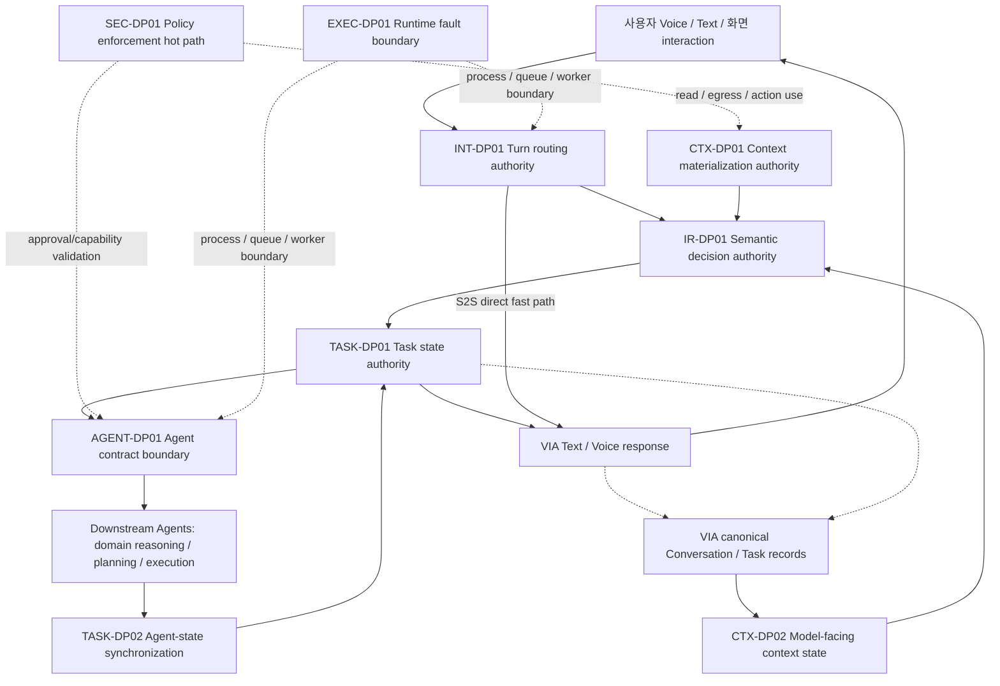

# 12-01. DP Master Catalog — Gate 1

> **Post-Gate-1 note (2026-09-22):** Gate 2 상세 리뷰에서 INT-DP01은 `FP-INT01 S2S Direct Fast Path` 고정 원칙으로, TASK-DP02는 `TASK-T01 Event-first + Query Reconciliation` tactic으로 내리는 안을 제안했다. 후보 실행·점수 산출 전 보정이며, 현재 Gate 2 리뷰본은 [12-02](./12-02-gate2-review-guide.md)를 우선한다.
> 버전: **W12-G1-FINAL / Gate 1 최종 기준선 — 사용자 피드백 반영 완료**.
> 범위: **25개 구조·설계 주제 분류 → 주요 비교 질문 9개**. 강한 candidate family 18개는 상세설계 전 탐색 범위이며, 확정 후보·승자·점수가 아니다.
> 원천: 03 §3.9의 열린 구조 질문, 04의 논리 흐름, 05 UC 18개, 06 공통 조건, 07 변화 24개, 10 RC-01~18.

## 0. DP ID 체계

DP ID는 전역 순번이 아니라 **설계 concern을 드러내는 semantic prefix**를 사용한다.

| Prefix | Concern |
|---|---|
| `INT` | Interaction / Voice–Core mediation |
| `CTX` | Context access & provisioning |
| `IR` | Interpretation & Refinement |
| `TASK` | Task lifecycle, supervision & feedback |
| `AGENT` | Agent integration contract |
| `SEC` | Policy, consent, privacy/security enforcement |
| `EXEC` | Execution runtime, scheduling & isolation |

따라서 `CTX-DP01`과 `CTX-DP02`는 같은 Context concern의 서로 다른 결정점이고, `TASK-DP01`과 `TASK-DP02`도 같은 Task-lifecycle concern 안에서 구분된다. 반면 `SEC-DP01`과 `EXEC-DP01`의 `01`은 서로의 선후·우선순위를 뜻하지 않는다.

## 1. 이번 리뷰에서 결정할 것

이 9개가 VIA의 주요 구조 질문인지, 그리고 각 DP의 두 대안이 실제로 **동시에 canonical할 수 없는 구조 선택**인지 검토한다. 상세 component/계약/E-ID와 숫자 비교는 Gate 2 이후다.

### DP admissibility rule

DP는 다음 네 조건을 순서대로 만족해야 한다.

1. Component/Interface/State/Runtime 책임 또는 경계를 바꾸는 구조 결정이다.
2. 두 대안이 authoritative owner / canonical contract / primary state path / process fault boundary 중 하나를 서로 다르게 정한다.
3. 단순 A+B hybrid로 decision을 회피할 수 없다.
4. 위 세 조건을 만족한 DP 중 여러 중요 W-ASR에 자연스러운 인과가 있으면 발표 가치가 높다.

공통 cache, retry, reconciliation, timeout, persistence 같은 tactic은 두 대안에 모두 들어갈 수 있다. 단, 그 tactic이 authority를 바꾸면 더 이상 공통 tactic이 아니라 candidate identity 변경이다.

### 고정 경계

VIA는 PC 기반 Agent-neutral Interaction & Orchestration이다. 외부 domain reasoning/planning/tool execution과 상태 변경은 Downstream Agent 책임이다. Voice Runtime은 VIA 내부다. **Model placement는 이번 Architecture Decision 축에서 제외하고, 각 reference Model의 deployment assumption을 후보 간 동일하게 고정한다. 제품 방향은 on-device-first로 두되 S2S 등 현재 reference feasibility에 필요한 dependency 배치는 별도 고정조건으로 취급한다.** S2S 직접 응답의 기록, User Memory 관리, 재시작 재연결, compound 네 관계를 모든 후보가 지원한다. 필요 기능을 구현하지 않은 안은 후보로 비교하지 않는다.

MODEL placement는 이번 Gate의 독립 DP가 아니다. Persistence representation(journal/snapshot)은 우선 TASK-DP01을 구현하는 tactic으로 유지한다. bounded Core/Agent handling은 혼합이 자연스러워 독립 DP로 두지 않는다.

## 2. 한눈에 보는 비교 질문

| DP | 구조 질문 | 상호배타적 대안 2개 | 관찰 우선 W-ASR 가설 |
|---|---|---|---|
| **INT-DP01 Interaction Routing & Fast-Path Ownership** | User Turn의 direct/semantic/task 경로를 누가 authoritative하게 결정하는가? | A. Voice-owned Turn Router B. Core-owned Turn Router | W-01, W-02, W-08 |
| **CTX-DP01 Context Materialization Ownership** | Source reference를 소비 가능한 Context로 만드는 canonical 책임이 어디에 있는가? | A. Central Materialization Authority B. Consumer-owned Resolution | W-01, W-05, W-08, W-11 |
| **IR-DP01 Semantic Decision Ownership** | Referent·Request·Task·Handling·Agent 판단을 하나의 semantic authority가 결정하는가, 단계별 authority가 결정하는가? | A. Integrated Semantic Authority B. Staged Semantic Authorities | W-01, W-02, W-05, W-08 |
| **CTX-DP02 Model-facing Context State Architecture** | Model-visible Conversation/Task context를 요청마다 재구성하는가, 지속 working set으로 유지하는가? | A. Request-reconstructed Context B. Incremental Working Context | W-01, W-06, W-08 |
| **TASK-DP01 Task State Authority & Supervision** | VIA Task 상태 전이의 authoritative owner가 하나의 공유 service인가, Task별 supervisor인가? | A. Central Task Authority B. Per-Task Authority | W-02, W-04, W-08, W-09 |
| **AGENT-DP01 Agent Integration Contract Boundary** | Agent별 차이를 integration edge에서 숨길지, Core 계약에 typed variation으로 노출할지? | A. Edge-normalized Canonical Contract B. Core-visible Typed Contracts | W-02, W-03, W-07, W-08 |
| **TASK-DP02 Agent State Synchronization Architecture** | Agent 실행 상태를 query가 authoritative하게 갱신하는가, revisioned event가 authoritative하게 갱신하는가? | A. Pull-authoritative Reconciliation B. Event-authoritative Streaming | W-03, W-04, W-07, W-09 |
| **SEC-DP01 Policy Enforcement Hot-path Architecture** | sensitive use 때 중앙 authorization을 매번 거칠지, 사전 발급한 revocable capability를 local 검증할지? | A. Online Reference Monitor B. Revocable Scoped Capability | W-02, W-08 *(W-11/12 regression)* |
| **EXEC-DP01 Runtime Fault-Isolation Boundary** | integration workload를 Core와 같은 process fault domain에 둘지, 별도 process fault domain에 둘지? | A. Single-process Partitioned Runtime B. Process-isolated Integration Runtime | W-01, W-04, W-09, W-10 |

### Gate 1 최종 분류

| 분류 | DP | 이유 |
|---|---|---|
| **Core** | INT-DP01 | Voice fast path와 unified routing의 ownership trade-off가 직관적이며 W-01/W-02/W-08에 직접 영향 |
| **Core** | IR-DP01 | semantic authority topology가 latency/completion/evolvability를 동시에 바꿈 |
| **Core** | TASK-DP01 | Task state single-writer 구조가 handoff/concurrency/recovery/evolvability를 바꿈 |
| **Core** | AGENT-DP01 | Agent-neutral product의 핵심 contract boundary이며 W-02/03/07/08과 직접 연결 |
| **Core** | TASK-DP02 | Agent state truth source가 feedback/concurrency/interoperability/recovery를 바꿈 |
| **Core** | EXEC-DP01 | in-process fast path와 process fault isolation의 trade-off가 명확함 |
| **Supporting** | CTX-DP01 | 중요하지만 context type별 tactic/hybrid가 자연스러워 발표 핵심축으로는 상대적으로 약함 |
| **Supporting** | CTX-DP02 | Architecture 차이는 있으나 on-device Model 기준에서 privacy 직접 인과가 약하고 continuity도 동점 가능 |
| **Supporting** | SEC-DP01 | Architecture 의미는 크지만 정상 후보의 privacy/safety 점수가 동점일 가능성이 높음 |

Core/Supporting은 최종 중요도 서열이 아니라 Gate 2 상세화 우선순위다. 12-A 전수 sweep에서는 9개 모두 동일 기준으로 평가한다.

## 3. 경계 그림

아래는 비교할 책임 경계의 **지도**이며 최종 component 구조나 고정 호출 순서가 아니다.

SEC-DP01 / EXEC-DP01은 cross-cutting이지만 각각 **authorization hot path / process fault-domain**이라는 하나의 decision을 소유한다. 모든 arrow가 별도 IPC/LLM 호출을 뜻하지 않는다.

## 4. DP 상세 카드

### INT-DP01 — Interaction Routing & Fast-Path Ownership

**직관적 질문:** 사용자의 한 Turn이 들어왔을 때 “S2S가 바로 답할지, Core semantic 처리로 넘길지, Task로 연결할지”의 최종 routing authority를 Voice 쪽이 가질 것인가 Core가 가질 것인가?

| Alternative | 구조적 의미 |
|---|---|
| **A. Voice-owned Turn Router** | Voice Runtime이 direct-response 가능 여부와 Core escalation을 authoritative하게 결정한다. Core는 escalated turn을 받아 semantic/task 처리를 수행한다. |
| **B. Core-owned Turn Router** | Voice Runtime은 normalized multimodal turn과 S2S candidate event를 제공하고, Core Interaction Coordinator가 direct/core/task routing을 authoritative하게 결정한다. |

**왜 둘을 동시에 채택할 수 없는가:** 한 Turn의 최종 routing decision authority는 하나여야 한다. Voice와 Core가 동시에 authoritative하면 duplicate response / conflicting dispatch를 해결하는 또 다른 상위 coordinator가 필요해져 사실상 제3 구조가 된다.

**주요 인과:** W-01은 fast path의 hop/coordination, W-02는 task handoff 전 중복 판단 경로, W-08은 S2S/event contract 변경의 전파 범위를 본다.

**연결:** UC-01, UC-04, UC-07, UC-11, UC-15 / RC-01, RC-08, RC-09, RC-12, RC-14 / M-01, M-07, M-09.

**공정성:** 두 안 모두 S2S Direct Response, Conversation 기록, interruption/cancel 구분을 지원한다. helper model/cache는 공통 tactic으로 허용하되 routing authority를 바꾸지 않는다.

### CTX-DP01 — Context Materialization Ownership

**직관적 질문:** “이 파일/이 메일/현재 selection” 같은 source reference를 실제 소비 가능한 내용으로 만드는 책임을 공통 Context 계층이 가질 것인가, 사용하는 consumer가 가질 것인가?

| Alternative | 구조적 의미 |
|---|---|
| **A. Central Materialization Authority** | 공통 Context subsystem이 source 접근·version 확인·정규화·materialization을 소유하고 consumer에는 versioned content snapshot을 제공한다. |
| **B. Consumer-owned Resolution** | 공통 Context subsystem은 identity/metadata/scoped handle을 제공하고 각 consumer가 자신의 use boundary에서 해당 handle을 resolve하여 내용을 얻는다. |

**왜 둘을 동시에 채택할 수 없는가:** canonical consumer contract가 **content-bearing snapshot**인지 **identity-bearing resolvable handle**인지 하나를 선택해야 한다. cache나 prefetch는 양쪽에 넣을 수 있지만 materialization authority 자체를 동시에 두 곳에 둘 수는 없다.

**주요 인과:** W-01 critical-path read/serialization, W-05 evidence fidelity, W-08 source/API change ripple, W-11 remote-readable scope.

**연결:** UC-02, UC-03, UC-04, UC-05, UC-06, UC-16 / RC-03, RC-04, RC-05 / C-01, C-02, C-03, C-05.

**공정성:** 두 안 모두 필요 범위/권한/version을 보존한다. B는 “아무 consumer나 직접 OS API 호출”이 아니라 scoped handle contract를 사용한다.

### IR-DP01 — Semantic Decision Ownership

**직관적 질문:** Referent·Request·Task relation·Handling·Agent 선택을 하나의 semantic decision authority가 함께 판단할 것인가, 각각의 책임을 별도 stage가 authoritative하게 판단할 것인가?

| Alternative | 구조적 의미 |
|---|---|
| **A. Integrated Semantic Authority** | 하나의 semantic decision component/call graph가 관련 evidence를 함께 보고 한 structured decision을 생성한다. |
| **B. Staged Semantic Authorities** | Grounding/Refinement/Task Association/Handling·Agent 판단이 명시적 intermediate contract를 통해 단계별로 authoritative하게 진행된다. |

**왜 둘을 동시에 채택할 수 없는가:** 같은 판단의 authoritative result가 한 integrated decision에서 나오거나 stage별 result에서 나온다. 일부 deterministic preprocessing/validation은 양쪽 공통 tactic이지만 semantic authority topology는 동시에 두 형태일 수 없다.

**주요 인과:** W-01/W-02는 critical path와 model-call topology, W-05는 joint evidence vs intermediate loss/error propagation, W-08은 semantic responsibility 변경 국소성을 본다.

**연결:** UC-03, UC-04, UC-06, UC-07, UC-08, UC-09, UC-10, UC-14 / RC-05, RC-06, RC-07, RC-08, RC-10 / M-02, M-03, M-08, A-06.

**공정성:** staged 안도 provenance/source-revisit/correction을 제공한다. 일부러 lossy DTO를 넣지 않는다. 같은 semantic role은 같은 reference model을 사용한다.

### CTX-DP02 — Model-facing Context State Architecture

**직관적 질문:** Model이 매 Turn 볼 Conversation/Task context를 canonical 기록에서 매번 다시 만들 것인가, Conversation/Task마다 지속되는 working context를 증가식으로 유지할 것인가?

| Alternative | 구조적 의미 |
|---|---|
| **A. Request-reconstructed Context** | 매 inference마다 VIA canonical records에서 필요한 history/result/reference를 선택해 self-contained context package를 재구성한다. Model/provider session state는 성능 cache일 뿐 의미상 source가 아니다. |
| **B. Incremental Working Context** | Conversation/Task별 model-facing working set을 VIA가 지속 관리하고 새 turn/result를 delta로 갱신한다. canonical records는 recovery/rebuild source이며 정상 경로는 working set을 소비한다. |

**왜 둘을 동시에 채택할 수 없는가:** 정상 inference의 model-visible state source가 **request-time reconstruction**인지 **long-lived incremental working set**인지 하나가 primary다. B가 restart 시 rebuild하는 것은 fallback이고 A가 cache를 쓰는 것은 optimization이라 authority를 바꾸지 않는다.

**주요 인과:** W-01 prompt assembly/prefill, W-06 long-turn continuity, W-08 history/model contract change ripple. **Model placement는 후보 간 고정하므로 model-facing history 크기 자체를 W-11의 구조 차이로 계산하지 않는다.** 동일 context가 외부 Agent/remote dependency egress에 실제 재사용되는 경우에만 W-11을 regression으로 확인한다.

**연결:** UC-01, UC-05, UC-06, UC-07, UC-10, UC-14, UC-15, UC-17 / RC-07, RC-12, RC-16 / M-03, M-09, C-04, C-06.

**공정성:** 두 안 모두 canonical original history와 Task identity를 보존한다. B의 working set을 provider가 유일하게 소유하게 하지 않는다.

### TASK-DP01 — Task State Authority & Supervision

**직관적 질문:** 여러 VIA Task의 상태 전이를 하나의 shared authority가 관리할 것인가, 각 Task가 자신의 state machine authority를 가질 것인가?

| Alternative | 구조적 의미 |
|---|---|
| **A. Central Task Authority** | 하나의 logical Task service가 모든 Task transition, handoff correlation, cancel/race, compound relation과 persistence transaction을 authoritative하게 관리한다. |
| **B. Per-Task Authority** | 각 durable Task supervisor/actor가 자신의 transition과 pending interaction을 authoritative하게 소유하고, global index는 조회/발견만 제공한다. |

**왜 둘을 동시에 채택할 수 없는가:** 동일 Task transition의 authoritative writer는 central service 또는 그 Task supervisor 중 하나여야 한다. 둘 다 write authority를 가지면 또 다른 conflict-resolution authority가 필요하다.

**주요 인과:** W-02 handoff coordination, W-04 cross-task contention/isolation, W-09 recovery scope, W-08 state-schema change ripple.

**연결:** UC-06, UC-09, UC-10, UC-12, UC-13, UC-14, UC-15, UC-17, UC-18 / RC-06, RC-12, RC-13, RC-16, RC-17 / A-04, A-05, A-08, C-04, C-06.

**공정성:** 두 안 모두 durable persistence, idempotency, cancel race, restart reconnect를 구현한다. journal/snapshot/outbox는 authority를 바꾸지 않는 한 tactic이다.

### AGENT-DP01 — Agent Integration Contract Boundary

**직관적 질문:** Agent별 protocol/capability 차이를 VIA Core에 들어오기 전에 하나의 canonical contract로 숨길 것인가, Core가 typed capability variation을 명시적으로 이해하게 할 것인가?

| Alternative | 구조적 의미 |
|---|---|
| **A. Edge-normalized Canonical Contract** | provider/protocol adapter가 Agent 차이를 integration edge에서 canonical lifecycle/capability/result contract로 정규화한다. Core orchestration은 provider variation을 모른다. |
| **B. Core-visible Typed Contracts** | 공통 identity/security kernel만 유지하고 streaming, clarification, cancel, result mode 같은 capability variation을 typed contract로 Core orchestration까지 전달한다. Adapter는 transport/schema 변환 위주다. |

**왜 둘을 동시에 채택할 수 없는가:** provider variation이 **edge에서 소거**되거나 **Core contract까지 보존**된다. stable-kernel + typed extension을 “둘 다”라고 부르는 경우는 B에 해당한다.

**주요 인과:** W-07 Agent change locality, W-02 handoff transform/validation, W-03 feedback normalization path, W-08 shared contract evolution.

**연결:** UC-08, UC-10, UC-12, UC-13, UC-14, UC-16, UC-18 / RC-09, RC-10, RC-11 / A-01~A-09.

**공정성:** 모든 후보가 동일 required capability set을 지원한다. unsupported native feature를 무료로 가정하지 않고 필요한 emulation/adapter element를 센다.

### TASK-DP02 — Agent State Synchronization Architecture

**직관적 질문:** Downstream Agent의 현재 실행 상태를 VIA에 반영할 때 query 결과가 authoritative한가, revisioned event stream이 authoritative한가?

| Alternative | 구조적 의미 |
|---|---|
| **A. Pull-authoritative Reconciliation** | VIA가 bounded cadence/on-demand query로 authoritative state를 읽어 Task state를 갱신한다. push/notification이 있어도 “새 상태가 있을 수 있음”이라는 hint로만 사용한다. |
| **B. Event-authoritative Streaming** | ordered/revisioned Agent event가 정상 경로의 authoritative state transition input이다. query는 reconnect, gap detection, reconciliation에서만 사용한다. |

**왜 둘을 동시에 채택할 수 없는가:** 정상 상태 전이를 확정하는 source가 query 또는 event revision 중 하나여야 한다. 둘 다 authoritative하면 conflict/order rule을 결정하는 제3 authority가 필요하다.

**주요 인과:** W-03 event-to-user delay, W-04 polling/event fan-in load, W-07 Agent event/query contract variation, W-09 reconnect/reconciliation time.

**연결:** UC-10, UC-12, UC-13, UC-14, UC-15, UC-18 / RC-11, RC-13, RC-14 / A-04, A-08, A-09.

**공정성:** 양쪽 모두 query와 event transport를 보조 수단으로 사용할 수 있으나 authoritative path는 하나다. polling 간격/stream reconnect policy는 Gate 2에서 동일 현실 제약으로 고정한다.

### SEC-DP01 — Policy Enforcement Hot-path Architecture

**직관적 질문:** 민감 Context read/egress나 pending Action 사용 시마다 중앙 정책 service의 online 승인을 받아야 하는가, 아니면 중앙 authority가 사전 발급한 revocable scoped capability를 사용 경계에서 검증하면 되는가?

| Alternative | 구조적 의미 |
|---|---|
| **A. Online Reference Monitor** | 모든 protected use가 central policy/consent authority를 동기적으로 호출해 current policy, destination, action revision을 확인한 뒤 진행한다. |
| **B. Revocable Scoped Capability** | central authority가 scope/destination/action/revision/expiry에 묶인 capability를 발급하고 connector/model/agent boundary가 local validation한다. revocation은 epoch/version/revocation state로 반영한다. |

**왜 둘을 동시에 채택할 수 없는가:** protected use의 hot-path authorization이 **central online decision**인지 **locally verifiable delegated authority**인지 하나가 primary다. capability 발급 authority가 중앙에 있는 것은 B와 모순이 아니다.

**주요 인과:** W-02 use-time authorization latency와 W-08 policy/connector change ripple을 우선 본다. W-11은 두 구조가 동일한 최소 scope를 enforce하면 동점일 수 있고, W-12는 정상 후보가 모두 0/24를 만족해야 하는 regression/constraint로 본다.

**연결:** UC-02, UC-08, UC-09, UC-14, UC-16, UC-17, UC-18 / RC-04, RC-09, RC-11, RC-15, RC-16 / A-07, A-08, C-01, C-04, C-05, M-04, M-06.

**공정성:** 두 안 모두 current policy와 revocation을 만족한다. B를 stale bearer token으로 약하게 만들지 않는다. W-12가 모두 0이면 constraint 동점으로 유지한다.

### EXEC-DP01 — Runtime Fault-Isolation Boundary

**직관적 질문:** Voice/Core와 Agent/Context integration workload를 같은 process fault domain 안에서 격리할 것인가, integration을 별도 process fault domain으로 분리할 것인가?

| Alternative | 구조적 의미 |
|---|---|
| **A. Single-process Partitioned Runtime** | 한 VIA process에서 async task, bounded queue, worker pool, cancellation/backpressure로 foreground와 integration workload를 논리적으로 격리한다. |
| **B. Process-isolated Integration Runtime** | foreground Interaction/Core와 Agent/Context integration worker를 별도 process fault domain으로 두고 명시적 IPC와 restart boundary를 사용한다. |

**왜 둘을 동시에 채택할 수 없는가:** integration workload가 Core와 **같은 OS process fault domain**에 있거나 **다른 process fault domain**에 있다. provider별 추가 worker는 B의 tactic이지 제3 family가 아니다.

**주요 인과:** W-01 IPC vs in-process fast path, W-04 shared-resource contention, W-10 crash/hang blast radius, W-09 restart/reconnect scope.

**연결:** UC-01, UC-11, UC-13, UC-14, UC-15, UC-18 / RC-01, RC-02, RC-03, RC-09, RC-11, RC-13, RC-17, RC-18 / M-05, M-06, A-01.

**공정성:** A도 blocking single-loop가 아니라 정상 async/backpressure 구조다. B도 IPC/persistence 비용을 숨기지 않는다. 동일 GPU/Model resource가 무한 병렬이라고 가정하지 않는다.

## 5. 중복을 자르는 경계와 Mutual-Exclusivity 점검

| 혼동하기 쉬운 DP | 서로 다른 authoritative decision |
|---|---|
| CTX-DP01 / CTX-DP02 | Source content materialization owner / Model-facing history state owner |
| INT-DP01 / IR-DP01 | Turn routing owner / semantic decision topology |
| TASK-DP01 / TASK-DP02 / EXEC-DP01 | VIA Task transition owner / Agent-state sync source / OS process fault boundary |
| AGENT-DP01 / TASK-DP02 | Agent contract variation boundary / execution-state synchronization authority |
| SEC-DP01 / CTX-DP01 | authorization hot path / content materialization authority |

### Hybrid rejection rule

A+B를 동시에 적용해도 각자의 canonical authority가 그대로 남는다면 두 안은 독립 tactic일 뿐이며 DP 대안으로 인정하지 않는다. 반대로 일부 보조 tactic을 공유하더라도 authoritative owner/contract/path가 하나로 결정되면 상호배타적인 architecture family다.

- CTX-DP01: snapshot cache를 B에 넣어도 consumer resolution이 authority이면 B.
- CTX-DP02: B가 restart 때 canonical record에서 rebuild해도 정상 path가 incremental working set이면 B.
- TASK-DP02: B가 gap recovery에 query를 써도 정상 transition authority가 event이면 B.
- SEC-DP01: B가 중앙에서 capability를 발급해도 use-time online authorization을 하지 않으면 B.
- EXEC-DP01: B 안에서 일부 light task가 Core process에 남아도 integration fault domain을 분리한다는 principal boundary가 유지되어야 한다.

## 6. 의존·결합과 진행 우선순위

Gate 2 상세화 우선순위는 **발표 채택 순위가 아니라 실제 trade-off를 빨리 검증하기 위한 순서**다.

1. **INT-DP01 / IR-DP01** — W-01/W-02와 W-08의 latency-vs-coupling trade-off
2. **TASK-DP01 / TASK-DP02 / EXEC-DP01** — W-02/03/04와 recovery/fault isolation
3. **AGENT-DP01** — W-02/03와 W-07/08
4. **CTX-DP01 / CTX-DP02** — responsiveness와 completion/continuity/privacy
5. **SEC-DP01** — handoff/evolvability/privacy/safety

결합 DP는 한꺼번에 winner를 고르지 않는다. 먼저 authority 하나만 바꾸는 paired comparison으로 주효과를 확인하고, 결론을 뒤집을 가능성이 있는 조합만 제한적으로 교차 확인한다.

## 7. 발표 본문 범위

9개는 설계 누락을 막기 위한 **master 질문 목록**이다. 발표 본문을 9개의 긴 DP로 채우겠다는 뜻은 아니다. Gate 3 이후 실제 인과 근거와 trade-off가 명확한 묶음을 본문 4~6개로 구성하고 나머지 결정·동점·필수 기능 처리는 appendix coverage에 남길 수 있다. 중요도를 사후 바꾸거나 불리한 결과를 숨기지는 않는다.

## 8. Gate 1 최종 확정 범위

구조 질문 9개와 그 boundary/상호배타성 원칙을 Gate 1 최종 기준선으로 확정한다. 두 대안 family는 비교 가능성을 보여주기 위한 범위이므로 상세 후보의 승인이나 특정 설계 선택을 뜻하지 않는다. [Coverage 원장](./12-01a-scope-and-coverage-ledger.md)에는 25개 주제의 처리, RC/UC/Change 누락 점검, ASR별 가설 표를 보존했다.

**현재: 후보별 요소 수·latency·accuracy·score·winner 모두 미산출.** 다음 Gate 2에서는 Core 6개를 먼저 상세 candidate/C·I·S·D 수준으로 만들고, Supporting 3개는 그 뒤 동일 원칙으로 상세화한다.