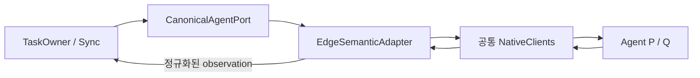
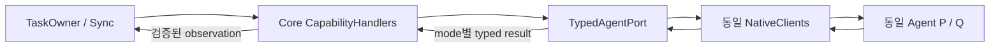

# AGENT-DP01 — Agent 차이를 경계에서 해석할지, Core의 typed handler가 해석할지

> G2-DESIGN-v1.1 / Gate 2 리뷰용. Agent 중립성은 양 후보 공통 요구다.
> W12-G2: 아래 W-02/W-03 responsiveness 가설은 이전 endpoint의 historical mapping이다. 새 W-01/W-03 Voice 경로의 applicability는 [11-E](../11e-voice-responsiveness-measurement-redefinition.md)를 기준으로 재동결한다.
<!-- gate2: {"dp":"AGENT-DP01","reference":"A","hypotheses":["W-02","W-03","W-07","W-08"],"alternatives":{"A":["G2-C-EDGESEM","G2-I-CANONAGENT"],"B":["G2-C-TYPEDHANDLER","G2-I-TYPEDAGENT"]}} -->

## 1. 질문을 정확하게 한정하기

이질적인 Agent는 접수·follow-up·취소·질문·result의 표현과 수명이 다르다. **그 차이를 VIA 외곽의 adapter가 해석해 Core에는 정규화된 계약을 주는 A와, 중립적인 typed variation을 Core의 전용 handler가 해석하는 B**를 비교한다.

A도 capability 차이와 미지원 기능을 숨기지 않는다. B도 provider 제품명이나 native JSON을 Core 전체에 노출하지 않는다. 비교점은 '기능을 잃는 공통분모 vs 모든 기능'이 아니라 **변형된 수명 의미를 해석하는 책임의 경계**다.

## 1-A. Protocol 선택과의 관계

**이 DP는 A2A/MCP/custom 중 어떤 wire protocol을 고르는 문제와 분리한다.** 동일 protocol을 써도 Agent마다 streaming, polling, push, follow-up, cancel, artifact, pending-input capability와 lifecycle profile이 다를 수 있다. 반대로 protocol이 달라도 integration edge가 그 차이를 canonicalize하면 Core는 provider variation을 거의 보지 않을 수 있다.

따라서 protocol은 NativeClient/transport의 입력이고, 이 DP는 **그 protocol·provider variation의 의미를 VIA 어디까지 노출할지**를 결정한다. 실제 downstream Agent가 모두 하나의 엄격한 lifecycle profile을 보장하면 A/B 차이는 작아질 수 있으며 그때는 W-07 Agent Interoperability와 W-08 Evolvability도 동점으로 인정한다.

## 2. A — Edge-normalized Canonical Contract

Core는 submit/followup/answer/cancel/query/subscribe의 공통 의미와 기능 가능 여부만 사용한다. EdgeSemanticAdapter가 같은 required capability를 native method 조합과 정규화된 pending/result 상태로 연결한다.

예를 들어 cancel 요청의 접수와 실제 canceled state를 분리하고, Agent의 artifact chunk 완료·질문 ID를 공통 Observation으로 보존한다. 미지원 follow-up은 `Unsupported`로 보고하거나, 명시적으로 허용된 새 run+기존 Task 연결 방식으로 처리한다. 없는 native 기능을 공짜로 구현했다고 하지 않는다.

## 3. B — Core-visible Typed Contracts

Core의 CapabilityHandlers가 `ExistingRunFollowup / NewRunContinuation`, `ConfirmedCancel / CancelRequestOnly`, `Snapshot / RevisionStream`, `WholeArtifact / ChunkedArtifact` 같은 provider-neutral union을 해석한다. 실제 URL·인증·native field 변환은 NativeClients에 남는다.

같은 공통 identity/security header를 사용하며, 최종 Task transition writer는 TASK-DP01이다. Typed handler가 Agent run을 VIA Task라고 덮어쓰거나 직접 persistent Task state를 갱신하지 않는다.

## 4. 공통 native fixture와 경계 조건

AF-v1은 실제 업무를 수행하지 않는 **설계·시험용 외부 계약**이다. 동일 Agent P/Q가 query와 outbound stream, cancellation 결과, pending question, artifact를 제공한다. P는 단일 run ID, Q는 context ID와 run ID를 분리한다. 두 형식의 원천 결과·지연·기능은 A/B에서 같다.

| 경계 | 양 후보가 반드시 보존할 것 |
|---|---|
| submit | request_revision, submission_key, accepted/run identity. 로컬 enqueue를 접수로 표시하지 않음 |
| follow-up | 같은 VIA Task, 대상 run/context, 새 run 필요 여부·대체 관계 |
| observation | source revision/정확한 event 의미를 지원할 때만 사용. local 수신 순번을 source truth로 위장하지 않음 |
| approval | pending action ID, action revision, scope/destination, 거부/철회 |
| artifact | 결과물 ID/version, chunk order·완료, task/run 연결 |
| unsupported | 설명 가능한 제한과 안전한 hold. 성공으로 변환하지 않음 |

A2A v0.3.0은 native compatibility 검증용 참고 계약이지 AF-v1의 보장을 자동 제공하는 구현이 아니다. 특히 재구독의 과거 event backfill, 일관된 source revision, submit idempotency는 개별 Agent에서 확인해야 한다. [E1](./evidence-and-readiness.md)

### TASK-DP02와 겹치지 않는 것

이 DP는 **수명/형식 의미를 어디서 해석하는가**다. polling interval·stream 재연결·gap reconciliation의 trigger는 TASK-DP02가 결정한다. A의 adapter에만 숨은 polling service를 넣거나 B Core에만 추가 query를 강제하지 않는다.

## 5. ELEMENTS

| Element ID | 책임·계약 | 소유자 / 소비자 / 수명 | 독립 변경 판정 |
|---|---|---|---|
| G2-C-EDGESEM | native variation의 공통 의미 정규화 | IntegrationEdge / TaskOwner·Sync / 연결 | Agent별 수명·artifact·제어 적응 행위 변화 |
| G2-I-CANONAGENT | 정규화된 operation/observation + capability 선언 | Edge→Core | 공통 method·error·완료 의미 변화 |
| G2-C-TYPEDHANDLER | 중립적 typed variation의 Core 해석 | Core / TaskOwner·Sync / 요청·run | variation 분기·조합 행위 변화 |
| G2-I-TYPEDAGENT | capability별 sealed typed operation/result | integration→Core handlers | variant/schema·수명 의미 변화 |

COMMON의 NativeClients, Registry와 ExecutionLink/Pending 상태를 재사용한다. 상태 payload를 다시 이름 붙인 S를 추가하지 않는다. EXEC=A이면 양쪽 해석 책임은 같은 OS process에 있을 수 있어 이름만으로 IPC 비용을 만들어내지 않는다. EXEC=B에서는 edge가 worker, typed handler가 Core에 배치되어 IPC로 넘기는 계약 자체가 달라질 수 있다.

## 6. trade-off 가설과 변경량 근거

| 사전 가설 | 검증할 구조 경로 | 반증/주의 |
|---|---|---|
| W-07 Agent Ecosystem Interoperability & Substitutability | A-01~09가 adapter·typed handler·소비 계약까지 바꾸는지 | 두 안 모두 edge/client만 고치면 동점 |
| W-08 Evolvability & Maintainability | M/C 변화가 integration 소비자와 공유 계약을 바꾸는지 | Agent change를 W-08에 중복 계산하지 않음 |
| W-01 Delegated Task Result Responsiveness / W-03 Agent Progress Voice Feedback Responsiveness | native→중립 계약 변환·검증·필요한 protocol 조합 | 새 endpoint에 대한 applicability와 latency는 재동결 필요 |

A는 Core의 수명 의미를 단순화하고 provider 적응을 국소화하기 쉽지만 adapter에 기능 해석 책임이 모인다. B는 capability 차이를 명시적으로 조합하기 쉽지만 Core가 그 variation의 변경을 따라가야 할 수 있다. 두 안 모두 기능 보존을 전제로 하고, 바뀌는 모든 C/I/S/D와 회귀 UC를 원장에 남긴다.

Agent state delivery는 공통 `TASK-T01 Event-first + Query Reconciliation` tactic으로 고정한다. 따라서 AGENT A/B에서 보이는 차이는 query/event 방식 자체의 차이로 설명하지 않는다. 결론을 뒤집을 가능성이 있는 경우에만 IR-DP01 × AGENT-DP01의 제한된 교차 확인을 수행한다.
