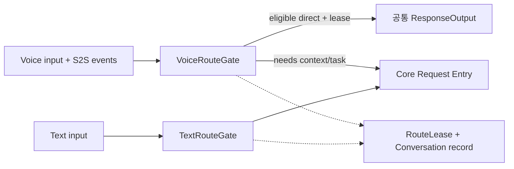
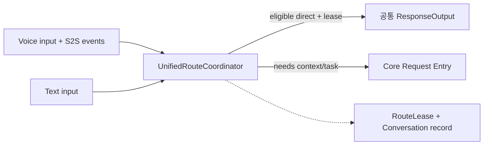

# INT-DP01 — 음성 응답을 바로 내보낼지, Core가 최종 중계할지

> G2-DESIGN-v1 / Gate 2 리뷰용. 11-D 점수·승자 없음.
<!-- gate2: {"dp":"INT-DP01","reference":"B","hypotheses":["W-01","W-02","W-08"],"alternatives":{"A":["G2-C-VROUTE","G2-C-TEXTROUTE","G2-I-ROUTE"],"B":["G2-C-UROUTE","G2-I-ROUTE"]}} -->

## 1. 결정 질문과 비교 단위

**음성 요청의 S2S 직접 응답 release를 VoiceRuntime이 확정하는 A와, Voice/Text 공통 CoreCoordinator가 확정하는 B를 비교한다.** 이 차이는 사용자에게 처음 응답하기 전의 조정 경로와 S2S 연동 변경이 퍼지는 경계를 바꾼다.

Text는 두 안 모두 음성 연결 없이 Core로 들어간다. A를 'Text도 VoiceRuntime을 거쳐야 하는 구조'로 만들지 않는다. 같은 Turn에 여러 Request가 있으면 response lease는 Request별로 분리하며, 전체 Turn을 한 Task로 강제하지 않는다. 모델의 업무 판단(IR)과 응답 release 권한(INT)은 별개다.

## 2. A — Voice Fast Path / Voice-owned Router

VoiceRouteGate가 동일한 direct-eligibility 규칙과 S2S의 **검증된** 관측을 사용한다. 일반지식/기존 대화만으로 충분한 요청은 lease를 얻어 직접 내보내고, Context·Task·외부 실행이 필요하거나 불확실하면 Core에 원 요청을 넘긴다. TextRouteGate와 direct 규칙 구현을 재사용해도 각각의 입력 수명·escalation 책임은 독립적이다.

중요한 경로: `voice_end → S2S proposal/필요한 helper 완료 → VoiceRouteGate 검증 → lease → 실제 Text/audio 시작`. 기록은 공통 Recorder에 전달하며 출력 완료/중단 offset을 보존한다. 기록 helper를 하나 더 호출했다는 이유로 S2S 답을 재생성하지 않는다.

## 3. B — Unified Core Path / Core-owned Router

VoiceRuntime은 원천과 proposal을 Core에 전달하고, UnifiedRouteCoordinator가 모든 modality의 release/escalation을 확정한다. **Core를 거친다고 추가 LLM 호출이나 별도 프로세스 왕복을 강제하지 않는다.** 같은 process에서 inline 결정이 가능하면 그대로 허용한다.

S2S 오디오 생성은 두 안 모두 release 전에 준비/버퍼링할 수 있다. B에만 음성 생성 시작을 늦추거나 A에만 speculation을 허용하지 않는다. Gate 2 참조에서는 후보 생성은 병렬 준비 가능하지만 release는 같은 eligibility·generation 검사를 거친다.

## 4. 계약·상태·복구

`G2-I-ROUTE`: `propose(turn_id, request_revision, proposal, evidence_refs) → release(decision_id, generation, destination) / escalate / hold`. destination은 direct/core이고, 최종 Agent 선택과 Task Relation은 `G2-I-DECISION`에 남는다.

`G2-S-ROUTE`의 writer는 음성 request에서 A=VoiceRouteGate, B=UnifiedRouteCoordinator다. 늦은 S2S chunk는 generation 불일치로 폐기한다. lease 경쟁 실패 뒤에는 두 번째 사용자 응답을 내보내지 않는다. Text/Voice 전환 시 canonical Conversation ID는 유지하되 Voice Connection ID는 새로 부여할 수 있다.

S2S가 'Core 이관' 이벤트를 실제 제공하지 않으면 양 후보 모두 같은 supplemental interpretation adapter가 필요하다. 그것의 LLM 호출·시간을 0 또는 무료 native 기능으로 가정하지 않는다. 입력 전체를 해석해야 direct 여부를 아는 경우 fast path 이득이 줄어드는 것도 그대로 관찰한다.

## 5. ELEMENTS

아래 선택 요소에 common-contract의 COMMON 원장과 다른 DP 참조 요소를 더하면 전수 목록이 된다.

| Element ID | 책임·계약 | 소유자 / 소비자 / 수명 | 독립 변경 판정 |
|---|---|---|---|
| G2-C-VROUTE | 음성 direct release·Core escalation 결정 | Voice / output·Core / request | 음성 route 수명·중계 행위 변화 |
| G2-C-TEXTROUTE | Text route·Core 진입 처리 | Core / output·IR / request | Text 전용 입력·route 행위 변화 |
| G2-C-UROUTE | 공통 modality route와 release | Core / Voice·UI·IR / request | modality 중계·release 행위 변화 |
| G2-I-ROUTE | proposal·lease·release·escalation 의미 | 선택 router / Voice·Core | 동일 decision의 중복·정정·완료 계약 변화 |

공통 `G2-C-VOICE`, `G2-C-UI`, `G2-C-RECORD`, `G2-S-ROUTE`는 두 안 모두 있다. 별도 D를 추가하지 않으며 process 경계는 EXEC 선택을 따른다. 코드 library 재사용은 C 두 개를 자동으로 하나로 합칠 근거가 아니지만, 완전히 같은 수명/행위 구현의 단순 인스턴스라면 중복 C로 세지 않고 Gate 2 리뷰에서 재등록한다.

## 6. 무엇으로 차이를 검증하는가

| 사전 가설 | 근거를 남길 지점 | 가설이 틀릴 조건 |
|---|---|---|
| W-01 Conversational Reaction Responsiveness | proposal 완료→route→release→첫 Text/audio span | 같은 inline route면 차이가 작거나 없을 수 있음 |
| W-02 Task Handoff Responsiveness | Core 진입 전 해석·escalation 및 최종 durable acceptance | A도 동일한 Core 의미 판단을 필요로 하면 이득 없음 |
| W-08 Evolvability & Maintainability | M-01/07/09가 Voice/Core route 계약에 미치는 변경 | 공통 adapter만 변경되면 동점 가능 |

대표 흐름은 TC-01.1/01.4/07.1/11.1/15.1이다. 다른 canonical TC를 제외하는 뜻은 아니다. 판단의 branch 비용과 실제 대기 span을 기록하며 'Core hop 1개=몇 ms' 같은 상수를 만들지 않는다.

## 7. 공정성·조합 검사와 예상 장단점

A는 직접 음성 경로의 중앙 조정을 줄일 가능성이 있지만 modality별 route 수명과 공유 history 연결을 관리해야 한다. B는 응답/위임 조정을 한 곳에서 검토하기 쉽지만 공통 경로의 대기·변경 영향이 모일 수 있다. **이것은 검증 가설이지 A가 항상 빠르다는 결론이 아니다.**

같은 음성 Request의 release owner를 두 곳에 두지 않는 것이 두 안의 차이다. Core가 규칙을 사전 제공하는 것은 A의 공통 tactic이고, runtime마다 owner를 전환하는 구조는 전환·fencing 비용을 가진 별도 설계다. INT A/B × IR A/B를 교차 확인해 direct eligibility helper의 중복을 점검한다.
