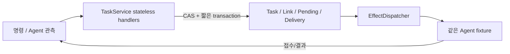
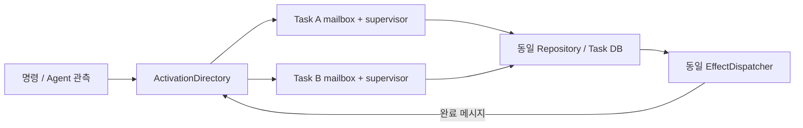

# TASK-DP01 — Task 상태를 공유 서비스가 갱신할지, Task별 소유자가 갱신할지

> G2-DESIGN-v1.1 / Gate 2 리뷰용. actor·central에 대한 성능 우열 가정 없음.
> W12-G2: 이 문서의 W-02 latency 가설은 이전 handoff endpoint의 historical mapping이다. 새 W-01/W-03 Voice 경로의 applicability는 [11-E](../11e-voice-responsiveness-measurement-redefinition.md)를 기준으로 재동결한다.
<!-- gate2: {"dp":"TASK-DP01","reference":"A","hypotheses":["W-02","W-04","W-08","W-09"],"alternatives":{"A":["G2-C-TASKSERVICE","G2-I-TXNTRANSITION"],"B":["G2-C-TASKACTOR","G2-C-ACTIVATION","G2-I-MAILBOX","G2-S-ACTIVATION"]}} -->

## 1. 결정과 중요성

여러 Task의 follow-up·질문·취소·Agent 결과가 겹쳐도 **같은 Task의 상태는 한 번만 올바르게 전이**해야 한다. 공유 TaskService가 transaction을 통해 전이를 수행하는 A와, Task별 durable supervisor가 명령을 직렬화하는 B를 비교한다.

'중앙 서비스라는 이름 안에 actor를 넣으면 둘 다 아닌가'라는 문제는 **실제 command의 writer와 scheduling 단위**로 판별한다. 요청마다 stateless handler가 DB revision을 검사해 갱신하면 A, 특정 Task activation만 그 Task를 수정할 수 있으면 B다. 프로세스 수는 이 DP에서 바꾸지 않는다.

## 1-A. 알려진 패턴과의 관계

**A/B가 ‘Agent harness 업계의 두 표준 형태’라고 말하면 과장이다.** A는 일반적인 shared service + durable store 접근에 가깝고, LangGraph 계열은 thread/checkpointer 기반 persistent shared state를 제공한다. B는 actor/durable-workflow 계열의 **per-execution durable owner**에 가깝고, Temporal은 Workflow Execution별 Event History와 crash recovery가 가능한 durable execution을 제공한다.

즉 두 패턴 모두 알려진 SW architecture family의 변형이지만, 경량 Agent SDK가 모두 B 같은 Task actor를 쓰는 것은 아니다. VIA에서 B를 검토할 이유는 여러 async Task, cancel/race, restart reconnect를 **VIA 제품 자체가 소유**하기 때문이다.

## 2. A — Shared Transactional Task Service

서로 다른 Task의 handler는 동시에 준비·조회할 수 있다. 같은 Task의 write는 `expected_revision` 조건과 transaction conflict로 조정한다. **전역 mutex나 전체 요청 직렬 queue를 강제하지 않는다.** Conflict 시 최신 state를 재조회해 다시 판단하고 duplicate command는 저장된 결과를 반환한다.

Task, ExecutionLink, pending reply, outbox의 연결 변경은 필요한 범위의 짧은 transaction이다. 외부 Agent/LLM 호출은 lock 밖에서 수행한다. status query는 committed view를 읽고, 여러 Task에 걸친 명시적 compound 관계는 같은 DB revision을 기준으로 확인할 수 있다.

## 3. B — Durable Single-writer Task Supervisors

Task마다 persistent activation epoch를 가진 소유자 하나가 command를 처리한다. **Tokio mailbox 자체는 in-memory channel이며 durable queue라고 부르지 않는다.** command identity/payload dedup과 Task state/result는 공통 Repository에 저장하고, commit 이후에만 처리 완료를 반환한다. caller는 실패 시 같은 command identity로 재시도할 수 있고 activation 교체 시 stale epoch writer를 Repository가 거부한다.

Agent를 기다리며 mailbox를 막지 않는다. `SUBMIT_PENDING`을 저장하고 외부 호출 완료는 후속 command로 처리해 cancel/status를 계속 수용한다. directory/read index는 발견·조회용이고 Task state를 직접 수정하지 않는다. compound group의 coordination은 공통 RelationScheduler가 command를 발행하고, 최종 각 Task의 writer는 해당 supervisor다.

## 4. 저장·동시성·복구 계약

두 안 모두 COMMON의 같은 snapshot schema, SQLite WAL/FULL, outbox/inbox, Agent idempotency 계약을 쓴다. actor 인스턴스 4개를 4개의 C/D 요소로 세지 않는다. DB가 writer를 직렬화하는 비용은 B에서도 남는다.

| 사건 | A | B | 공통 invariant |
|---|---|---|---|
| 같은 Task의 동시 correction/cancel | expected_revision conflict 재조회 | mailbox 순서 + activation fencing | stale 판단이 최신 state를 덮지 않음 |
| 서로 다른 Task의 진행 event | 동시 handler + 짧은 DB write | 독립 mailbox + 같은 DB write | 전역 제어로 다른 Task 취소 금지 |
| submit 뒤 접수 이전 crash | outbox/Link 복원 | supervisor 재활성화 + 같은 outbox/Link | 확인 전 새 state-changing submit 발행 금지 |
| accepted 뒤 로컬 commit 이전 crash | submission_key로 조회·조정 | 동일 조회·조정 후 소유자 commit | 공통 외부 계약 없으면 Unknown |
| 완료/cancel race | source revision·현재 state로 전이 | 동일 규칙을 actor가 전이 | cancel_requested를 canceled로 단정하지 않음 |

W-09 복구는 UI 창이나 actor activation만 띄운 시점이 아니다. 해당 Task들의 확인된 상태·result·허용 control이 사용 가능할 때 끝난다. A의 lazy load와 B의 lazy activation도 동일 active Task 집합으로 검사한다.

## 5. ELEMENTS

| Element ID | 책임·계약 | 소유자 / 소비자 / 수명 | 독립 변경 판정 |
|---|---|---|---|
| G2-C-TASKSERVICE | transaction 기반 Task 전이 | Core / 명령·관측 소비자 / service 수명 | 상태 전이·transaction 조정 행위 변화 |
| G2-I-TXNTRANSITION | read-revision/conditional transition/duplicate-result | TaskService↔Repository | conflict·commit 완료 의미 변화 |
| G2-C-TASKACTOR | Task 단일 writer와 command 처리 | Core Task activation / dispatcher·UI / activation | Task 전이·mailbox 처리 행위 변화 |
| G2-C-ACTIVATION | Task activation 발견·재활성화·fencing | Core / 모든 Task command / service | 소유자 배정·교체 행위 변화 |
| G2-I-MAILBOX | per-Task command delivery·commit completion | directory→supervisor | channel delivery와 durable commit 완료, retry/dedup 의미 변화 |
| G2-S-ACTIVATION | Task owner epoch·activation lease | Directory writer / Repository reader / 재활성화 간 영속 | ownership 교체·fencing schema 변화 |

`G2-S-TASK/LINK/PENDING/DELIVERY`는 공통 ID를 유지하되 writer binding이 A=TaskService, B=TaskActor로 바뀐다. B를 event-sourced 저장, A를 snapshot 저장으로 만들어 저장 tactic까지 묶어 비교하지 않는다.

## 6. 예상 trade-off와 관측

A는 여러 Task의 관계 조회·transaction 제어가 직접적이지만 conflict 재처리와 공유 저장소의 비용을 부담할 수 있다. B는 Task별 ordering과 activation scope가 명확하지만 in-memory mailbox routing·persistent fencing·cross-Task command 조정이 추가된다. **중앙형=동시성 불가, actor=빠른 복구라는 결론은 허용하지 않는다.**

W-02는 접수+Link commit, W-04는 1/4 Task에서 foreground ratio와 절대 latency, W-09는 6 recovery strata, W-08은 C-04/06 등을 포함한 전체 15 change의 수정 ID를 본다. 진단 span은 command 대기, conflict retry, transaction wait/commit, activation, external reconciliation이다.

TC-09.3/12.3/14.2/18.1~18.6의 상태 전이를 상세 trace로 사용한다. 실제 fixed 4-Task 부하에서 차이가 없다면 동점이며 부하를 임의로 늘려 공식 점수를 만들지 않는다. TASK-DP01 A/B × EXEC A/B를 교차 확인해 writer 차이와 process 차이를 분리한다.
