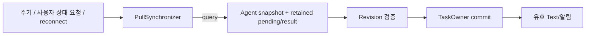
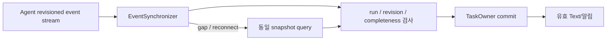

# TASK-DP02 — Agent 상태를 조회로 갱신할지, 이벤트로 갱신할지

> G2-DESIGN-v1 / Gate 2 리뷰용. Agent의 source of truth는 두 안 모두 Agent다.
<!-- gate2: {"dp":"TASK-DP02","reference":"A","hypotheses":["W-03","W-04","W-07","W-09"],"alternatives":{"A":["G2-C-PULLSYNC","G2-I-SYNC","G2-S-SYNC"],"B":["G2-C-EVENTSYNC","G2-I-SYNC","G2-S-SYNC"]}} -->

## 1. 질문과 중요성

Agent에서 이미 진행·질문·결과가 준비됐는데 VIA가 늦게 알면, 사용자는 대기하거나 다시 상태를 묻게 된다. **평상시 상태 갱신을 주기적 query가 촉발하는 A와, Agent event가 촉발하는 B**를 비교한다.

Gate 1의 'authoritative path'는 **VIA 관측을 확정하는 정상 수집 경로**라는 뜻이다. Query나 stream이 별도 진실을 창조하는 것이 아니며, VIA Task의 최종 writer는 양쪽 모두 TASK-DP01이다. 두 경로 모두 실제 Agent revision과 관측의 완전성을 검사한다.

## 2. A — Pull-authoritative Reconciliation

참조 설정은 run별 **500ms polling**, 최대 동시 query 4개, run별 outstanding query 1개다. 여러 run의 phase를 분산하고 느린 query 때문에 전체 scheduler가 막히지 않는다. 최신 status/result와 pending 질문을 조회하며, push hint를 쓰더라도 최종 갱신은 query 결과로 확정한다.

사용자가 직접 상태를 물으면 freshness가 부족한 경우 on-demand query를 허용한다. 진단용 interval 250/1000ms도 같은 입력으로 비교할 수 있지만 공식 값은 후보 결과를 본 뒤 유리한 값으로 교체하지 않는다.

## 3. B — Event-authoritative Streaming

run별 outbound subscription을 유지하고 검증된 event를 즉시 적용한다. 동일 revision은 idempotent 처리하고 이전 revision은 폐기하며, gap이나 partial artifact는 완료로 확정하지 않는다. 재연결에서는 snapshot을 얻고 checkpoint 이후 event를 조정한다. 이벤트만 있고 query fallback은 없는 약한 후보가 아니다.

공통 AF-v1은 monotonic source revision과 현재 pending/result snapshot을 제공한다. 실 Agent가 이 보장을 제공하지 않으면 adapter가 없는 정보를 만들지 않고 **event-as-hint + query**로 내려간다. 해당 기능 제한 프로필은 regression 결과로 보존하며 full-capability stream 비교와 섞지 않는다.

## 4. 설정·순서·질문 누락 방지

| 조건 | 고정 참조 계약 |
|---|---|
| transport | A/B 동일 query·stream 지원 Agent. 직접 inbound webhook을 가정하지 않음 |
| native stream | AF-v1 heartbeat 5s. disconnect/gap 확인 후 query, backoff 100/500/1000ms 상한 적용 |
| B 정기 검증 | 30s reconciliation, event 누락/오류 시 즉시 query. A는 500ms 정상 query |
| update order | source_revision 우선. request_revision/run/context mismatched event는 reject/확인 |
| pending/result | 질문·최종 결과는 다음 query/reconnect에서도 조회 가능. progress는 더 최신 상태로 대체 가능 |
| persistence | sync checkpoint와 Task 적용 기록을 같은 commit 또는 안전한 at-least-once 재적용으로 연결 |
| slow consumer | bounded queue + backpressure. 질문·최종 결과를 조용히 drop하지 않음 |

위 수치는 실제 Agent의 SLA가 아니라 후보 간 비교를 위한 설계 설정이다. 같은 dataset의 event 발생 시각을 후보의 polling tick에 맞추지 않는다. `source_event_available`부터 재고 gateway 수신 후로 시간을 초기화하지 않는다.

A2A v0.3.0의 SSE/resubscribe만으로 revision/backfill을 보장한다고 말하지 않는다. [E1](./evidence-and-readiness.md)

## 5. ELEMENTS

| Element ID | 책임·계약 | 소유자 / 소비자 / 수명 | 독립 변경 판정 |
|---|---|---|---|
| G2-C-PULLSYNC | polling/on-demand snapshot 수집·갱신 제출 | Core sync / TaskOwner / active run | cadence/query/gap 처리 행위 변화 |
| G2-C-EVENTSYNC | subscription·event validation·snapshot 보완 | Core sync / TaskOwner / active run | stream/reconnect/gap 처리 행위 변화 |
| G2-I-SYNC | observation 수집 시작/중지·cursor·status 전달 | Sync↔AgentBoundary·TaskOwner | 수집·freshness·reconciliation 완료 의미 변화 |
| G2-S-SYNC | source watermark·subscription/query checkpoint | Sync / TaskOwner·recovery / run 동안 영속 | cursor·관측 완전성·복구 schema 변화 |

G2-S-SYNC는 Agent truth나 G2-S-TASK의 복사본이 아니라 **어디까지 관측·적용했는지**를 보존하는 독립 수명 상태다. 같은 normalizer와 TaskOwner를 사용한다. AGENT/EXEC 선택으로 transport의 실제 배치가 달라져도 update policy는 이 DP에만 귀속한다.

## 6. 관측과 반증

| 사전 가설 | 검증할 근거 | 동점/반대 결과 가능성 |
|---|---|---|
| W-03 Task Feedback Responsiveness | source 발생→발견→검증→commit→표시 span | 짧은 polling/빠른 query면 gap이 작을 수 있음 |
| W-04 Concurrent Task Performance Isolation | 1/4 run의 query 횟수·event fan-in·foreground ratio | 낮은 고정 부하에서 둘 다 영향이 없을 수 있음 |
| W-07 Agent Ecosystem Interoperability & Substitutability | A-04/08/09 및 전체 Agent change 원장 | 공통 adapter만 바뀌면 같은 changed count |
| W-09 Recovery Timeliness & Recoverability | snapshot 재구성과 cursor 복원·재구독 | query가 더 빠르거나 두 안 같은 복구 경로일 수 있음 |

A는 snapshot 기반 재동기화가 직접적이지만 조회 사이 지연과 반복 query를 부담한다. B는 변화 발생 즉시 반영할 기회가 있지만 subscription·누락/순서·cursor 상태를 관리해야 한다. `Δ=500ms`로 곧바로 p95를 산출하지 않고 실제 event phase·RTT·queue·commit 분포를 측정한다.

TC-13.1/13.2/13.3 및 TC-18 계열을 대표 trace로 사용한다. 실무적으로 pull과 event가 공존할 수 있음을 부정하지 않는다. 이 비교는 **일상 update가 query 완료를 기다려야 하는지**에 관한 선택이며, 지원하지 않는 Agent까지 무조건 event로 강제하지 않는다.
